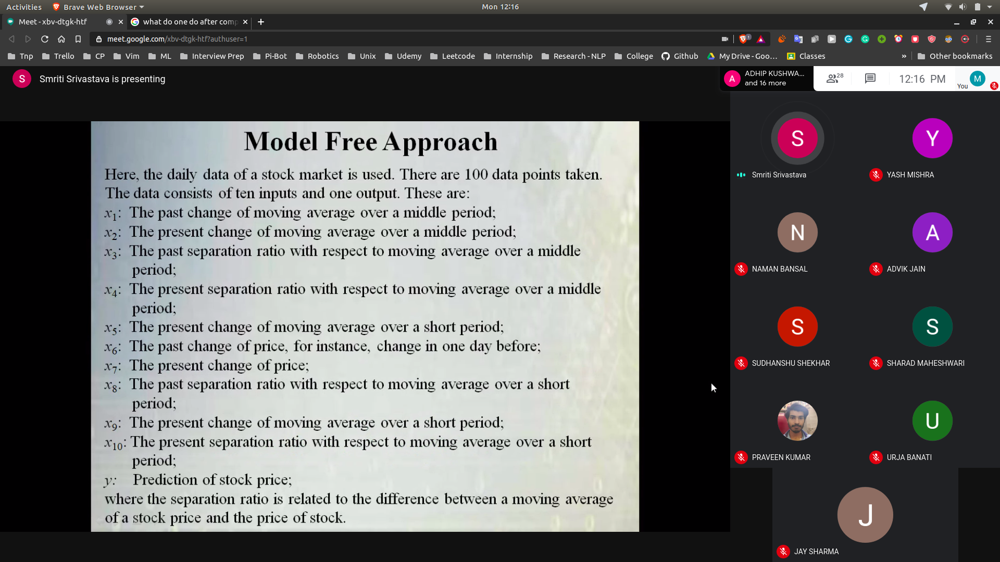
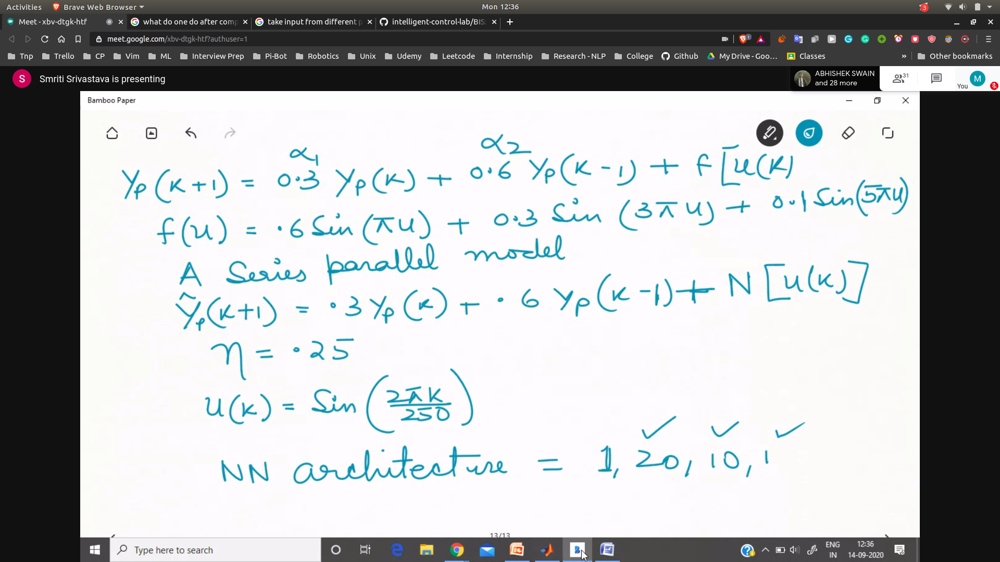
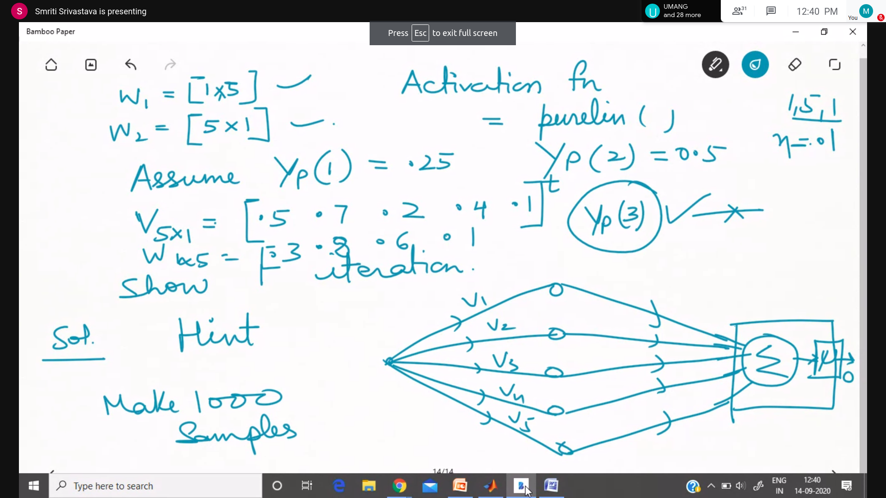
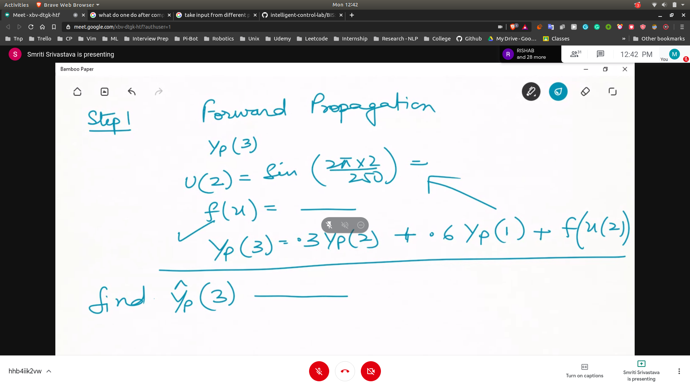
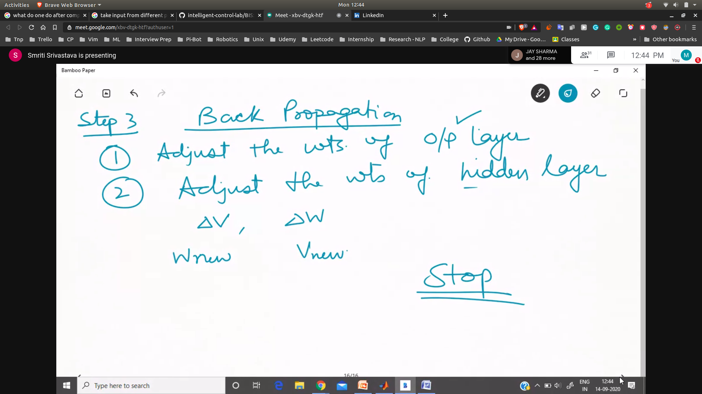

## Modelling and Identification using NN
- Programming
 - MLFNN
 - RBFNN
 - Recurrent NN
 - KSOM

- Generally Model Based Approach is used for dynamic non-linear systems

## Model Free Approach
- The machine learns from the numerical data
- Problem
  - Predicting stock prices
  - 
  - 
  - Here the input has modelled the stock price model

## TO BE DONE

- 
- 
- 

### Steps
- 
- Calculate error
- Back Progration
- 