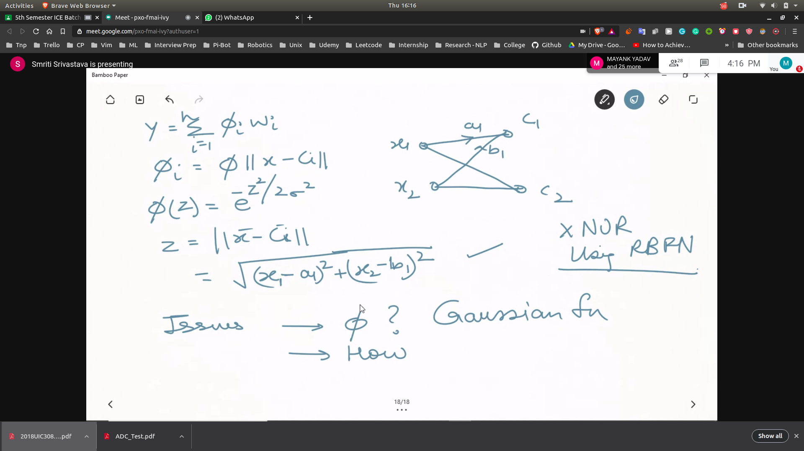
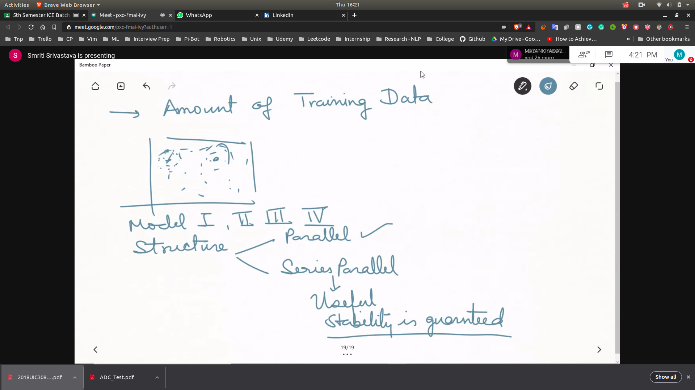
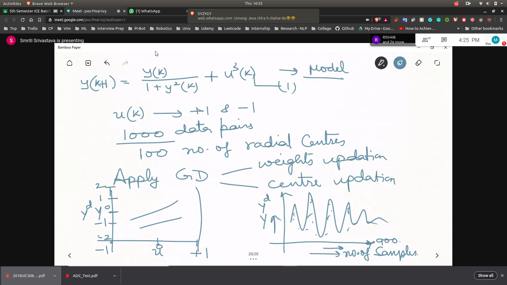
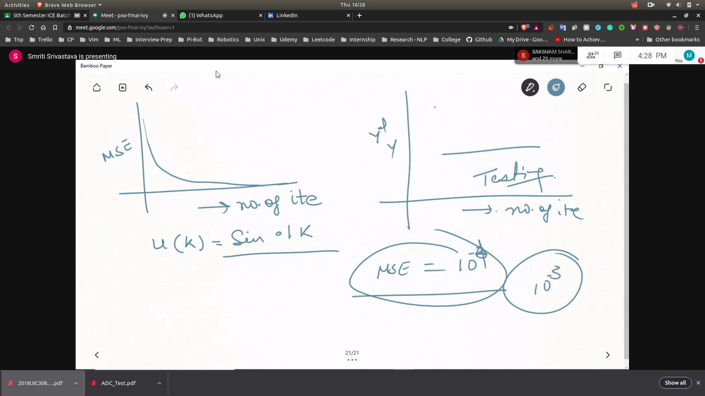
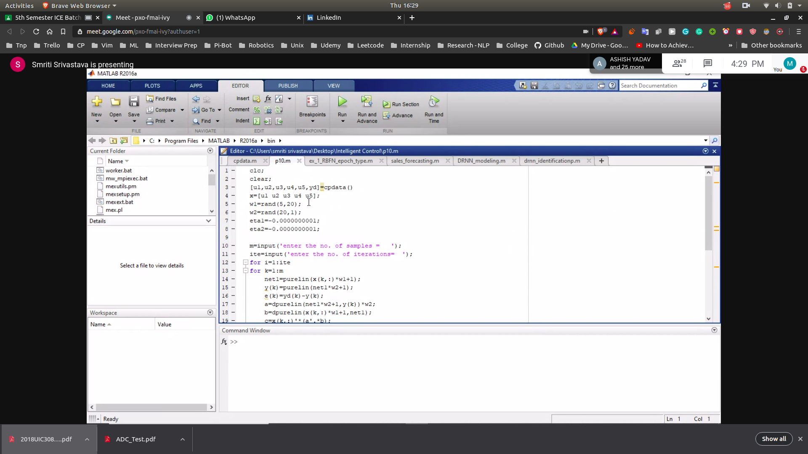
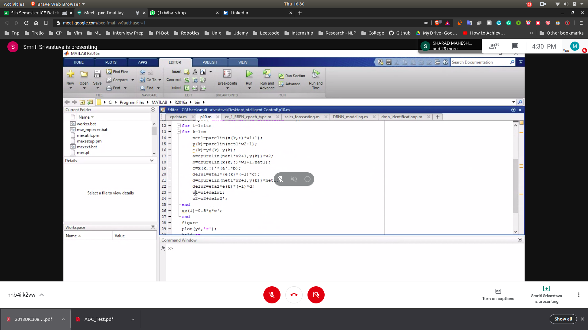
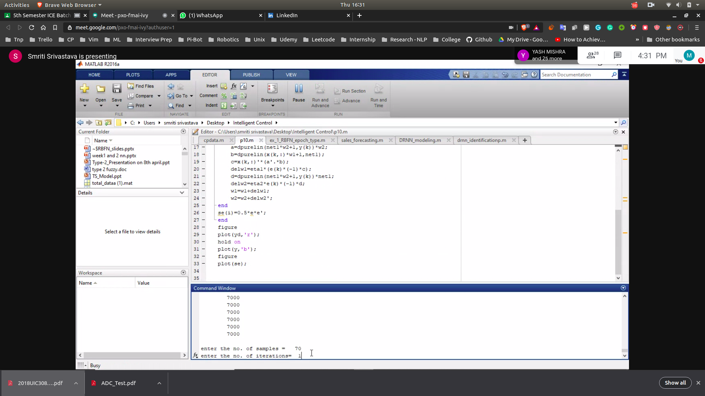
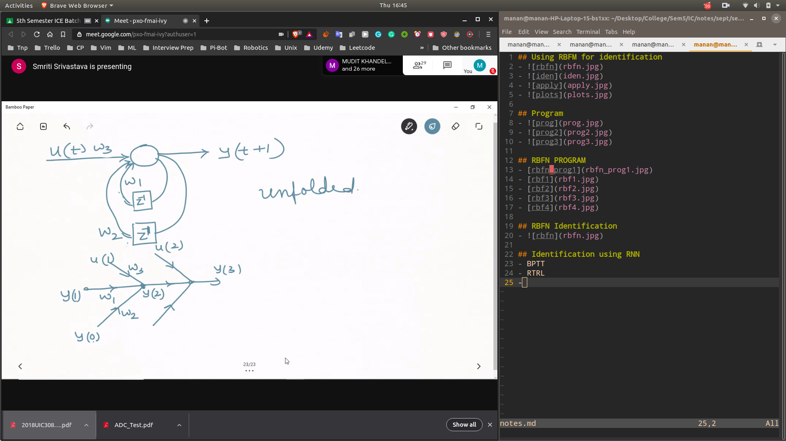
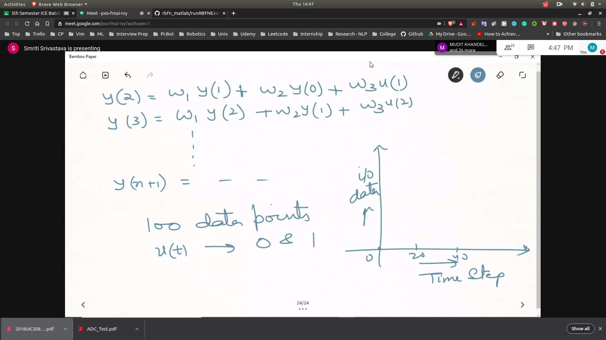
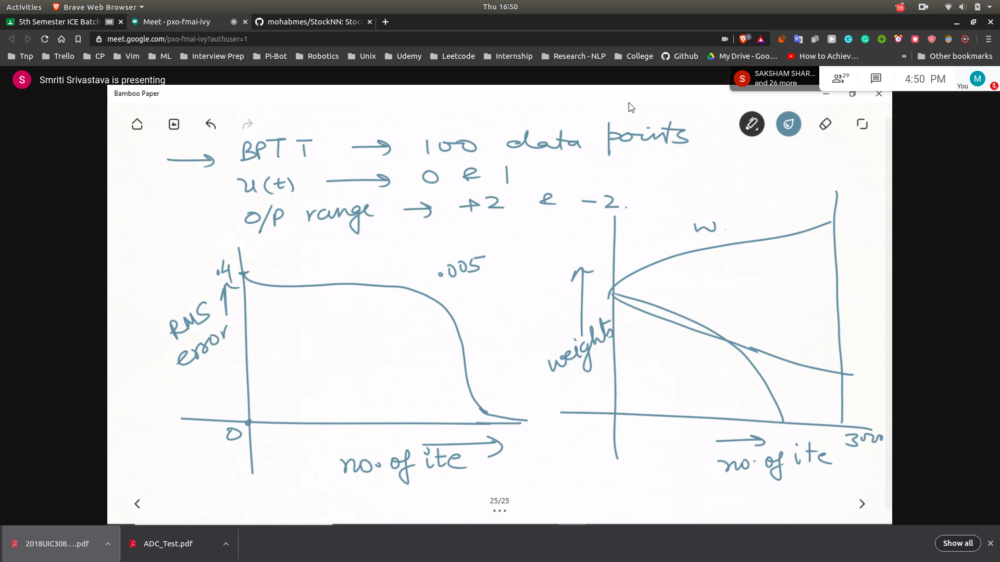

## Using RBFM for identification
- 
-  
- 
- 

## Program
- 
- 
- 

## RBFN PROGRAM
- [rbfn_prog1](rbfn_prog1.jpg)
- [rbf1](rbf1.jpg)
- [rbf2](rbf2.jpg)
- [rbf3](rbf3.jpg)
- [rbf4](rbf4.jpg)

## RBFN Identification
- 

## Identification using RNN
- BPTT
- 
- 
- 
- RTRL
- 
