## Feedback Networks

- FF network is a static network
- So in order to have dynamic , we need feedback
- Hence we need a feedback
- 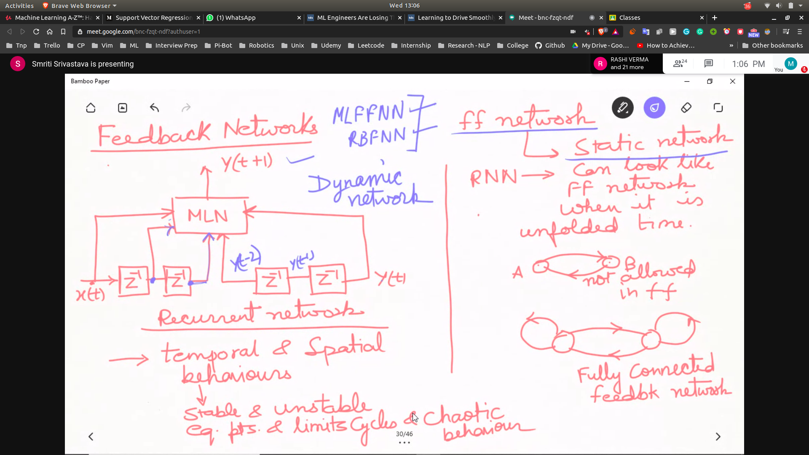

### Prop.

- Rich Temporal and spatial behaviours
  - because it's time stamp depends upon t,t-1
- stable and unstable cycles
- mainly used for pattern recoginition

### Unfolding in Time

- RNN can look like NN , when they are unfolded in time 

### Types

- FCRNN
- Partially Connected(PCRNN)

### Application 

- Time Series Prediction
- Temporal Pattern recognition 
   - signal classification
   - sound  classification

### Time Delay Network
- 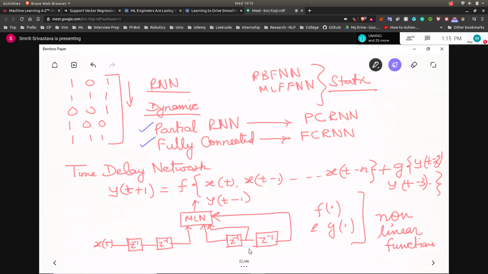

## Formation of full conncected neural networks
- each neuron is connected to itsel
- 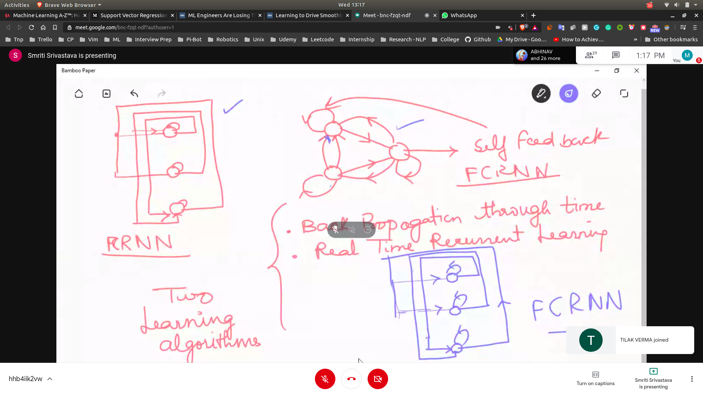

## Comp
- comparision of the NN
- 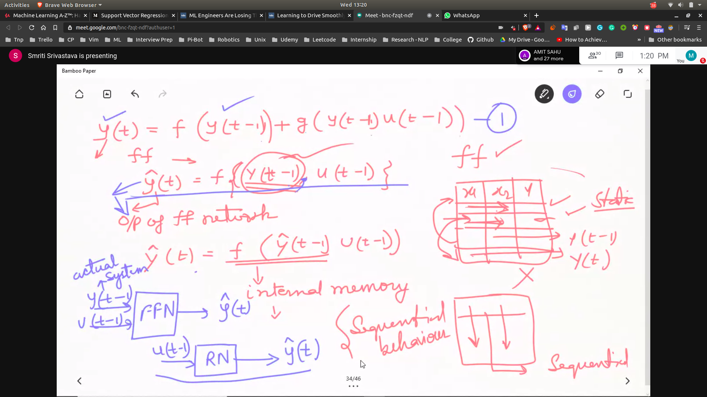

## Applying Back Propagation
- we roll the network in time to apply back prop
- 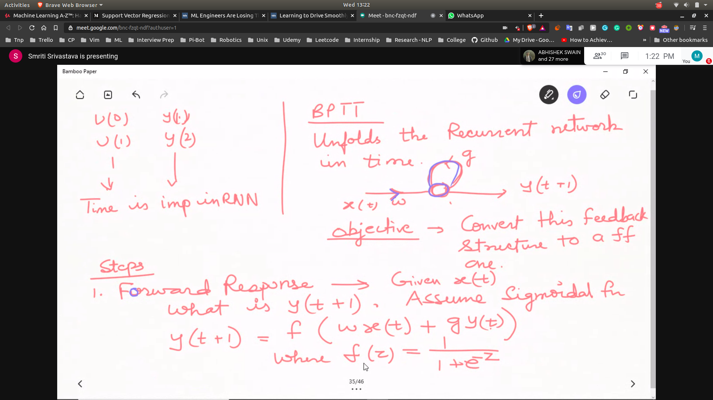
- 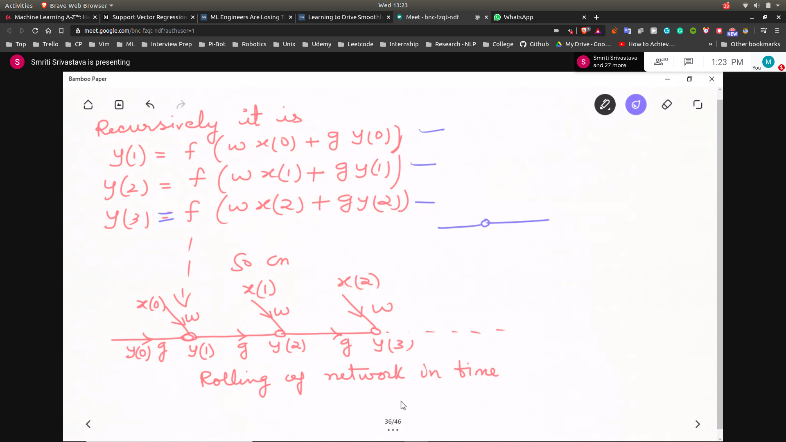
- 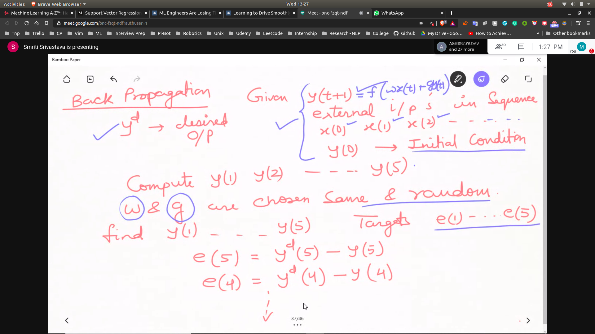
- 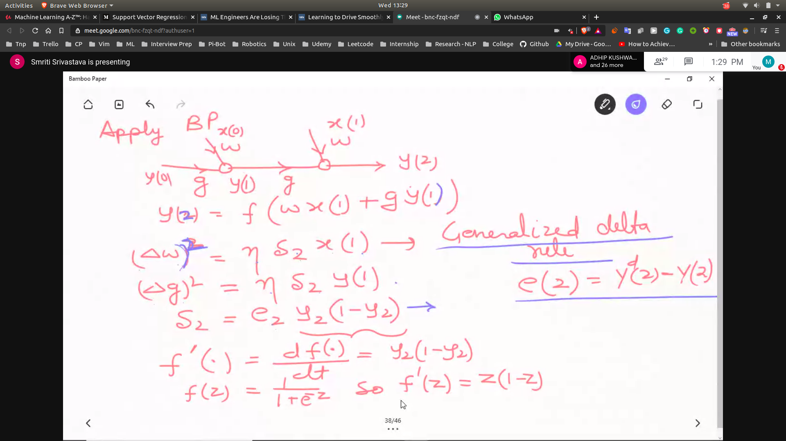
- 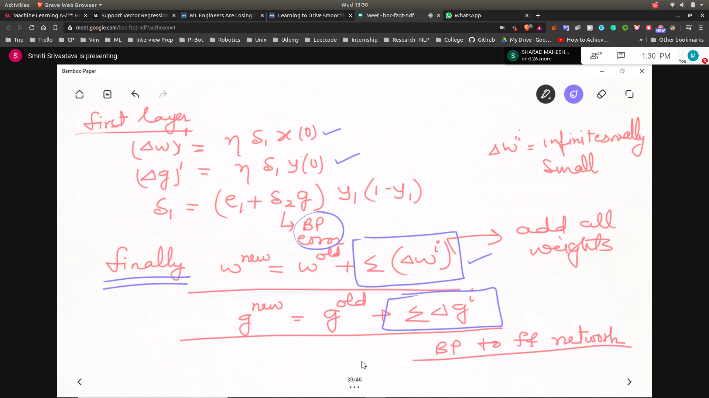

## 2 Learning Algo
- Back Prop Through time
- Real Time recurrent learning

## Example
- 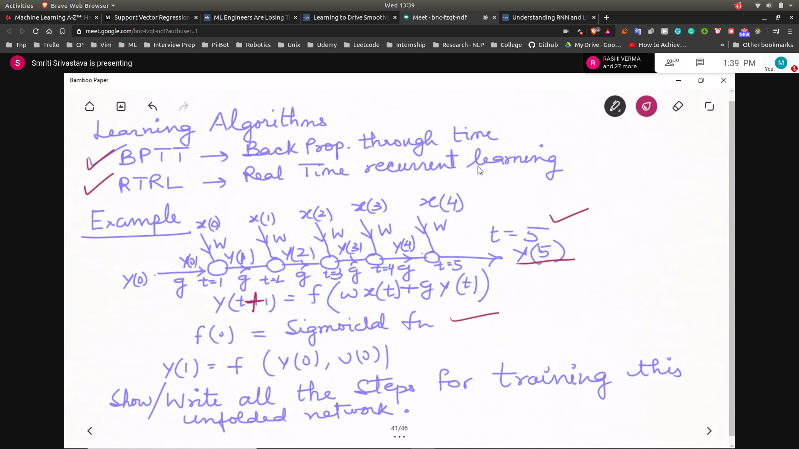
- 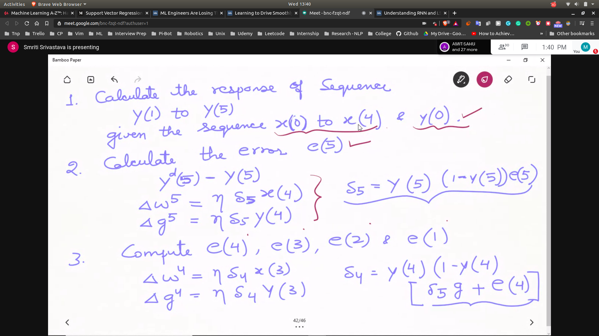
- 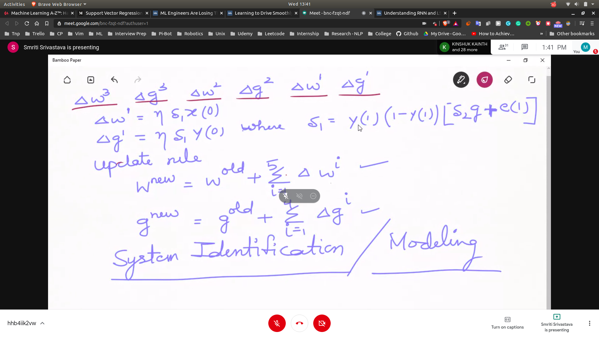

## Difference b/w two methods
- BPTT VS RTRL
- 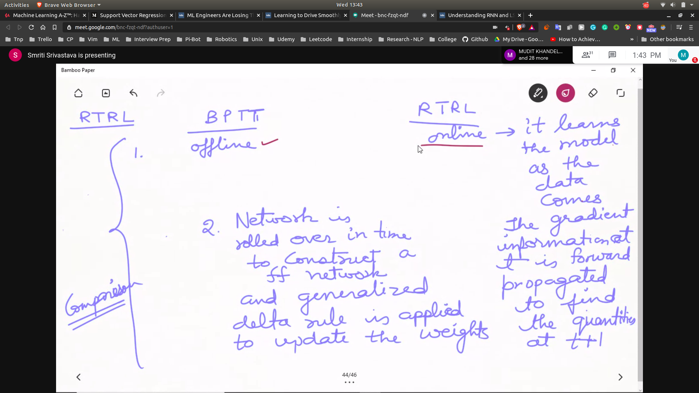
