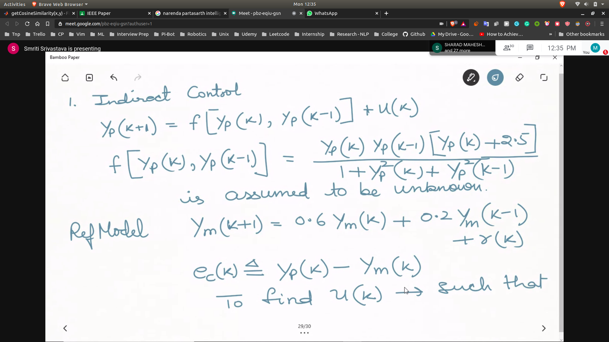

# Control
- There have been 2 widely known approach
- u = -Kx
- Parameter Perturbation : The parameters are changing
- Disturbances

**There are conventional non-linear control also available but intelligent controller are better**

### Adaptive Controller
- The controller is adaptable to the parameter perturbation
- PID is also adaptable to a certain extent
- It is mainly used when the model of the plant is unknown
- Because for tuning the PID Parameters physically , we have to know the physical model to tune the parameters

## Approaches

### Direct Control
- Simultaneous Identification and Control is done

### Indirect Control
- Identify the system
- Control

**Note : In case of linear gain , non-linear parameters are places**

### Indirect Control
- Indirect is more suitable , and the starting point of control
- 

- Covered example2 from the narendra parthasarthi paper

## Process
- [prc1](prc1.jpg)

## Outputs
- Also from narendra parthasarthi

