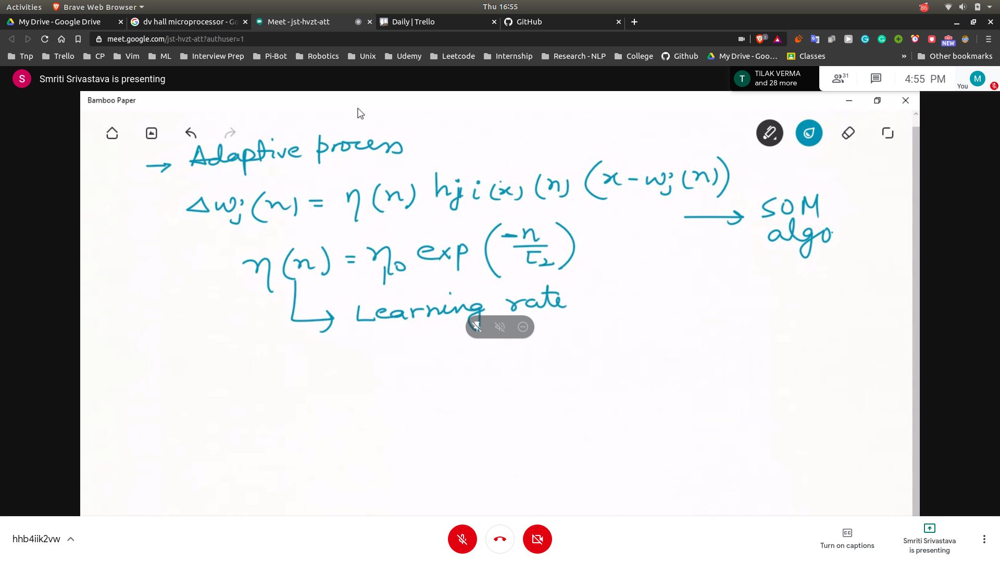

## RTRL
- 
- Use Gradient Descent to minimize the w weights as well as self weights g
- Basically minimis Pwt ... Pterms
- 
- Now we derive the recursive relation
- 
- 
- Finally we get w(t+1) and g(t+1)
- 

## Assighnment PROB -> RTRL Algo
- We have to apply RTRL to a network

## Kohonen Self-organising MAP (SOM)
- unsupervised learning algorithm
- Motivated by features in brain
### Characteristics
- 
- 

## Steps
- initalize random weights
- competition
 - 
 - i(x) is the function to identify the best neuron
 - 
 - after this the competition is over and best neuron is selected
- cooperation
 - 
 - assighn values using gaussian neighbourhood function
 - 
- adaptive process
 - 
