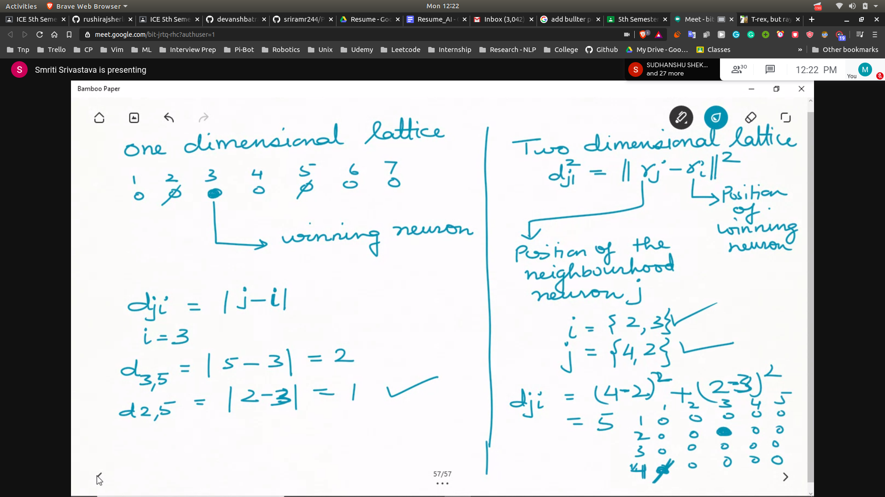
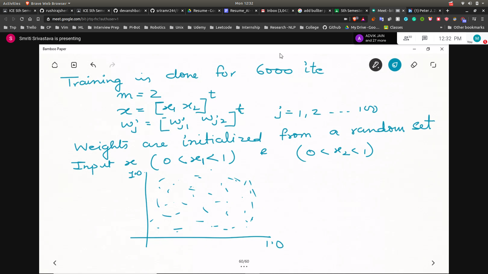

## SOM 
- 

## How 1-D SOM Learn 2-D Topology
- simulation
 - 100 neurons chosen
 - organised in 1-d lattice

- network is to be trained with a 2 dimensional input vector x
### Steps
- input data is coming randomly from a 2d topolgy
- x = [x1,c2] -> each data point is 2 dimension
- wi --> is also 2-dimensional
- Training
 - for 6000 iteration
 - m = 2
 - x = [x1 x2]^T
 - wj = [wj1 wj2]^T j=1,2 ...100
 - wrights are initialized from random set
 - 
 - 
 - 
