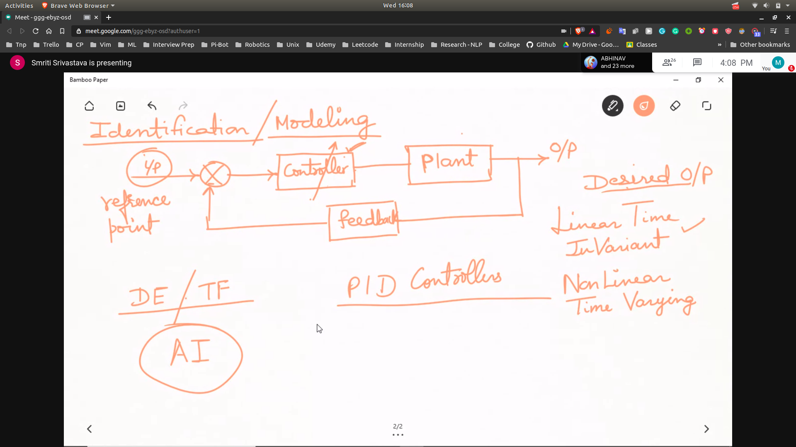
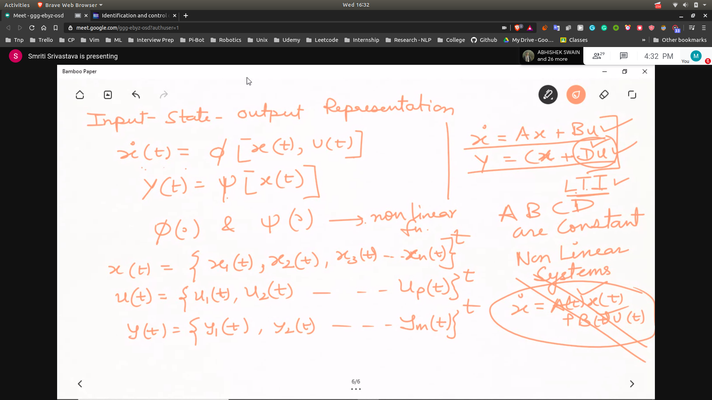
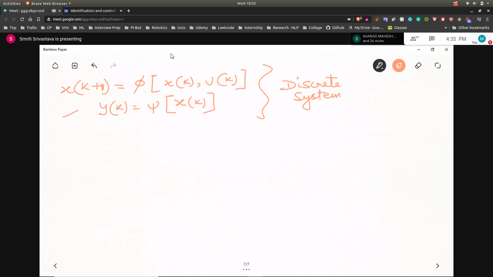

## Identification/Modelling

- System
- 
- Modelling
- Static System
  - time is not important
- Dynamic System
  - system has to consider previous inputs and outputs
  - we give the sytem input and output and obtain the model

- **Refer Paper**
 - Identification and Control of dynmaical system using NN's
   - by KS Narenda something ..

## Objectives

 - To suggest identification as well as controller stuctures for adaptive control of unknown non-linear dynamical systems
 - To present a method for the dynamic adjustment of the parameters based on backprop 
 - To state clearly the theoretic assumptions that are required to have a well defined problem

## Input-State-Output Representation
- 

## Discrete System
- 

**We say that weight of the NN's are the parameters of the plant**
