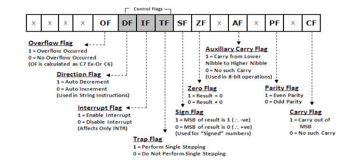
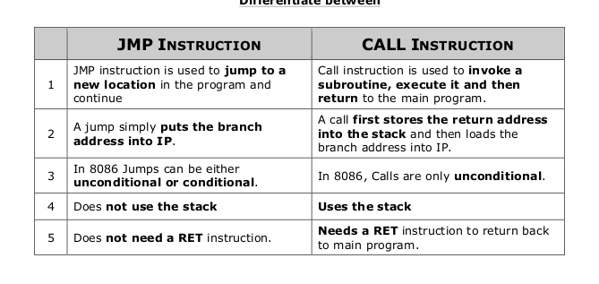
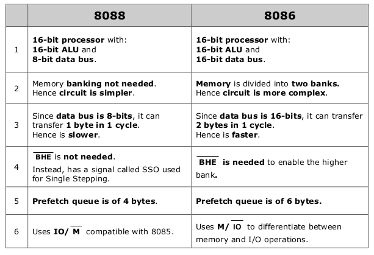

## TODO
- Data Transfer Instruction from My Notes [done]
- Max Min Mode from copy 
- Program Execution and Tranfer function at Page 54 bharat acharya PDF [done]
- Interrupts from my notes [done]
- difference b/w 8086 and 8088 from pg 103 bharat acharya [done]
- peripherals from notes 

# Facts to know!

- 40 pins are available in 8086
- 20 bit adress but hence 1MB Memory Acess
- 16 bit data bus
- Has 2 operating Modes
  - Min : Only 8086
  - Max : Other MPC'S such as 8088/8089 also collabrate to get better performance
- 8086 has 16-bit IO adresses , hence it can acess 64k IO ports at once
- Flags in 8086
    - 
    - Overflow Flag
    - Carry Flag
    - Zero Flag
    - Parity Flag
    - Auxiliary Carry Flag
    - Direction Flag
    - Interrupt Flag
    - Sign Flag
- JMP
    - It has 2 main branches:
    - Near Branch
     - Inter Segement Only IP has to be changed
    - Far Branch
     - Intra Segment Both CS and IP has to be changed
- CALS
   - It transfer the program control to a subroutine to another program with the intention of coming back
   - 8086 first saves the address of the next instruction into the stack before branching to the sub-routine
   - It also has two branches:
     - Near Branch
      - Program execution has changed to a subroutine inside the segement
      - Intersegement
     - Far Branch
      - Intra Segement

- Diff b/w JMP and CALL
 - 

- Diff b/w 8086 and 8088
 - 
 - Mainly data bus is 8 bits in 8088
 - hence you can transfer 1 byte per cycle hence it is slower
 - queue size is of 4 bytes in 8088 , where as it is 6 bytes in 8086
# Concepts

Pipeling
--------
- 8086 supports pipelining
- It is the Process of fetching next instruction while processing current instruction
- This makes the processing faster as the next instruction is already fetched , during the current instruction processing.
- When the current instruction finishes we can just process the fetched instruction

Architechtural Units
--------------------
- 8086's architecture is made up of 2 units:
  - Bus Interface Unit
  - Execution Unit

- **Bus Interface Unit**
 - Interface of 8086 to other devices
 - Performs read / write , interfacing with IO's
 - Main Components of BIU:
    - Segement Register
    - Adress Generation Circuit
        - Generates a 20 bit physical adress using segement and offset adress
        - Physical Adress = Segement Adress * 10h + Offset Adress

- **Execution Unit**
 - It fetches instruction from BIU , decodes and executes them
 - Basically the "brain" of the 8086 sytem
 - Main Components of Execution Unit:
    - General Purpose Registers
    - AX , BX , CX , DX
    - Special Purpose Registers
    - Stack Pointer , Base Pointer , Source Index , Destination Index
    - ALU (**16bit**)
    - Flag Register

Memory Segementation
--------------------
- Deviding the memory into logically different parts called segements
- Max Size of a segement is 64kb and minimum size if 16bit
- "The main reason to do segementation is to devide the memory logically , so that the process involving those memory can be isolated"
- Memory is segemented into:
    - Code Segement
      - Used to hold the program to be executed
      - Base Adress : CS Register
      - Offset : IP Regiser
    - Data Segment
      - Used to hold general data
      - Base Adress : DS Register
      - Offset : BX register
    - Stack Segment
      - Holds the stack memory which operated in LIFO manner.
      - Base Adress : SS Register
      - SP holds the offset adress of the Top of the stack
      - BP holds the 16-bit offset adress during Random Acess
    - Extra Segement
      - Used to hold general data
      - Base Adress : ES Register
      - Offset : DI register

- Advantage of Segmentation
    - Devides the memory logically
    - Acess 1MB using 16-bit address
- Disadvantage
    - Overall Memory is 16 * 64kb , but at a time 4*64kb can be acessed

Memory Banking
--------------
- Concept of deviding the odd adresses and even adresses of Memory into different banks to increase the processing rate
- 
- Advantages
 - This banking scheme allows to access two aligned memory locations from both banks simultaneously and process 16 bit data transfer.Memory banking doesn’t make it compulsory to transfer 16 bits, it facilitates the 16 bit data transfer.

