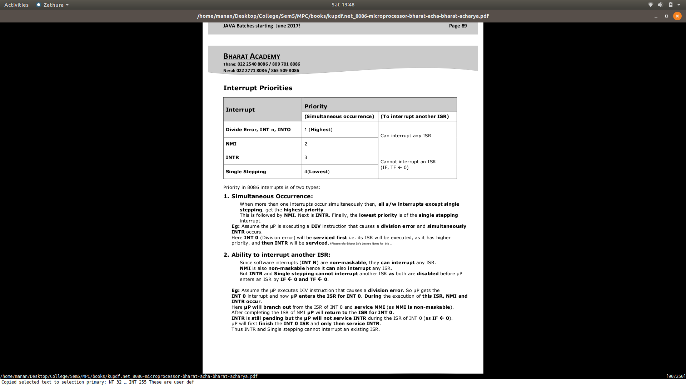

# Interrupts

- Special Condition that arises during the working of a micro processor
- When it happens micro processor calls the ISR (Interrupt Service Routine)

## Types
- Hardware
    - Comes through pins:NMI and INTR
- Software
    - Can be caused by writing interrupt instruction INTn
    - n can be from 0 to 255
- Internally Generated
    - Caused by programs
    - Like div by zero will invoke INT 0 interrupt

## IVT
- Whenever an interrupt INT N occurs, µP does N x 4 to get values of IP and CS from the IVT and hence perform the ISR.
- CS and IP adresses of INT n are stored in Interrupt Vector Table

## Common Interrupts
- INT 0 -- Devide Error
- INT 1 -- Single Stepping
- INT 2 -- NMI
- INT 3 -- Breakpoint
- INT 4 -- Interrupt on overflow

- INT 5 - 31 are **reserved**
- INT 32-255 are **user defined**

## Hardware Interrupts
- Maskable and Non Maskable
- Maskable are kind of like warning , then do not always need to be responded with
- Non Maskable are real errors , they are a high priority interrupt

### NMI 
- On recieving this the micro processor executes INT2 instruction

### INTR
- On reciving an interrupt here micro processor sends 2 pulses
- 1st INTA pulse -- the interuping device calculates the vector number
- 2nd INTA pulse -- the interruping device sends the vector number n
- 
