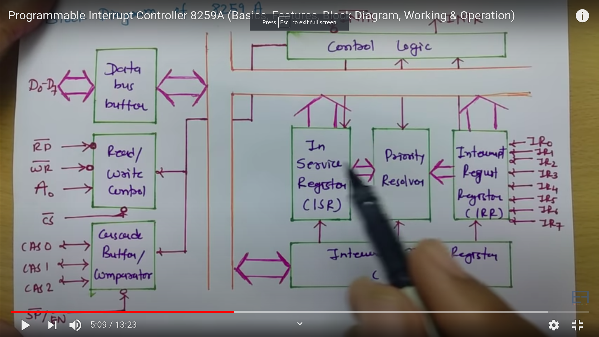
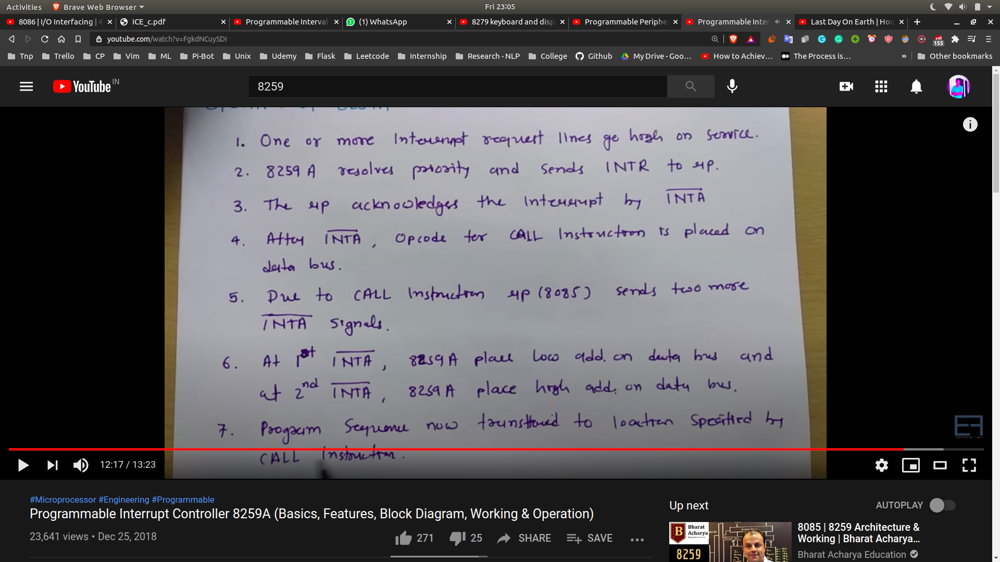
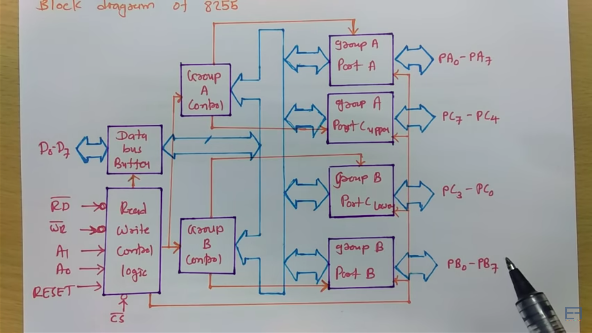
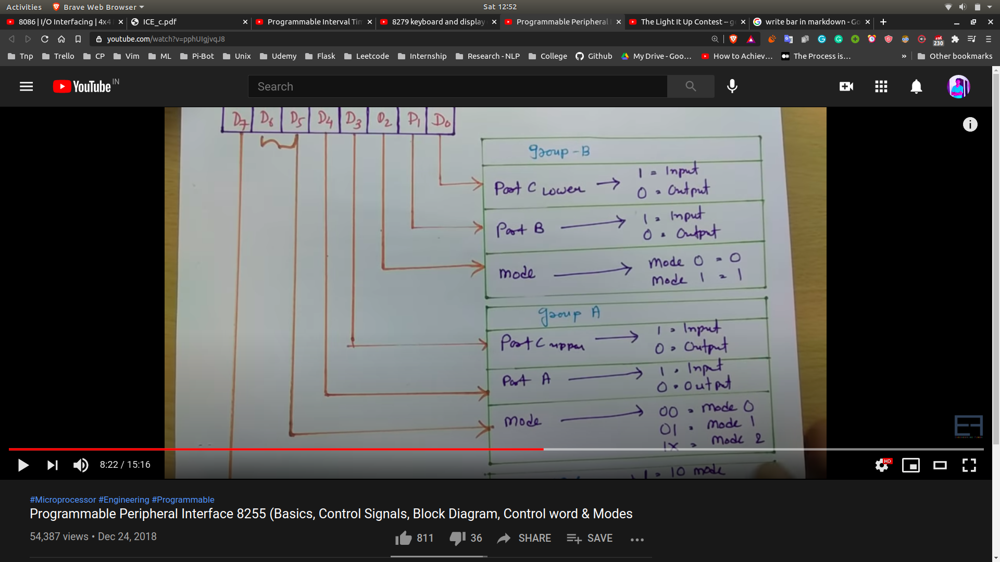
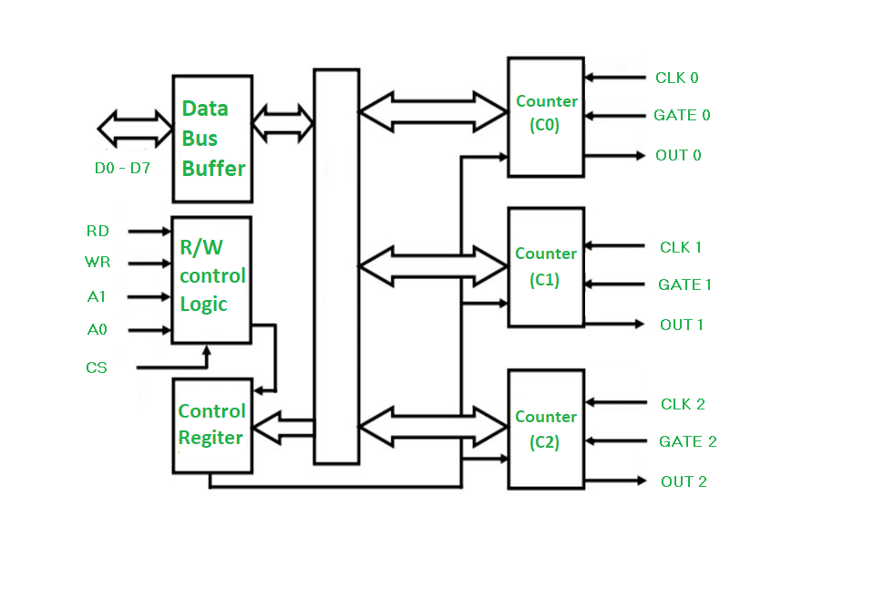

## 8259
**Programmable Interrupt Controller**

### Basics
- Interfaced with 8085 with INTR/INTA pins
- 8085 has limited hardware interrupts , hence we want to use 8259
- 8259 can be interfaced with 8088/8085 both

### Features
- It manages 8 interrupt requests
- It can vector an interrupt anywhere on memory map through progam control
without additional harware
- It can solve eight levels of interrupt priorities in a variety of modes
- With addition  8259A devices , priority scheme can be expanded to 64 levels

### Diagram
- 

### Operation
- First the interrupts will come
- They will go into the priority resolver that will pass the most priority
   - Other will be get masked
- Then INTR will be sent to MPC 8085
- and then 8085 will send INTA to 8259
- call instruction will be placed on the data bus buffer
- 

## 8255
**Programmable Peripheral Interface**

### Basics
- Increase I/0 interfacing capabilities
- It has 24 I/O pins that can be grouped in 2 8 bits parallel ports : A and
B , with the remaining 8 bits into port C
- Port C can be used as individual bits or can be used as 4 bit ports
$C_{upper}$ and $C_{lower}$
- 8255 Modes
  - I/O Modes (Mode 0 ,Mode 1 , Mode 2)
- BSR Modes
  - Bit Set Reset

### Control Signals
- RD [ Read ] - Active Low Signal
  - MPU reads data from the selected port of 8255
- WR [ Write] - Active Low Signal
  - MPU write data on the selected port of 8255
- RESET - Active High Signal
  - It clears control registors and sets all ports in input mode

|CS~ | A1  | A0 |
|----|-----|----|
| 0  |  0  |  0 | -> PORT A
| 0  |  0  |  1 | -> PORT B
| 0  |  1  |  0 | -> PORT C
| 0  |  1  |  1 | -> CONTROL REGISTER -> specify control word on data bus
| 1  | cr  |  cr| -> 8255 not selected

- 

### Control Word
- 

## 8254/8253
**Programmable Interval Time (8254/8253)**

### Diagram
- 

### Decription
- It is designed to solve the timing problems in 8085
- It has 3 independent counters 
  - Each capable of clock inputs upto 10MHz
  - Size of each counter is 16bit
  - It operates in +5V regulated power supply.

- Counters Structure
  - It has 2 inputs clock and gate and 1 output
  - gate is used to enable or disable counting
    - When any value of count is loaded gate is set to 1
    - After every step , the value of count is decremented by 1 unit , until it becomes zero

|CS~ | A1  | A0 |
|----|-----|----|
| 0  |  0  |  0 | -> COUNTER C0
| 0  |  0  |  1 | -> COUNTER C1
| 0  |  1  |  0 | -> COUNTER C2
| 0  |  1  |  1 | -> CONTROL REGISTER -> specify control word on data bus

### Control Word Format
- |SC1 | SC0 | RW1 | RW2 | M2 | M1 | M0 | BCD/Binary |

- SC1 SC0  --> using this we will select a specific counter
- RW1 and RW0 are used to decide the read - write operation
- M2 and M1 and M0 are used to decide the operating modes of 8254
- [control-word-format](https://www.geeksforgeeks.org/8254-control-word-operating-modes/)

## Programmable Keyboard/Display Controller (8279)
- 