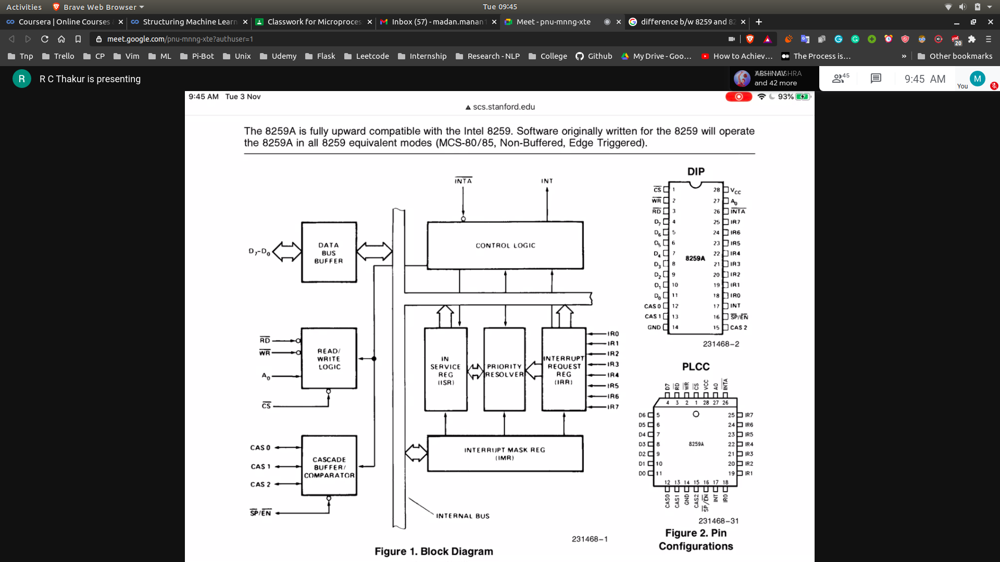

## Interrupt Controller
- Function?
  - For handling interrupts from multiple devices and prioritising the interrupts
---------
8259 Chip
---------
- It has a cascade buffer/comparator
- It has a single address lines
- 

**Working of interrupt controller**
- Whatever interrupts is coming from external devices is coming to IRR Flag
- These will go to priority resolver
- Then will go the ISR which will decide the interrupt service subroutine to
run for a particular interrupt
- IMR will decide which interrupts will be maskable and whcih will be
non-maskable
- Interrupt controller will device the type of interrupt INT n
- And send it to 8086 using INT Line
- INTA will recieve low , as acknowledgement by 8086 MPC
- Then it will generate n and send to INT line
- Which will be executed by the 8086
