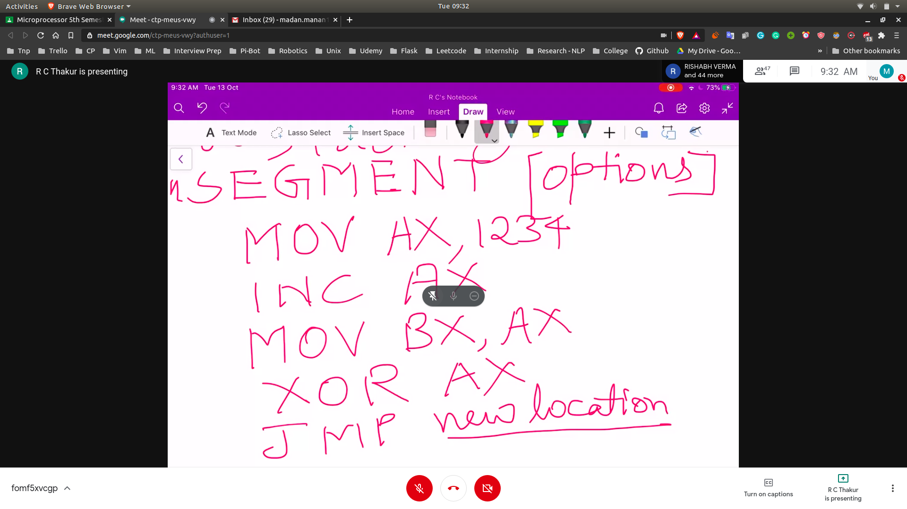
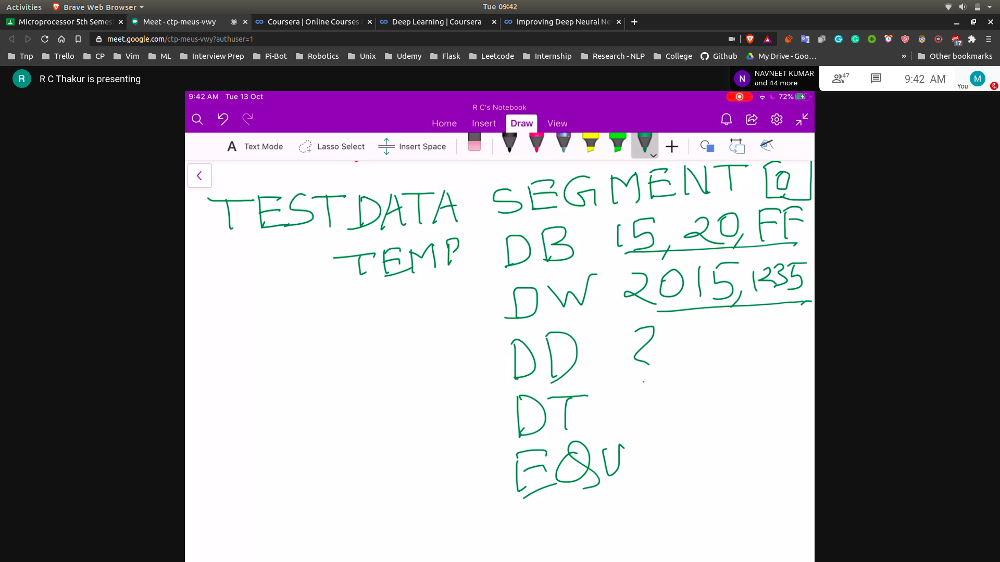

## Use of segementation
- It isolates the code and the data 
- The total number of segements can be 64k , each with the difference of 16bit
- 16byte = 10H
- Hence the difference between 12340H and 12350H

## How to define memory segment by the assembler
- SEGMENT [options]
 - You can write the program in the segment
 - 
 - Then in last you can write ENDS
 - This will make a segment which containts the above command in it

- What are the options here?
- Allignment of code in the memory : PARA

- How to define data segment?
- TEST DATA SEGMENT[options]
- 
- ENDS

## Other kinds of segements
- [name] PROC
- ENDP

- MACRO
- ENDM
