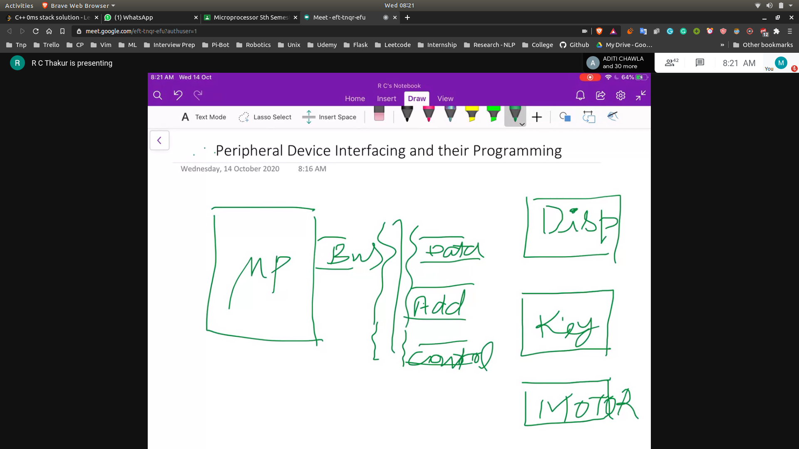

# PCI devices and their working
- 
- Activities with the help of clock
- Machine Cycle
 - Opcode fetch
 - Mem Read

## Peripheral Interfacing
- PPI-8255
- I/O interfacing
- Providing 3 set of interfacing arrangements
- Port A
  - Having Pins A_0 , .... , A_7
- Port B
  - Having Pins B_0, .... , B_7
- Port C
  - Having Pins C_0, .... , C_7

- Key Signal 
