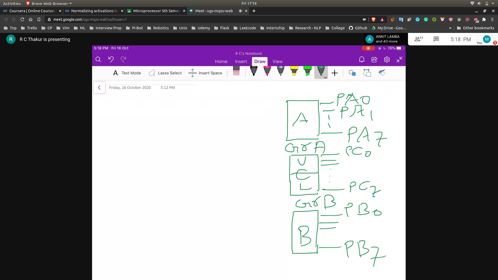
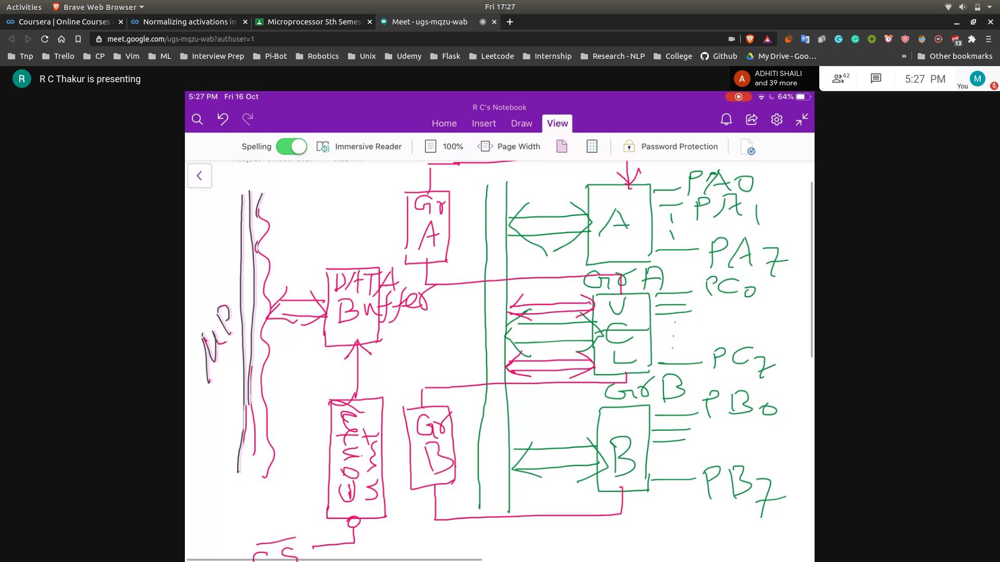
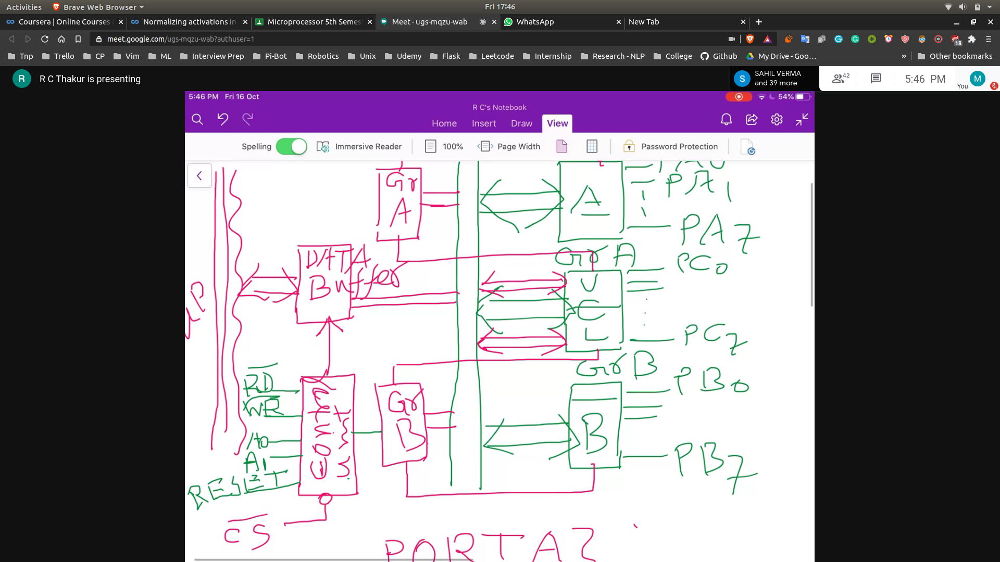
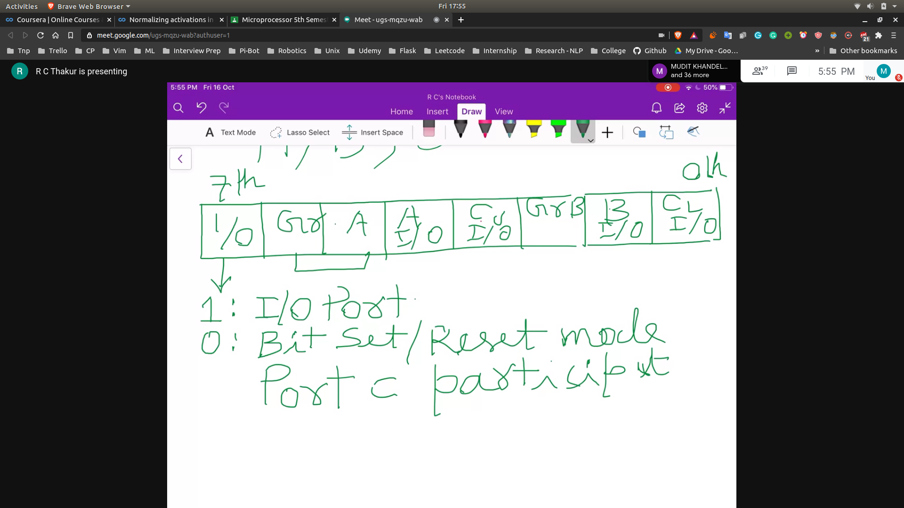

# Programming of Peripheral Devices (8255)

## I/O Ports
- Port A , C , B can be used an I/O ports
- Each port can have 8 pins
- 

## Groups
- Each group can control multiple ports

## Data Buffer
- Sending data from microprocessor to the bus

- 

## Target [External Entity]
- Given PORT A , B , C
  - When read/write information is given , these will get configured
- Control Word
  - Microprocessor will read the status from this.

### Adressing of Targets
- 2 bits can be using to address the targets
  - On the control unit

- We will also require a read bar and a write bar
- Also we will need on the reset signal
- 

### How it works?
- Control Unit will send the information to Port A and Port B
- Control Word Format
  - It is of 8 bit size
  - Port A , B , C is also of 8 bit size
### Control Word 
- 

## Mode
Grp A
- 00 -> Mode 0
- 01 -> Mode 1
- 10 -> Mode 2
- 11 -> Invalid
Grp B
- 0 -> Mode 0
- 1 -> Mode 1

Mode O -> Simple I/0 
Mode 1 -> Handshake I/0 
Mode 2 -> Bidirection I/0