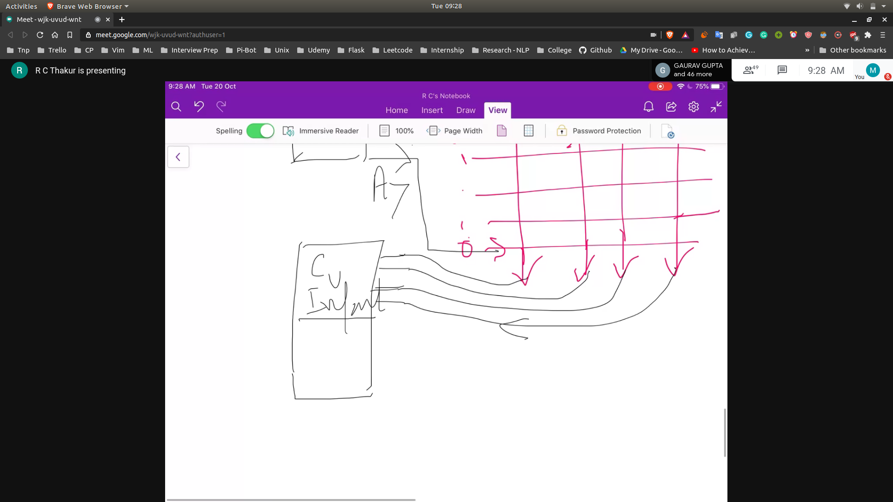
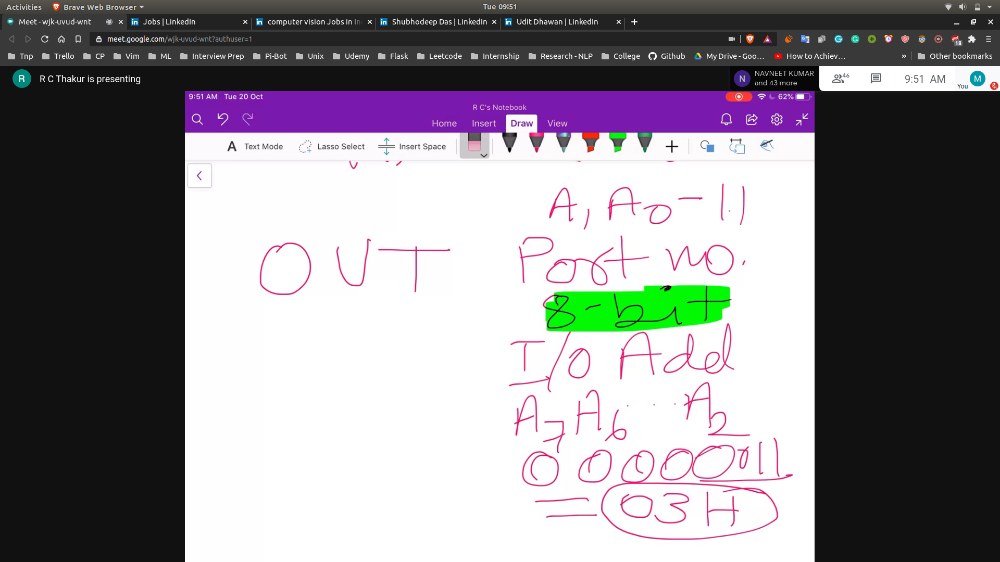

# Programming of 8255
- So we have 4 ports $A , B , C_l , C_u$

## Interfacing Examples
- Suppose we have to interface a keyboard
- Keyboard Structure
    - 
    - When you press the key there is a connection in b/w the x and the y axis
- Port A has to configured as an output port
- Port C will be configured as an input port
    - 
- NOW IN ORDER TO CONFIGURE WE NEED TO PROGRAM IT
- So we will give the command using the Control World

### Control Word
- 7th bit will be one because it is in I/0 Mode
- 5th and 6th will be 0 0 because of I/0 Mode
- 4th will be 0 to tell A is in output mode
- 3rd Will be 1 to tell C_l is in input mode
- Last 3 values do not matter as we are not using B and CL
    - CW - 10001000

## Final Program
- 
- MOV AL,88H
- OUT 03H (adress will get floated on the adress bus)
- IN 02H
