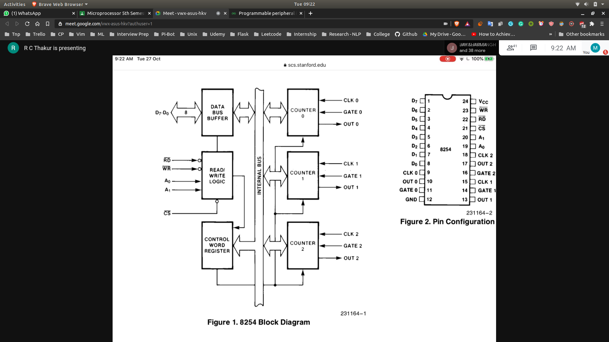
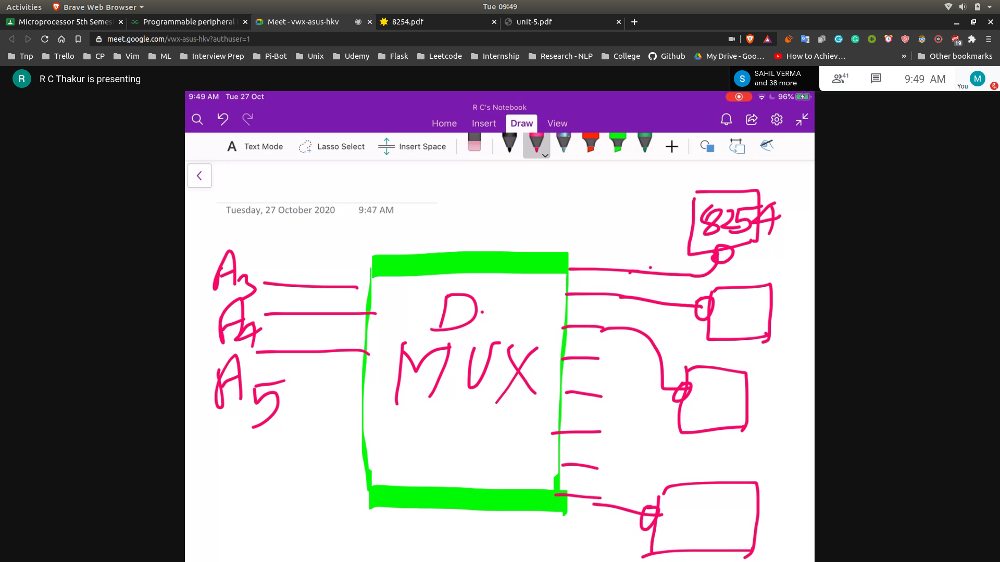

# 8254 block diagram
- 
- Counting of external events is the main purpose of 8254

## 3 pins
- CLK
  - Input for the Counter , so that it can count interval after gate is opened
- GATE 0
  - If gate is 0 nothing will be count!.
- OUT 0
  - The reaction of the process will be given at the out pin

## 4 targets for the Microprocessor
- **Tagets : Location where it will read or write**
- TARGETS
  - control word register
  - counter 0
  - counter 1
  - counter 2
- Targets can be controlled by using 2 adress lines $A_0 and A_1$

## Chip Select Pin
- Choose a CHIP connected to the the counter
- 
