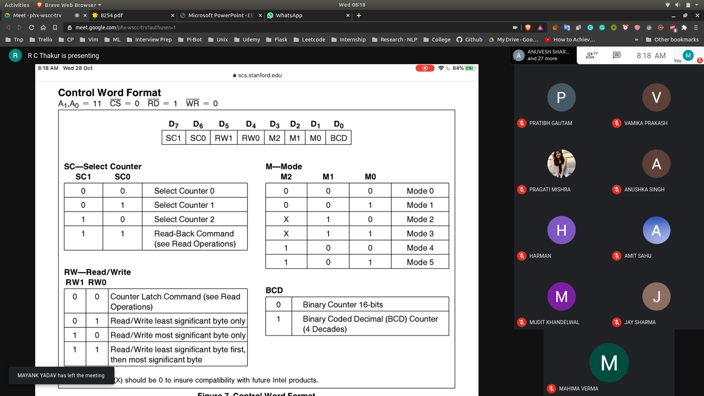
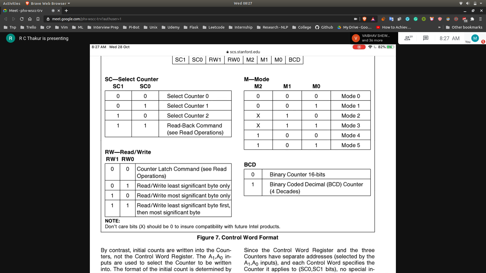
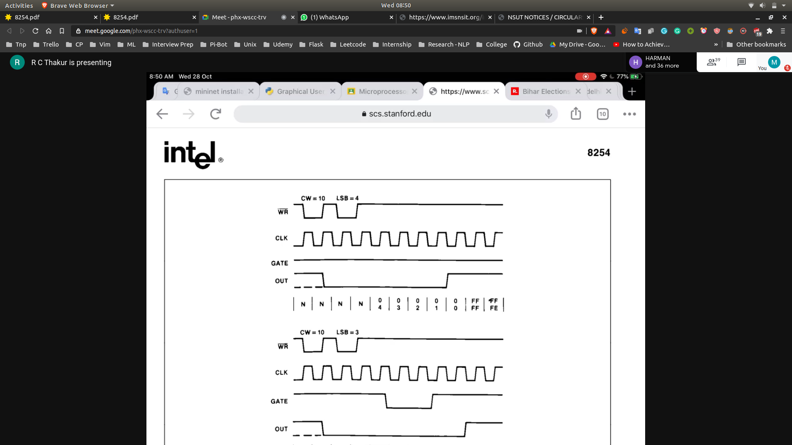

## Control Word for 8254
- 

### D0 bit
- For binary counting
  - 0000H -> FFFFH
- For BCD
  - 0000H -> 9999H (10,000 counting in BCD Mode)

### D1 , D2 , D3 bits
- 6 Modes are available
- 

### READ/WRITE Pins
- The data bus connecting from MPC to 8254 to 8bit bus
- Since the data bus is 8 bit and counter can read/write 16 bits
- So we will do it in One time we will read upper byte and then lower byte

### D6,D7
- Selecting the counters
- Read status

## Modes

### Mode 0
- 
- First the counter is supplied and gate is high
- But the counting has not begun as out is high
- If the gate is low , counting is disabled (if started , it will be stuck)

### TO DO : REST OF THE MODES
