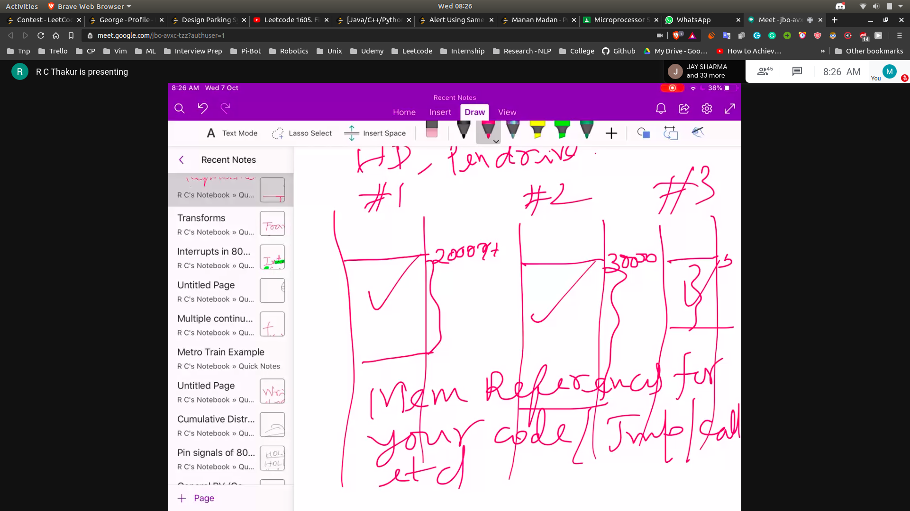
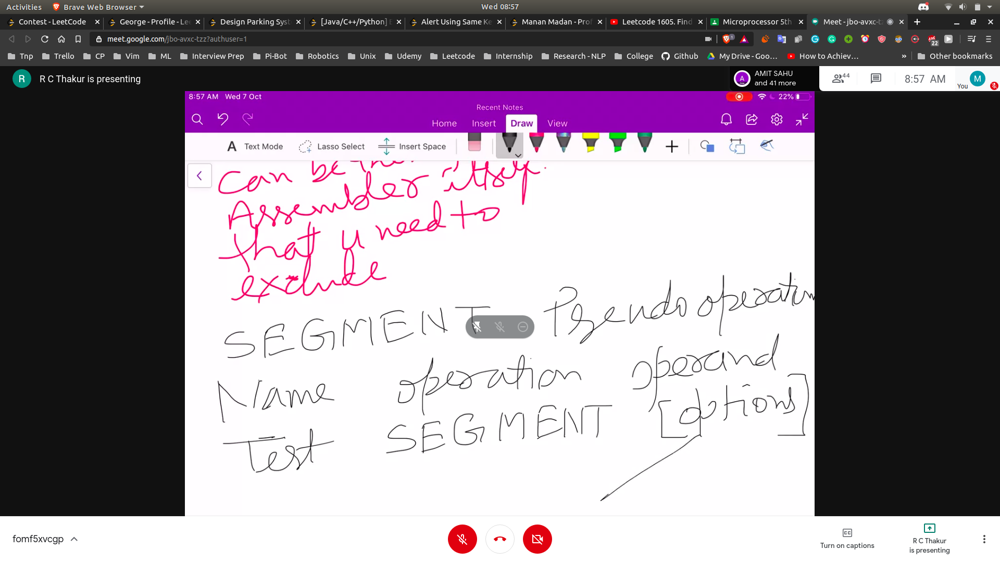

## Mem References for you code/Jum/cal
- 
- Allocated memory location will be different
- What to do in JMP etc. will be stored in different memory references

## Write Gen Manner
- When we write the program in generalised manner
- Prog --> Compiler --> Machine Code
- Compiler will store the relative adresses from the memory to run that program
- Linker will link the function subroutine together to get make the whole program 
- Then based on the operating sys , the compiler will get absolute addresses

## Modules in assembly
- Symbolic names will be there for varaibles , function , labels etc.
- There a some rules for writing in assembly language

## General Form - (Assembly Language)
- [name] operation [operand(s)];
- Name
 - Naming is optional
 - Name --> Alphabetic letter , digits , special char
    - first char has to be alphabetic or special chars
    - first char cannot have digits , maximum size = 31
    - some reserved words can be there from assembler itself that we can exclude them
- Operation 
   - Mnemonics defines a feild work area or constants in a seg
   - Pseudo-operations
- Operands
   - associated data or reg
- Comment

- eg MOV AX,55H
  - MOV is the operation
  - Operands are AX,55H

## Imp Operations
- 
- Boundaries that can be define
- Align Type
- Combine Type
- Class Type