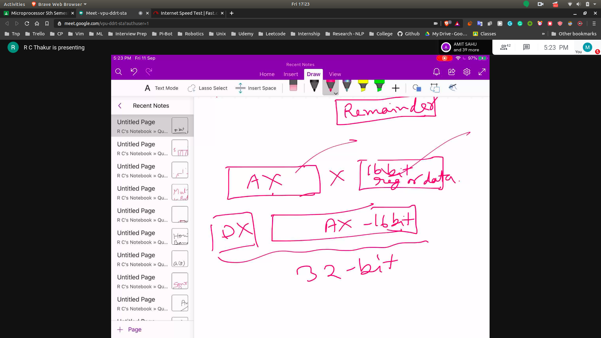
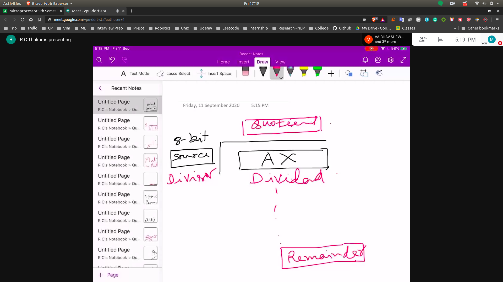
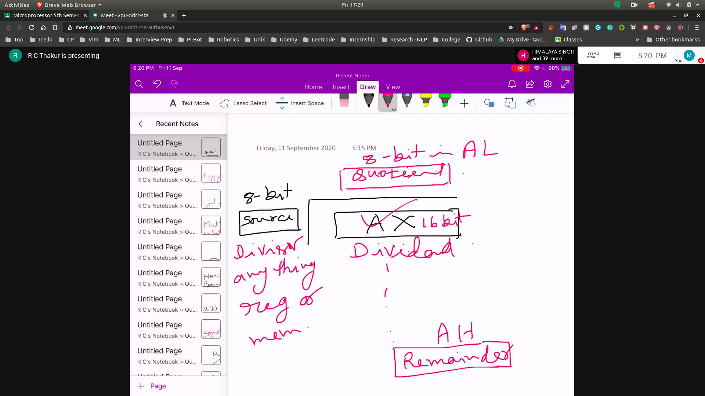
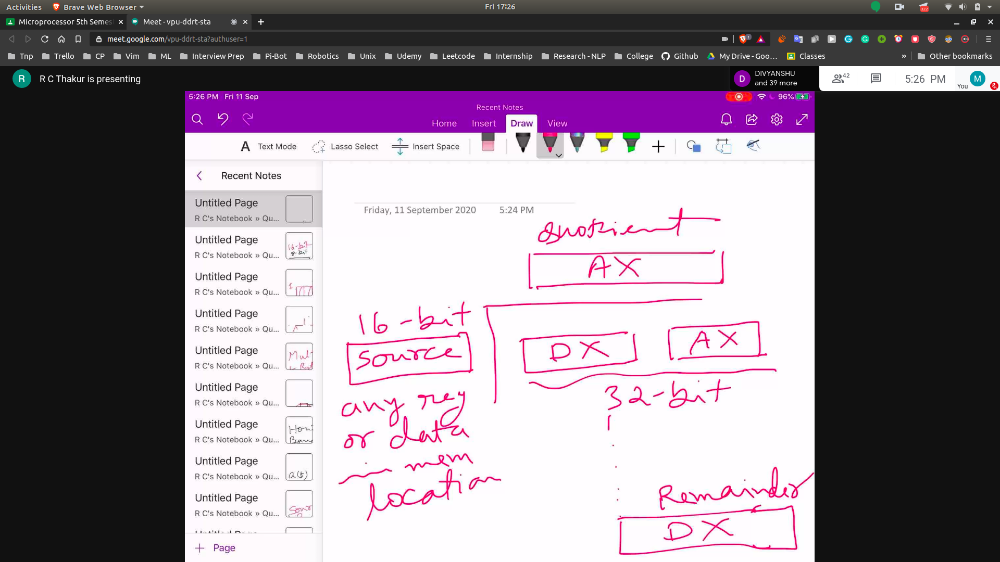
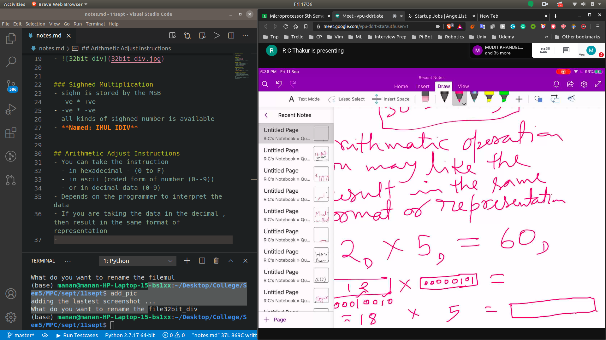

## Arithemeric Instruction

### Multiplication
- 

### Division
- 
- In terms of Memory
 - 
- Basically divisiion is just the opposite of multiplication

### 32 bit division
- dividend is composed of DX and AX
- divisor is 16bit , (can be in any reg)
- quotient will be in ax registor
- remained in dx register
- 

### Sighned Multiplication
- sighn is stored by the MSB
- -ve * +ve
- -ve * -ve
- all kinds of sighned number is available
- **Named: IMUL IDIV**

## Arithmetic Adjust Instructions
- You can take the instruction 
  - in hexadecimal - (0 to F)
  - in ascii (coded form of number (0--9))
  - or in decimal data (0-9)
- Depends on the programmer to interpret the data
- If you are taking the data in the decimal , then result in the same format of representation
- If the register stores the data in binary , then it might interpret it wrong
- For eg.
  - basically multiplication is in binary
  - 

### Solution
- Hence we have adjustment instruction to covert from one form to another
  - **Look in the book**
  - DAA
  - DAS
  - Similarly we have for ascii
  - AAM (ascci adjust after mul)
  - AAS ( " subtraction)
  - AAD ( " division)

- Diff b/w Decimal and Ascii
- In ascii simply does the unpacking of the packed number so that you can add seperately the base value of ASCII ie 30

# Logical Instruction 
- 2 imp instruction 
 - Shift 
   - Like mul by 2
   - Div by 2
 - Rotate
