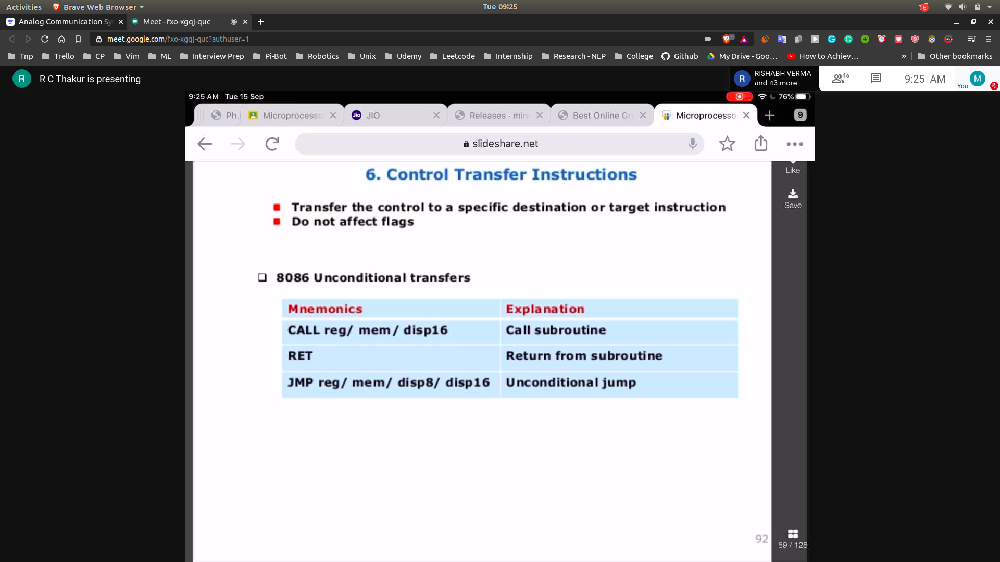
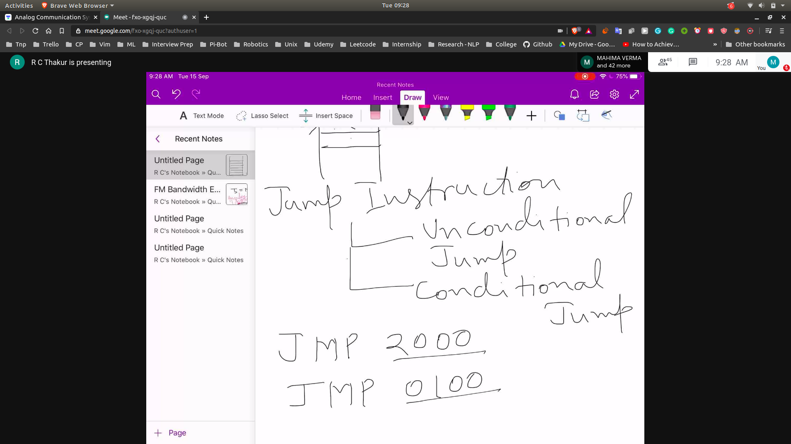

### Processor Control Instructions

## Control Transfer Instruction
- 

### Jump Instruction
- 
- Near Jump
  - Jump within the same segement
- Short Jump
  - Within the same segement
  - relative position up or down +127 to -128
- Far Jump
  - 

### Call Routine
### Differenciate b/w call and jump