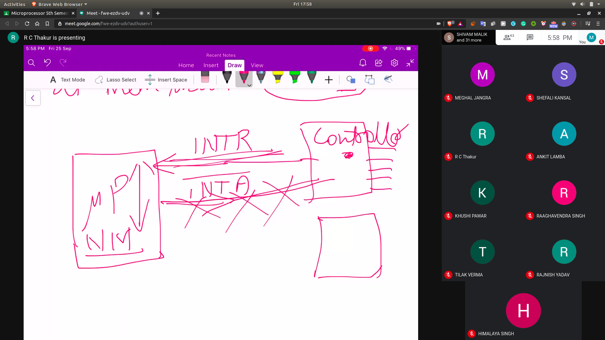

# Interrupts

## Types
- 2 Types of Interrupts
  - Software Interrupts
  - Hardware Interrupts

## How to interrupts work?
- Their is a Normal Program execution
  - These codes are stored in the memory
  - and the MPC will try to run it

- When you shutdown?
  - It stores the status of the machine
  - Then when you switch it on
  - Then it will be able to restore the state of machine

- Mainly there can be many small programs running
- Now there will be some interrupts in the normal routine

### How to recoginize the type of interrupts?
- There is a Memory Allocated in ROM for Int. called as Int. Vector
- The data in the Int. Vector to help in indentifying the kind of interrupt

## Interrupt Handler Subroutine
- Get the data from interrupt line
- Check the type of interrupt from the interrupt vector
- Execute the commans to follow accordingly

## Software Interrupts
- They are getting initiated through the instructions

## Hardware Interrupts
- Coming through external pins
  - INTR
    - Here it will check the flag ans then execute the INTR Line
    - It is active high
    - If high voltage for some time then it is recoginised

  - NMI
    - None Maskable Interrupts
    - Directly execute , no checking the flag
    - Eg: Power Failure
    - Rising Edge Trigger

- Flag Reg --> Interrupt Flag
- If this is 1 , then only the flag can be recoginised
  - This is done by interrup controller
  - 

**NMI control is transfered is transfered at mem location at 0008-BH**
