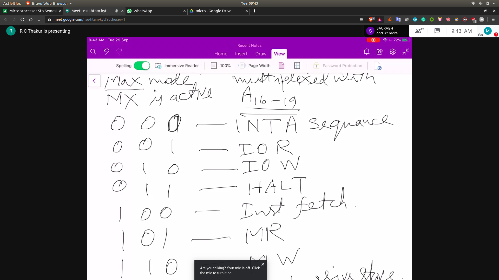

# Pin Signals of 8086 to coordinate other co-processors or peripherals

- It can access other devices using Bus or pin signals

## Pin Signals
- HOLD
   - Hold is an active high CPU input that causes the processor to go for open ckt. for all of it's bus lines.
   - This disconnects the CPU from it's mem and I/O connected to it and allowing a second processor to acess these devices which is called normally DMA

- HLDA (Hold Acknowledge)
  -  This helps the other device to know that the CPU is not using the memory 

- Request Grant Signal
 - ($RQ_0,GT_0$) and ($RQ_1,GT_14)
 - similar to HOLD/HLDA
 - up releases it's buses with pulse signals through (RQ/GT)

- Queue Synchronisation
 - 0 0 -> 
 - 0 1 ->
 - 1 0 -> Queue is cancelled
 - 1 1 -> next byte of the opcode is processed

- Status Signals
  - S0,S1,S2
  - S3,S4,S5
  - 

- All this is in on Page27 of the PDF of Bharat Academy Notes
