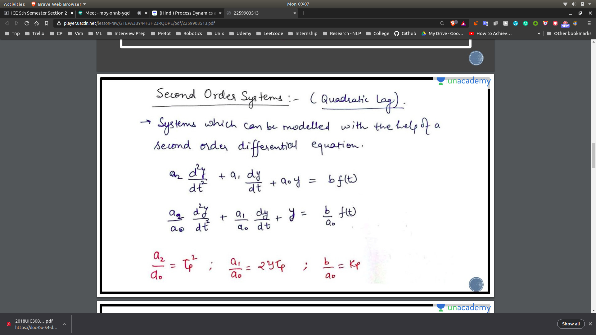
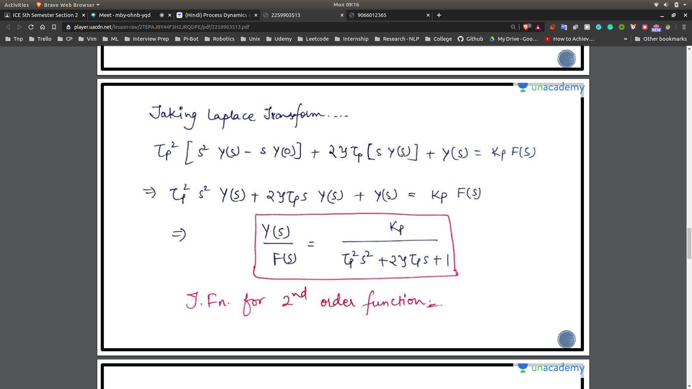
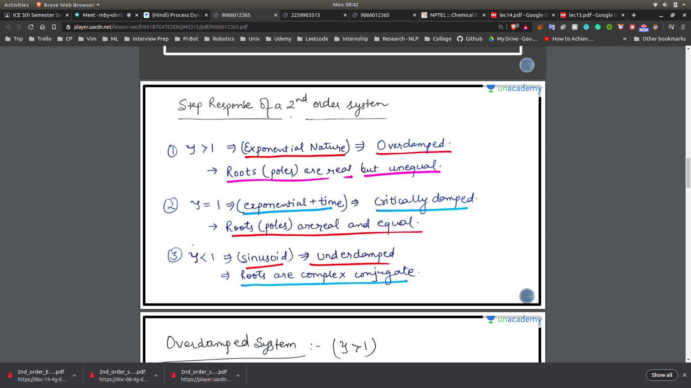

## Second Order Systems
- The second order equation can be written as:
- 
- Here t_p ===> Natural Period of oscillations
- y ===> Damping Coefficient
- k_p ==> Process Gain

## Converting into Laplace

- Taking Laplace Transform , we will get
- 

- Slides in the today's folder only

## How to make 2nd order using the First Order

 **Check  in the NPTEL Examples Side for each of these Examples**

- By cascading the 1st order in series the to get the second order system
- If propotional integration is applied to the first order system it will become a second order system
- Inherent Systems
- No need to derive these equation , just know examples from high level

## Examples

**Check  in the NPTEL Examples Side for each of these Examples**

- Spring Mass Damper
- Manometer
- CSTRs in series (NPTEL Slides)
   - Also go in the calculation for this system!
   - Try to cascade and get the calculation

## Damping

- Discussed Damping -- Overdamped , Critically Damped , Underdamped
- 

## References

- NPTEL Slides (Also in the Folder)
- Unacademy Slides (Also in the Folder)

