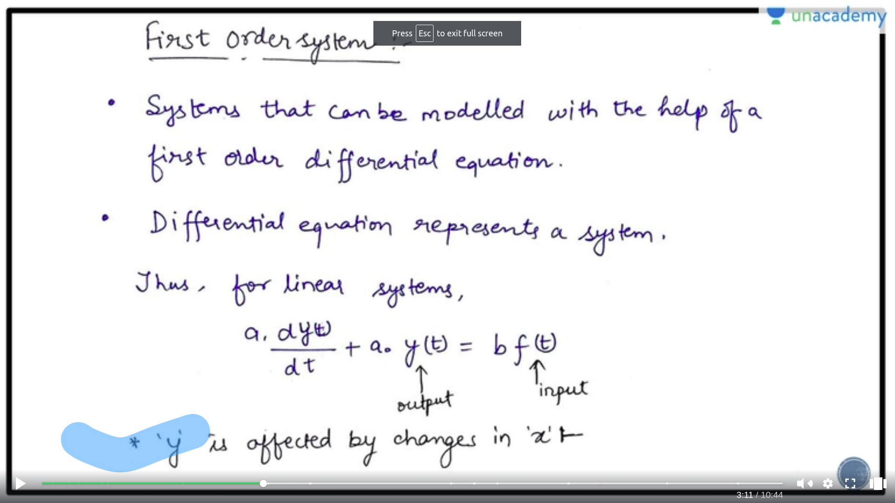

## Operational Criteria
- Some Operational Criteria are imposed on the design engineer
  - Safety
  - Environmental Regulations
  - Product Specification
  - Operational Constraints
  - Economics
- The above mentioned criteria make a requirement for control of chemical process

## Basic Architechture of Control System
  <-----|CS|-------|Sensor|
  |                    |
Input--->|Process|--->Output

- Process Inputs : The external influences that can affect the dynamics of our system
- Process Output : The entities that are influenced by these inputs

## Basic Control Structure

- Feedback
  - Measure the output and then control the input variable
- Feedforward
  - Measure the input and directly control it
- 

## Process Modelling
- Basically Generating a mathematical model for the process in order to control it!

### State Variables and Equations
- State Variables
  - These are independent quantities that describe the natural state of a given process
- State Equation
  - Then are the equations that describe the change in the states with time

### Modelling of a STR
- Before modelling , you should know certain things
   - State Variables : h,T
   - Output Variables : h,T 
   - Input Variables : Q,F_i ==> manipulated
                       T_i ==> disturbance
  
- Diagram
   - 

- We will use 2 laws
  - Balance of Material
  - Balance of Energy

- Balance of Material
  - 

- Balance of energy
  - 

- Final Equations
  - 

## Input Functions
- When we define a model , we test it on some kind of inputs like
   - Step Input Function
   - Rectangular Pulse Input Function
   - Unit Pulse Input Function
   - Impule Input Function
   - Ramp Input Functions
   - Sinusoidal Input Functions

### Step Input Functions
- 
- This use to test how does the model behave in presence of a sudden change in the input
    - Plot of how the step function changes the output of a running plant
    - 
- **Deviation Variable**
  - A = f(t) - fss 
  - Basically this variable indicates how far the input is from a given steady state

### Rectangular Input Functions
- Sudden change but system comes back to it's original state
-  

### Unit Impluse Function
- 

### Impluse Function
- 

### Ramp Input
- 

### Sin Input
- 

## First Order System
- Those system that changes wrt to the first order
- 

### Step Input Response
- First order transfer function is
  - **Main Formula**
  - $G_p(s) = Y(s)/X(s) = K_p/(T_p*s + 1)$
- 
- Then do partial fractions
- Taking inverse laplace
  - and get the formula in the time format
  - and get the response
- 

### Steady State Gain(Kp)
- time t = Tp
- y(t)|t=tp  = AKp(1-e^(-1))
- y(t)|t=tp = 0.632 * y(t)|t->inf
- 

### Time Constant(Tp)
- time taken by the process to reach 63.2% of the ultimate value of the response(UVR)
- 

### Impulse and Ramp Input Response of a first order system

### Sinosoidal Input Response of a first order system
- Y(s) = (Kp/(Tp*s+1)) * (Aw/(s^2 + w^2))
- 
- the e_(-t/tp) factor decays
- if then the term can be written in be sin form
- 
- There is a phase lag in it
  - The output magnitude will decrease
  - and there will be a phase lag in the input

- Prop
  - We can find the amplitude ration in this thing
  - Phase difference

### Example of the first order system
- Balancing the hieght of the system to be a particular order
  - 
  - Now arrange the equation in the form of time equation , by taking the inverse laplace 
  - Compare this to the equation of the first order system and take the values of to form the general transfer function of the system
  - 

### Purely Capacitive System

## Second Order System
- Any system that we can model with the help of second order system
- Terms 
  - zeta : damping factor
  - tp : Natural Period of oscillations
  - Kp : ss gains

- Transfer function of the second order systems
  - 

## Step Response
- Nature of the step response of the system
  - zeta > 1 ==> overdamped system (exponential)
     - poles are real but unequal
  - zeta == 1 ==> critically damped
     - poles are real and equal
  - zeta < 1 ==> underdampes
     - roots are complex conjugate

- **zeta** means the **Resistance** offered by the system
- if zeta is more the system is more sluggish
- if zeta is less the system is fast

### Inherently Second Order Systems
- 

### Properties of the under damped system
- 

- Overshoot
  - 

- Decay Ratio
  - 

- MVR (Maximum Value of response)
   - 

- Period of Oscillation
   - 

- Natural Period of Oscilation
  - 

- Rise Time
  - 
  - Variation of rise time with the zeta
  - 
