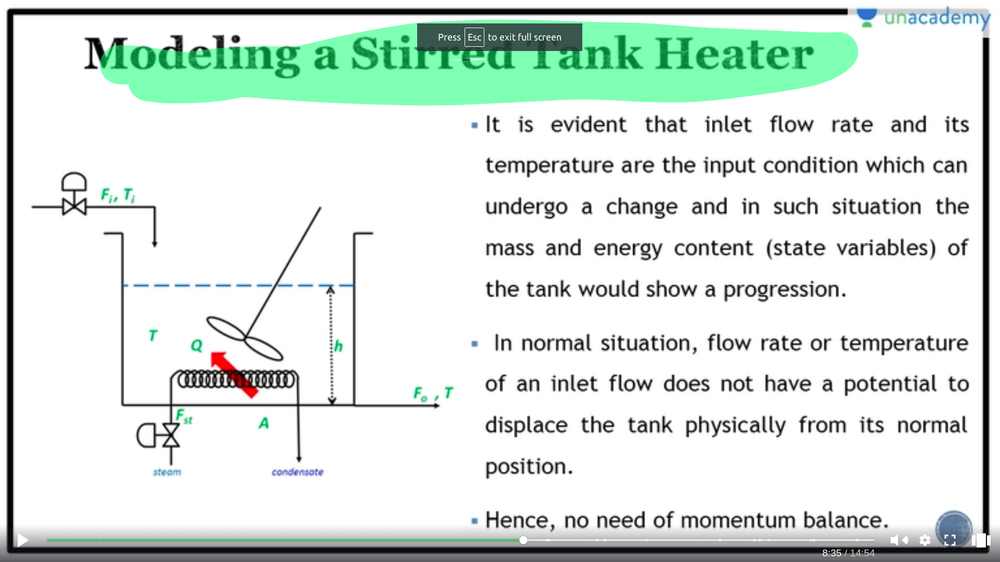
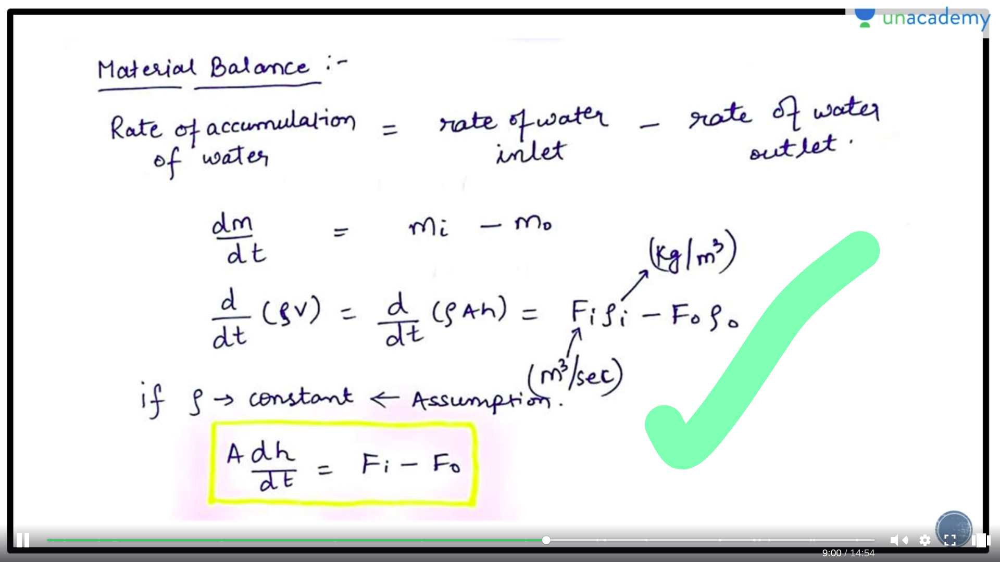
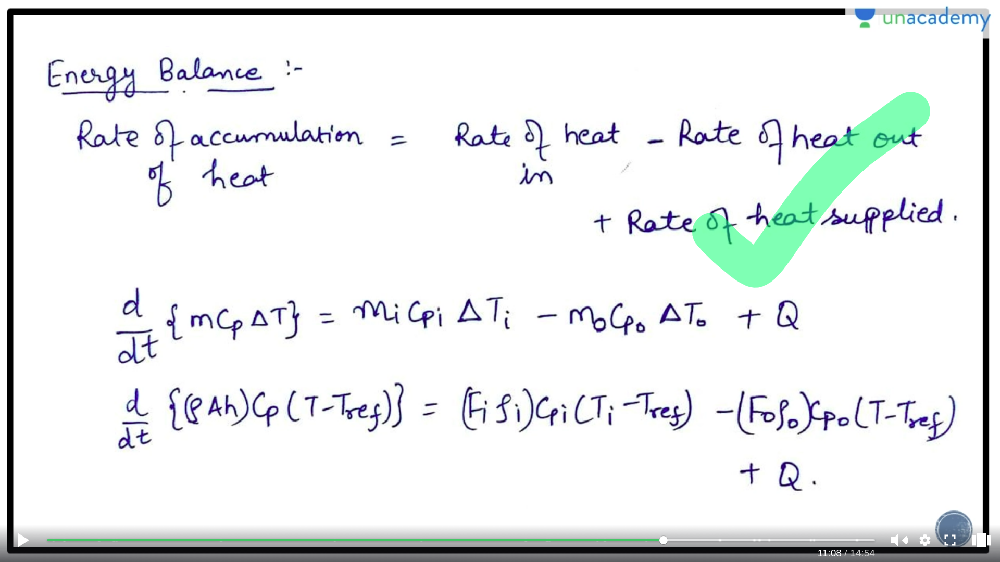
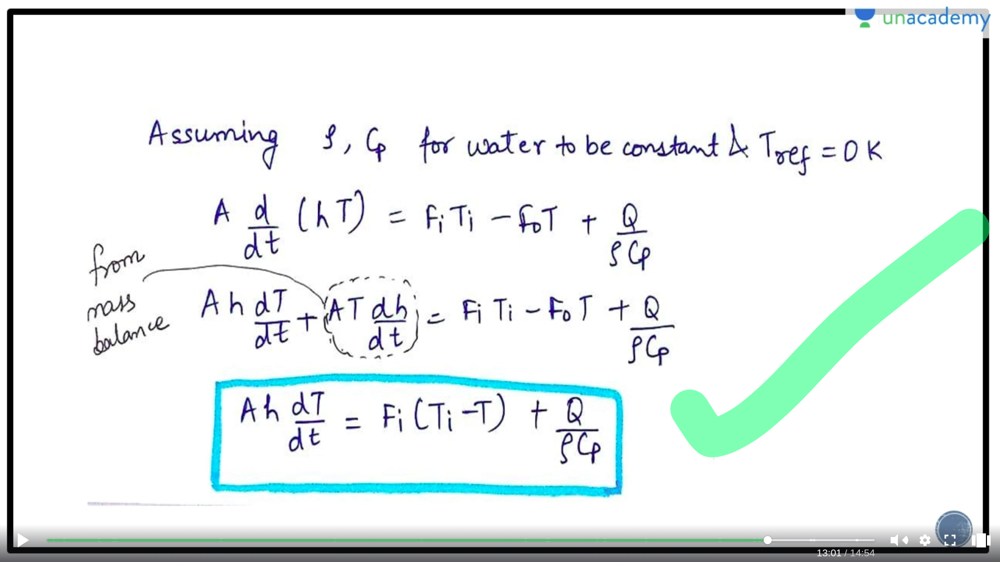

# On Numericals
- Modelling of system
- Linearisation of non-linear system

## Linearisation

### Process
- First model the system in an non-linear equation using mass and energy balance
- Assume the equation to be at steady state then and change the variables accordingly
- Subtract the present non linear equations and steady state
- introduce deviation variable
   - Deviation variable is the diff b/w the present state and the steady state
- then expand on the values of non linear using the taylor series
- f(x) = f(a) + f'(a)/1! * (x-a) + f''(a)/2! * (x-a) * (x-a)
   - here a will be the steady state variable
   - x will be variable having present state
- Now , ignore upper values in the taylor series , only considering linear terms
- Then take the laplace of the system and obtain the transfer function required
- [process](https://www.youtube.com/watch?v=_7iQcXJ_G5k&t=653s&ab_channel=RajMusale)

## Process Modelling
- Basically Generating a mathematical model for the process in order to control it!

### State Variables and Equations
- State Variables
  - These are independent quantities that describe the natural state of a given process
- State Equation
  - Then are the equations that describe the change in the states with time

### Modelling of a STR
- Before modelling , you should know certain things
   - State Variables : h,T
   - Output Variables : h,T 
   - Input Variables : $Q,F_i$ ==> manipulated
                       $T_i$ ==> disturbance
  
- Diagram
   - 

- We will use 2 laws
  - Balance of Material
  - Balance of Energy

- Balance of Material
  - 

- Balance of energy
  - 

- Final Equations
  - 

## TODO
- Questions on Modelling
