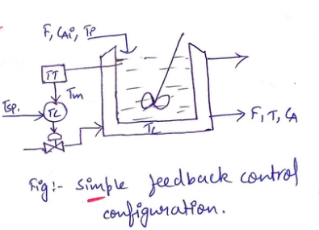
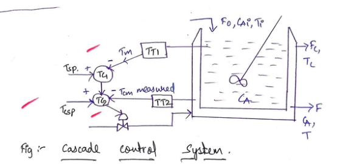
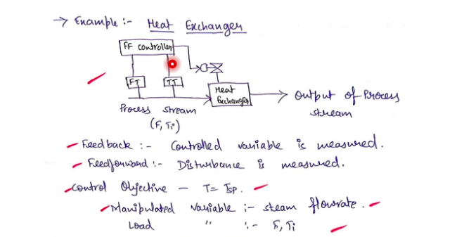
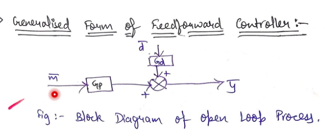
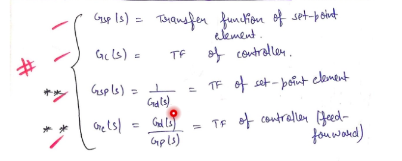

## TOPICS COVERED
- CASCADE CONTROL
- FEEDFORWARD CONTROL

## Cascade Control

- Difference b/w Feedback control and cascade control
- In feedback control , there is only one manipulated variable and only one measured variable
- In case of cascade control , there are many measured variables and only one manipulated variable

*"Generally cascade control is used when more than of the measurements may effect the manipulated variable"*

Jacketed CSTR
-------------

- In case of feebak control in Jacketed CSTR 
- 
    - Here the measured variable is the temprature of the liquid excluding the jacket and the manipulated variable is the flow rate of the coolant

- **Problem with the Feedback system**
- Change in temprature of the coolant will slowly affect the temprature of the input , hence the controller will not be able to compensate it quickly
- SOLUTION : We take both the coolant temprature and the input temprature without the jacket as the input to the control system

- Cascaded System
- 
- In this case there are 2 measurements the temp of the coolant from the jacket , and the temp of the input liquid without the jacket and the manipulated system is still 1

- In cascade control there are always 2 processes happening , one is called the primary loop and other the secondary loop

- **Closed Loop Block Diagram for cascade control**
- 
- So the outer loop is called the primary loop and the inner loop is called the secondary loop.
- We can calculate the transfer function of this system according to the block diagram one the gains are know to us

## Feedforward control
- Feedback control is the a form of *"compensatory control"*
- Whereas feedforward control is a form of *"antecepatory control"*
- Here the manipulated variable is changed before the change has happened into the system
- 

- **Generalised Form of feedforward controller**
- 
- on solving we can get the relation b/w diff Gains of the equation
- final results we get
- 
