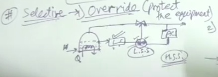
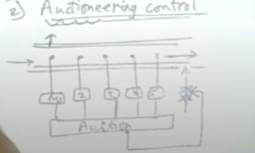

## Selective Control
*"Selective control system is a form of multivariable control in which more than one controller (atleast two) is employed to manipulate the same process and the selection of controller is determined by a constraint."*

- It can be of 2 types
    - Override control
      - It is generally used during startup / shutdown
      - Basically used to protect the system from extreme condition 
    - Eg of override control
      - 
      - In this example the manipulated variable is Q the heat of the heater
      - But Both the level and pressure are the imp factors to monitor as both of them exceed a certain quantity then the system can rupture
      - So in case of override control if the level of the tank for example is lower then a certain limit , then the system will use the level controller and override the pressure or any other controller
      - "Basically it is used when some variables in the sytem are so important that if they are distrubted then we shoud **override** all the other processes and compensate their disturbance
    - Auctioneering Control
      - 
      - In this type of system we take in measurements of 3,4 variables and **auction** these value for the max or the min value and then take action upon that.

## Inferential Control
- In inferential control we use on of the measured variable as a proxy for another variable that can not be measured properly
- Reasons to use inferential control
    - Excessive deadtime with sensor (measuring the controlled variable ) + this must be avoided
    - Cost is prohibitive - online analyzer sensors are expensive , so it is important to measure other sensors in order to infer main variable
    - Required sensor insn't even avaialabe to measure

- **Requirement** 
    - A good model is needed in case of inferential control 
    - A good model of how the measured variable related to process variable is needed

- **Example of distillation column**
- [vedio-link](https://www.youtube.com/watch?v=88G1ZJh5P7o)
- After 8:52 is the example of distillation column