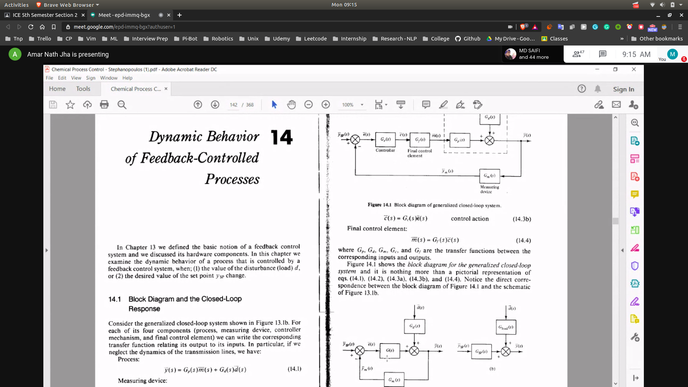
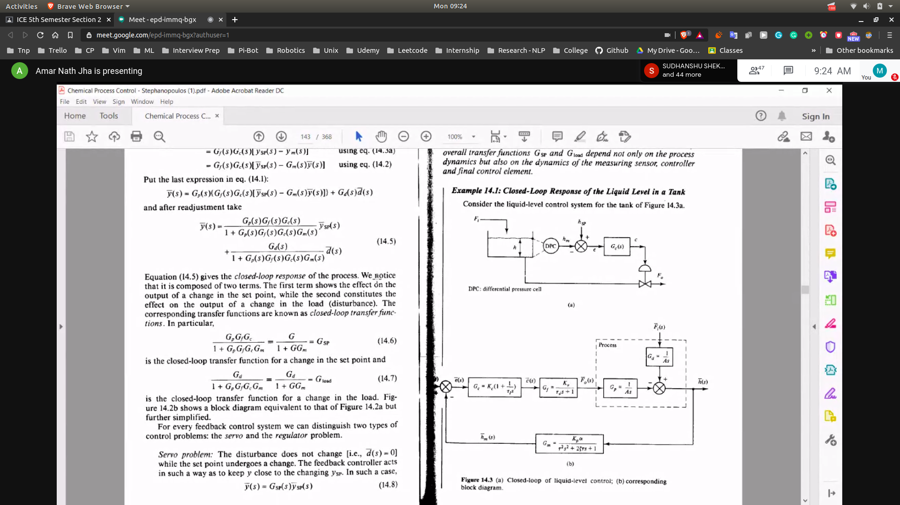
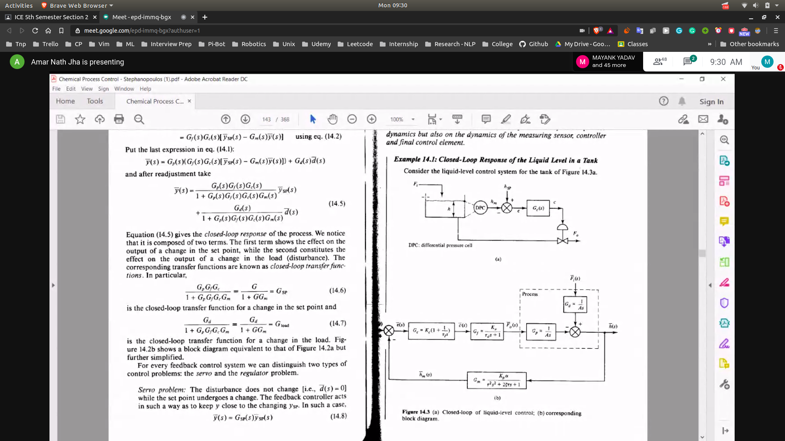

## Dynamic Behaviour of Feedback Controlled Process
- To be read from G Stephanapulous ( Chapter - 14)
- 
- There are 2 terms in the transfer function
  - one due to the disturbance
  - one due to the set point
- 

## 2 types of problems
**Also in stephanapolous**

- Servo Problems
  - disturbance does not change
  - set point may change
- Regulator Problems
  - set point does not change
  - disturbance changes

## Closed Loop Response of Liquid Level in a Tank
- set point is Hsp
- 
