## Operational Criteria
- Some Operational Criteria are imposed on the design engineer
  - Safety
  - Environmental Regulations
  - Product Specification
  - Operational Constraints
  - Economics
- The above mentioned criteria make a requirement for control of chemical process

## Basic Architechture of Control System
  <-----|CS|-------|Sensor|
  |                    |
Input--->|Process|--->Output

- Process Inputs : The external influences that can affect the dynamics of our system
- Process Output : The entities that are influenced by these inputs

## Basic Control Structure

- Feedback
  - Measure the output and then control the input variable
- Feedforward
  - Measure the input and directly control it
- 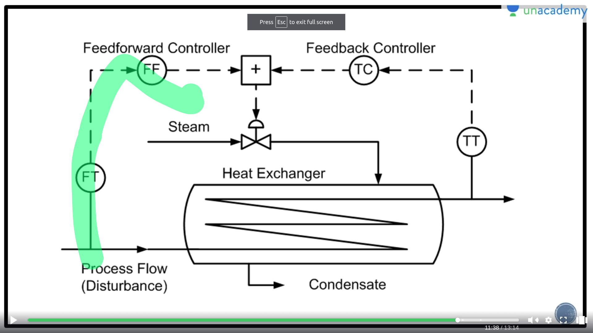

## Process Modelling
- Basically Generating a mathematical model for the process in order to control it!

### State Variables and Equations
- State Variables
  - These are independent quantities that describe the natural state of a given process
- State Equation
  - Then are the equations that describe the change in the states with time

### Modelling of a STR
- Before modelling , you should know certain things
   - State Variables : h,T
   - Output Variables : h,T 
   - Input Variables : Q,F_i ==> manipulated
                       T_i ==> disturbance
  
- Diagram
   - 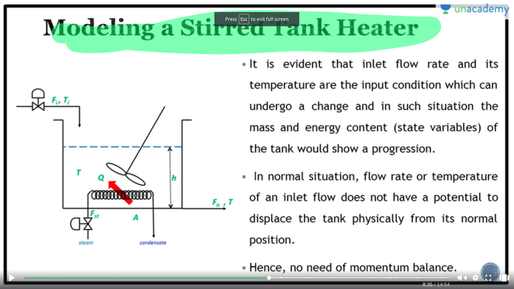

- We will use 2 laws
  - Balance of Material
  - Balance of Energy

- Balance of Material
  - 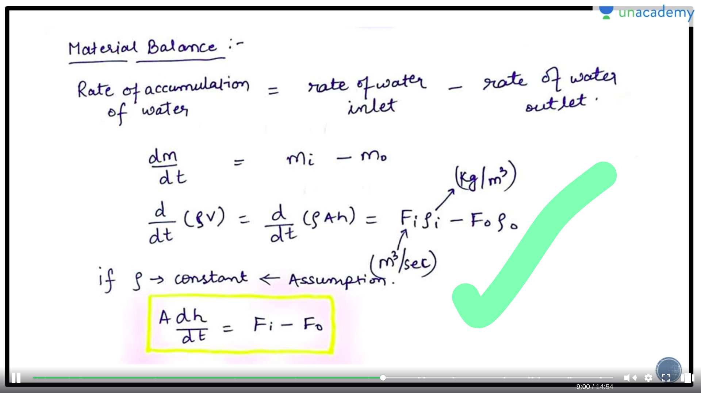

- Balance of energy
  - 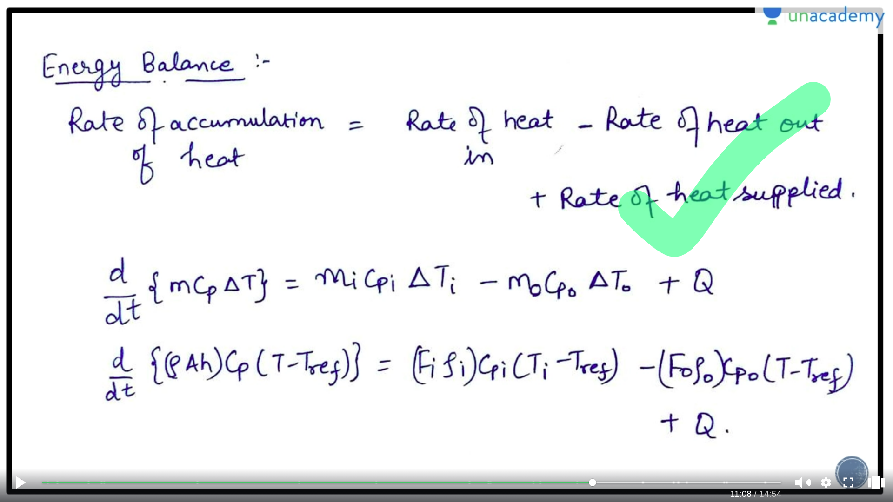

- Final Equations
  - 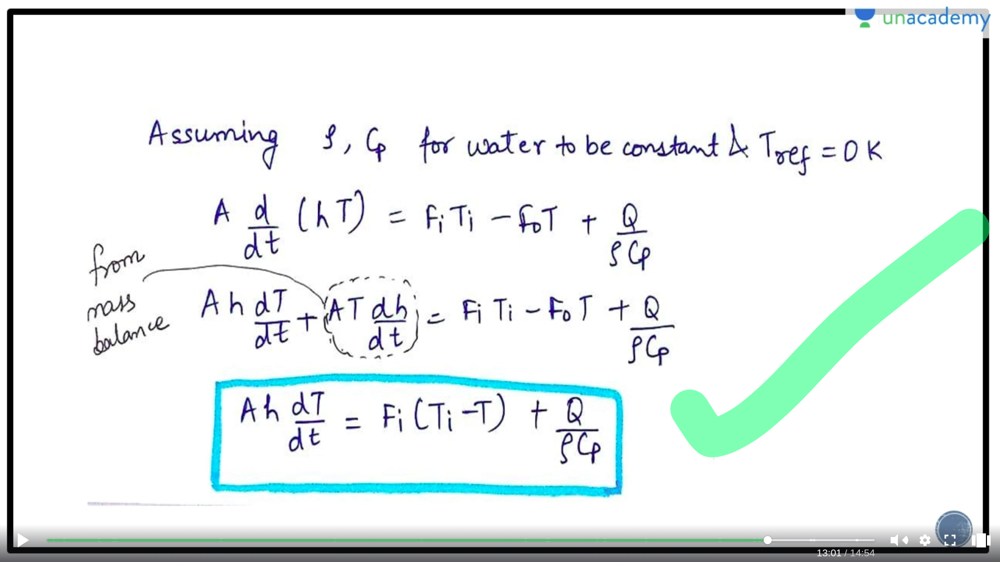

## Input Functions
- When we define a model , we test it on some kind of inputs like
   - Step Input Function
   - Rectangular Pulse Input Function
   - Unit Pulse Input Function
   - Impule Input Function
   - Ramp Input Functions
   - Sinusoidal Input Functions

### Step Input Functions
- 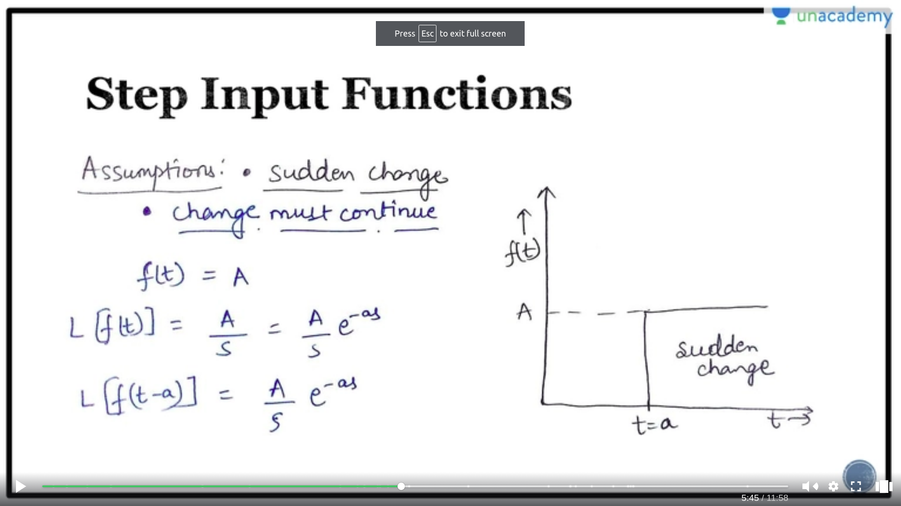
- This use to test how does the model behave in presence of a sudden change in the input
    - Plot of how the step function changes the output of a running plant
    - 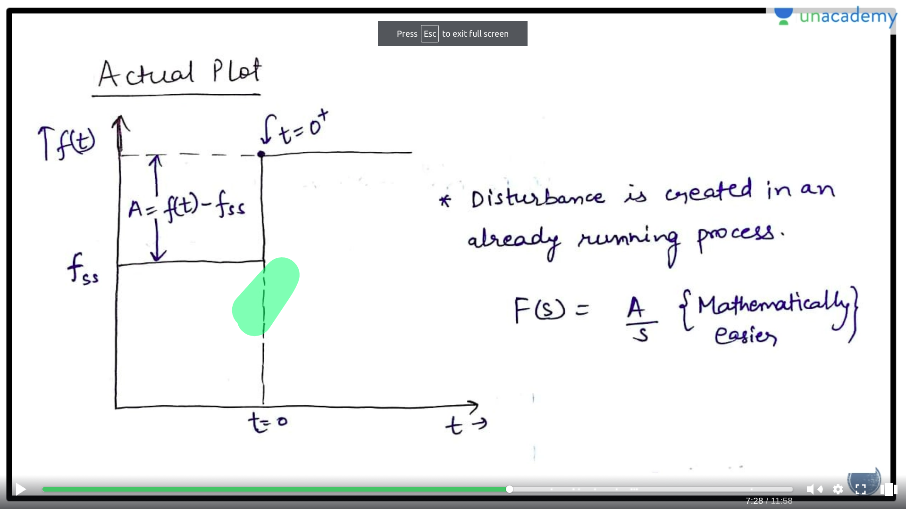
- **Deviation Variable**
  - A = f(t) - fss 
  - Basically this variable indicates how far the input is from a given steady state

### Rectangular Input Functions
- Sudden change but system comes back to it's original state
-  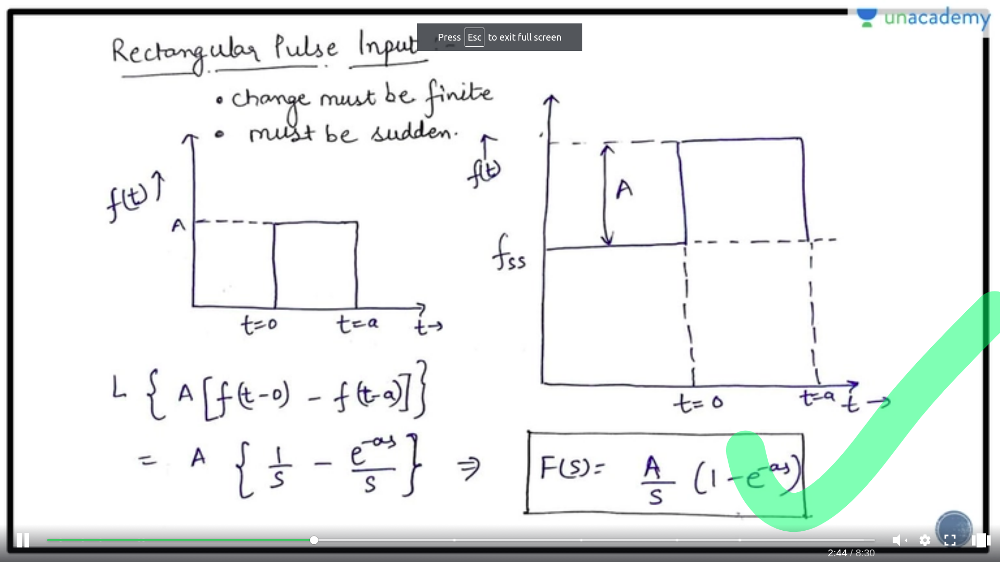

### Unit Impluse Function
- 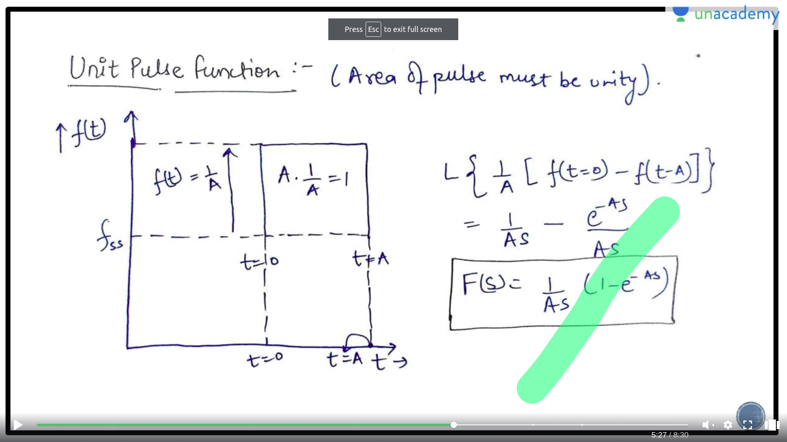

### Impluse Function
- 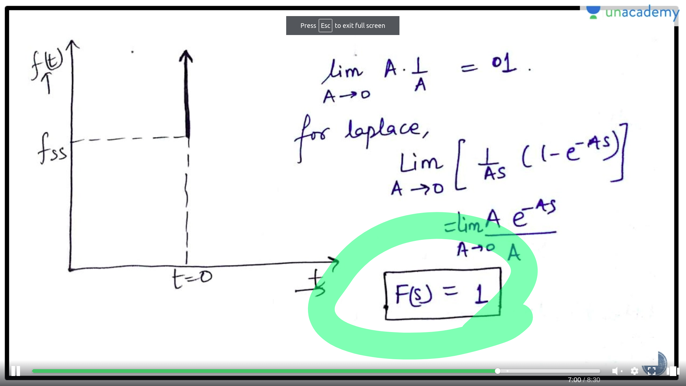

### Ramp Input
- 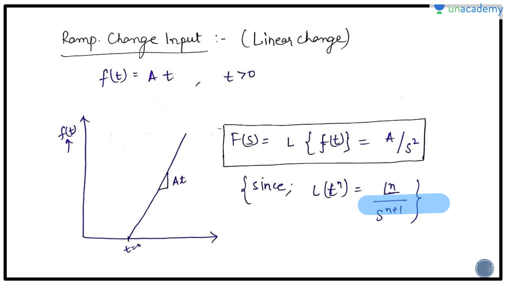

### Sin Input
- 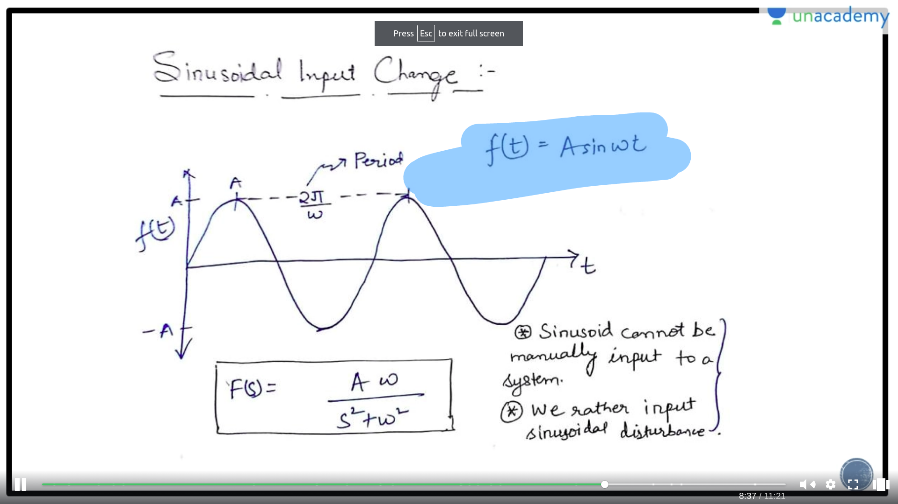

## First Order System
- Those system that changes wrt to the first order