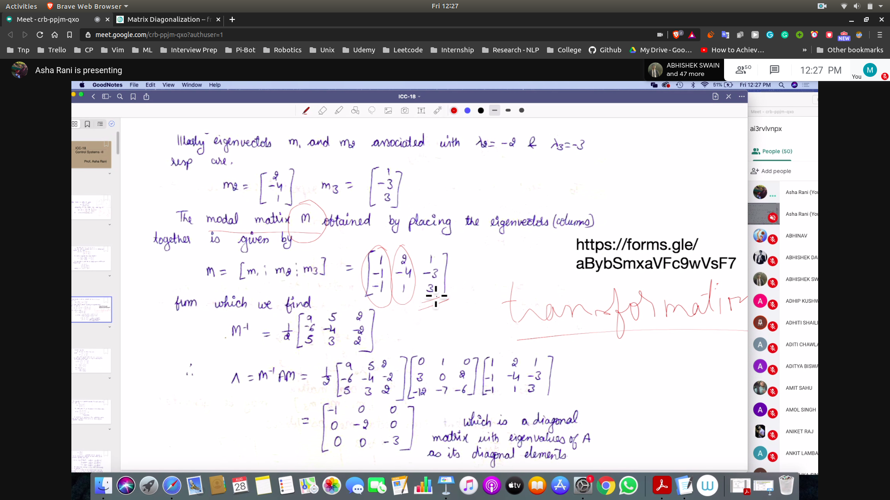
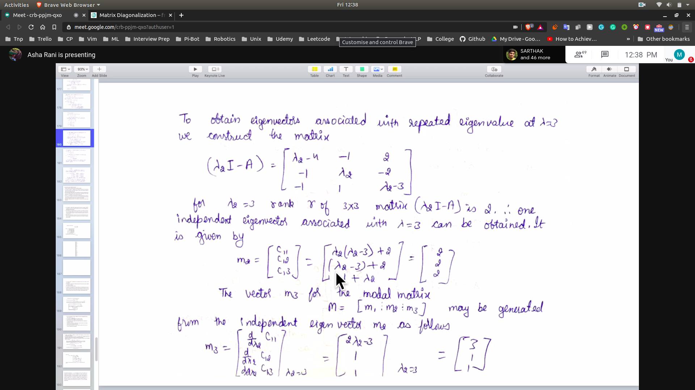
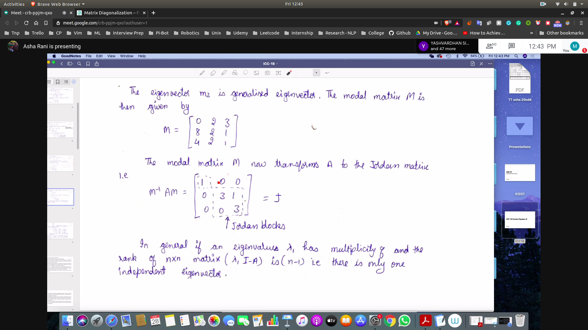
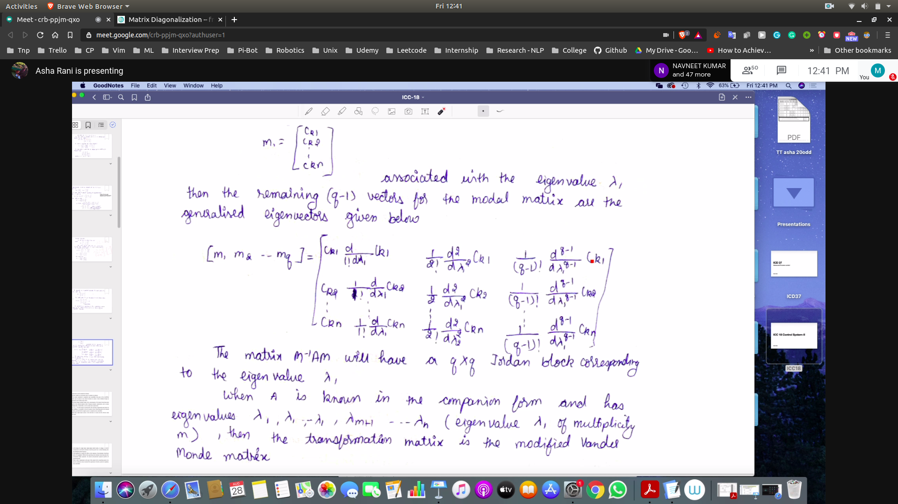
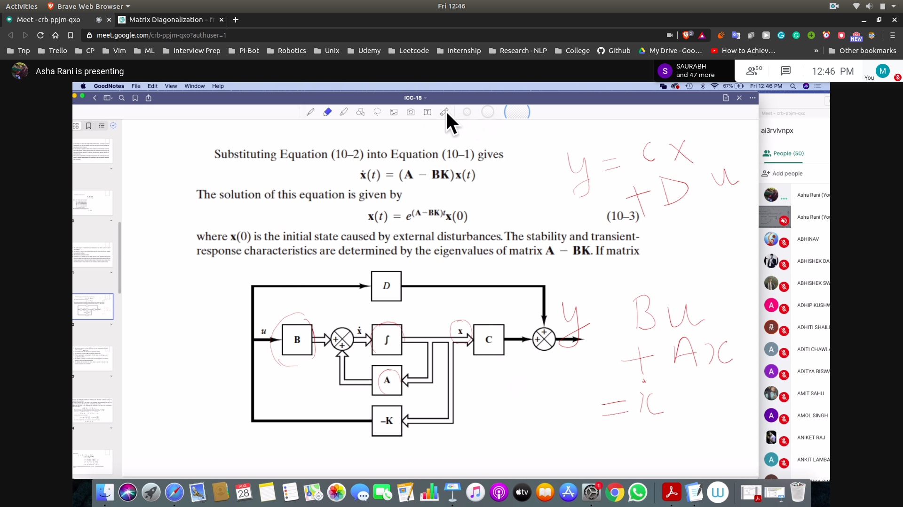

## Diagnolization of the matrix
- We want to obtain the trans. mat (P) to diagnolize the matrix
 - Find the eigen vectors of the matrix A
 - then obtain the modal matrix M by placing the eigenvectors(colums)
 - 
 - then do P(inverse) * A * P to obtain the matrix

**This is independent of the fact of multiplicity**

`
  - if that comes out to be zero
  - then use the second row
  - if that comes out to be zero
  - then use the third row
`

**Case when eig vector are same**

- say lambda_1  (lambda_2==lambda_3)
 - find the eigen vector with lambda1
 - find the eigen vector with lambda2
 - Now to obtain the third eigen factors
   - differenciate the elements in co-factors matrix of 2 to get the third vector
 - 
 - Then put the value [lambda1 | lambda2 | lambda 3]
 - We will not be able to form full diagnol
  - We will form jordan blocks
  - 

**When multipliclity > 2**

  - matrix can be obtained as follows
  - 

## State Model Using Intergrator Circuit
- 

## Pole Placement
**What are poles?**

 -  in TF put Den to zero to obtain char. eqn
 -  char eqn. cna be obtained using |lamda * I - A| = 0
    - A is the state space model of the function
    - Why?
    - Explained by the method using
    - [siminusa](siminusa.png)

- Poles define the behaviour of the system
  - They define the dynamics of the sytem 
  - like fast or slow
  - like rise time etc
