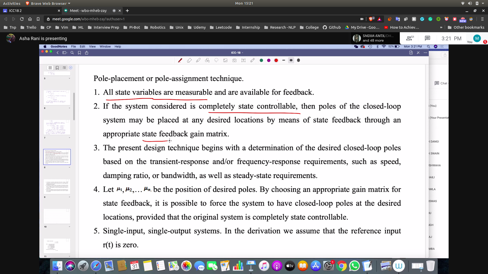
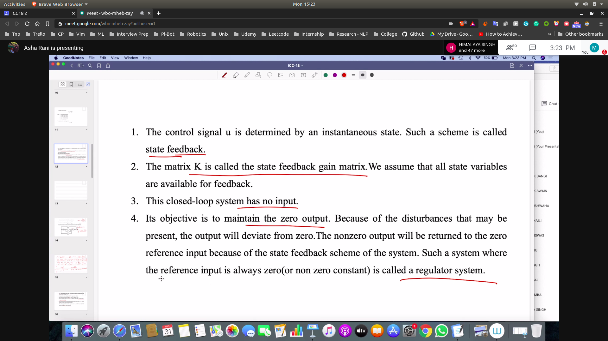
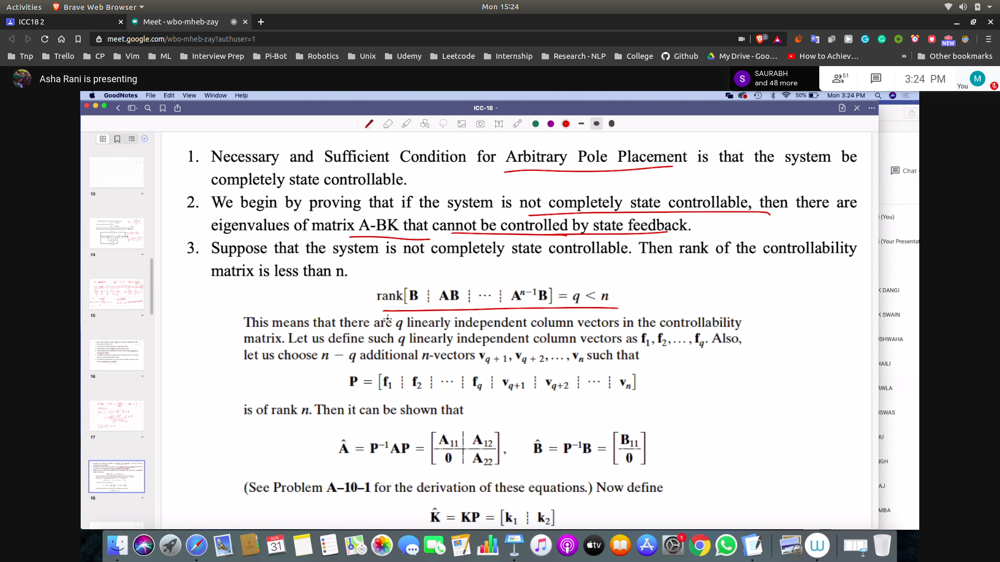
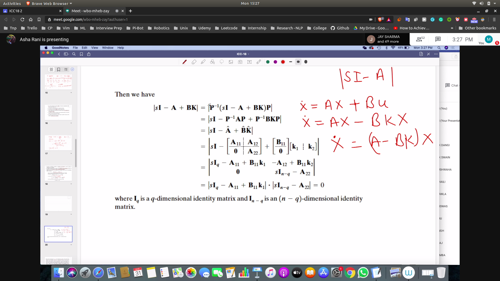
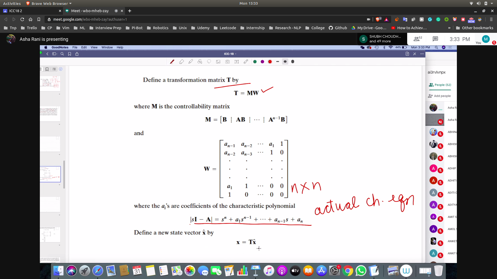
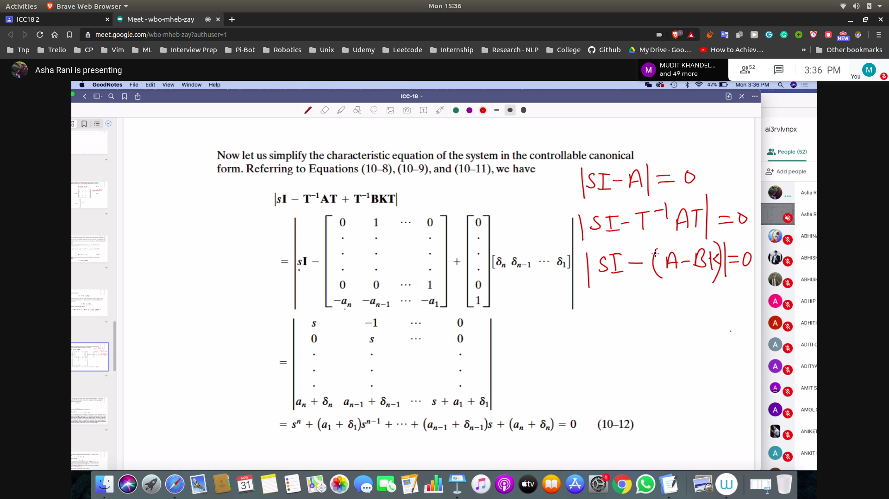
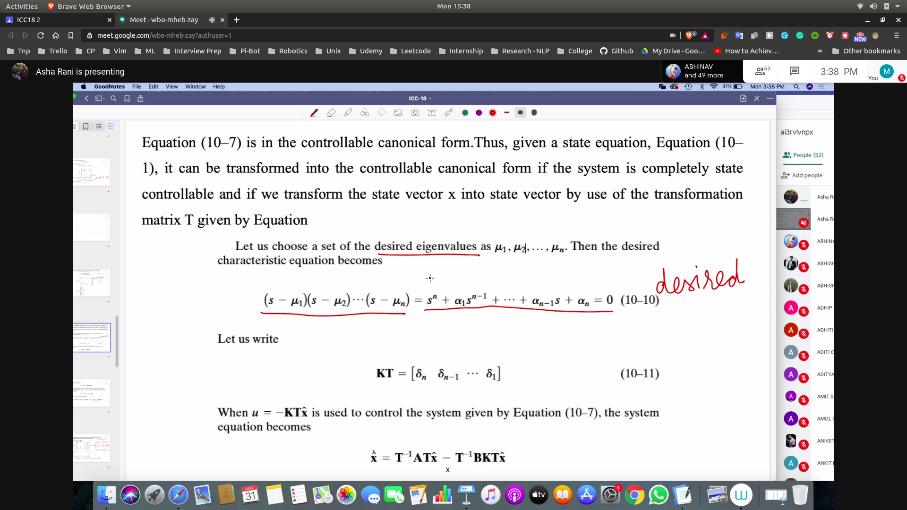
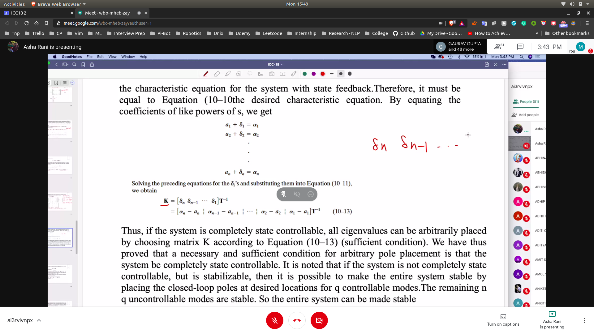
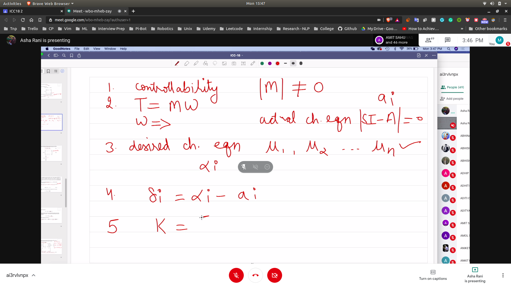

**Name: Manan Madan**
**Roll No: 2018UIC3087**

## Why do we want to do pole placement
- They describe the behaviour of the sytem 
- For eg
  - in second order system rise time , peak time etc.
  - can be explained by zeta and omega_n
  - which are nothing but indicate the position of the poles

## Dominant and Non Dominant Roots
- To modify system only 2 root are dominant
- Other n-2 will be non dominant roots

## Solution of |SI - A|
- The solution of the characterisitic equation are the eigen values

## Value of U
- U is written as -k * x(input) to control the pole of the system

## Assumptions for pole placement
- 

## Terms
- 

## Condition for arbitary pole placement
- 

**Here somewhere there is a proof that matrix should be controllable for pole placement**

## Characteristic Eqn for system with state feedback
- 
- In this q poles will be controllable
- Then n-q poles will not be controllable
- So proved that we need to have full controllable matrix

## How to do pole placement?
- 
- Transform the system using T
- the sytem will be in a controllable form

### Char eqn in controllable form
- **This is the actual char eqn**
- 
- a1 + delta1 = alpha1
- a2 + delta2 = alpha2

### Desired Char Eqn
- 

### To make Desired == Equal
- Find K using delta i
K = [.......]
- 

### Summary
- 
- Find M |M|!=0
- Find T = MW
- M is the controllability Matrix
- Desired char eqn
- Calculte delta i from above
- Calculate K using delta values 

