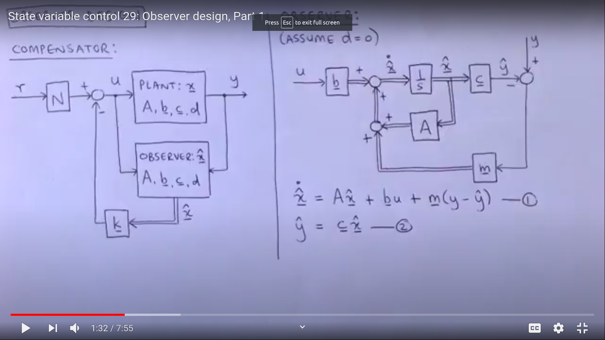

# Observer Systems
- We studied that given the state x of the plant , we can obtain the state feedback gain matrix K to and place the poles accordingly
- But in the real world plant we do not know the state x of the system
- So in order to apply controls , we have to estimate the state x to place the poles of the system
- The system that estimates the value of x given the controls and the output of the plant is called the **observer system**
- 

## Duality
- Let's us say the estimated state equation x'~ = Ax~ - KeCx~
- So the difference the estimated and the real state is
   - x' - x'~ = Ax - Ax~ + KeC(x - x~) 
   - x' - x'~ = (A - KeC)(x-x~)
- So it can be seen that if A - KeC is a **Stable Matrix** then it will converge to zero and the difference will become null

- So our main purpose it here to estimate Ke such that A - KeC will converge to zero
- This the exact same problem for the controls also
- Hence this is called the **duality**
- Also we if put C instead of B in the controllability matrix , then we will find the necessary condition for the observer systems

## Methods to estimate Ke

- It will have the exact same methods as controls , for example
1. Direct Substitution
- |SI - (A-keC)| = (s-u1)(s-u2)(s-u3)
