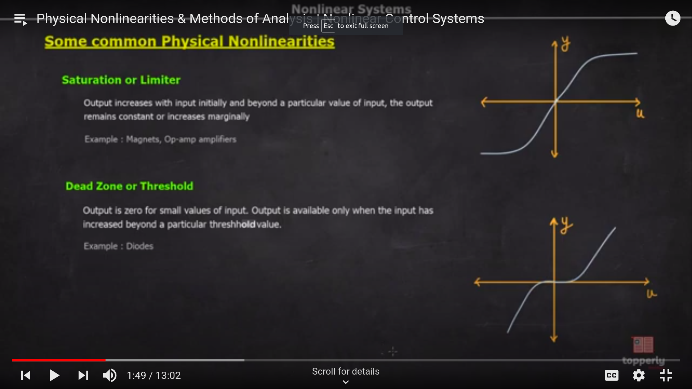

# Non-Linear Systems

- Does not obey superposition principle
- Does not have closed form solution
  - We do not have the ability to express the system in some equations
  - Hence we have perform approximate analysis
- Stability depends on inital conditions , input signals and system parameters

## Mathematical Model of nonlinear systems
- The mathematical model of non linear system can be expressed as follows
  - In the form of vectors
  - $\frac{dx}{dt} = f(t,x,u)$
  - $y = h(t,x,u)$
  - These equations are called state space models

### Variations in the state space model
- **Unforced state Equation**
 - u is zero in this case
 - $\frac{dx}{dt} = f(t,x)$

- **Autonomous System**
  - $\frac{dx}{dt}$ is independent of time and is only dependent on present input
  - $\frac{dx}{dt} = f(x)$

## Non Linearities
- Inherent nonlinearities
  - already present in the system
- Intentional nonlinearities
  - induced in the system 

### Common Physical Non-Linearities
- Saturation or Limiter
- Dead Zone
- 
- Relay
- Output switches b/w positive and negative maximum values depending on whether the input is positive or negative
  - Ideal Relay
  - Relay with dead zone
  - Relay with hysterisis
  - Relay with hysterisis and deadzone
