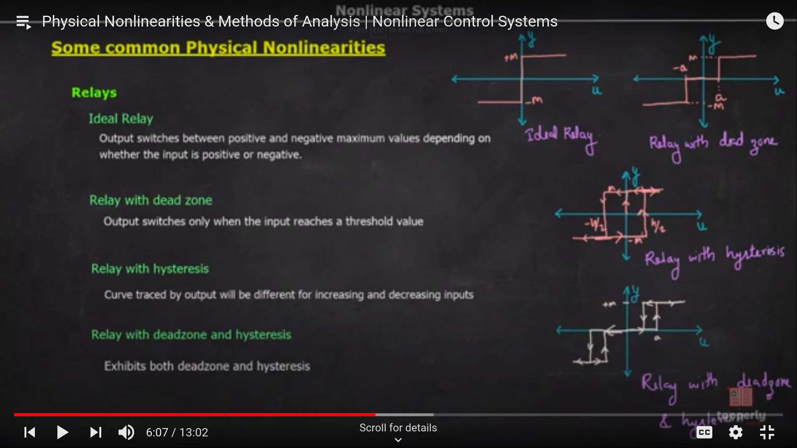
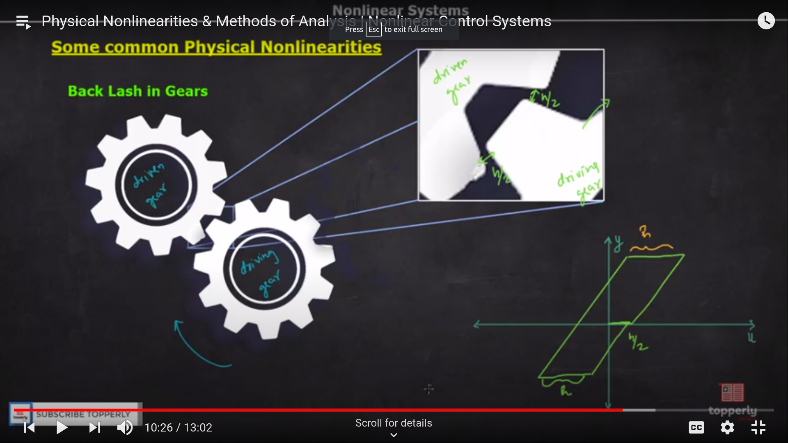
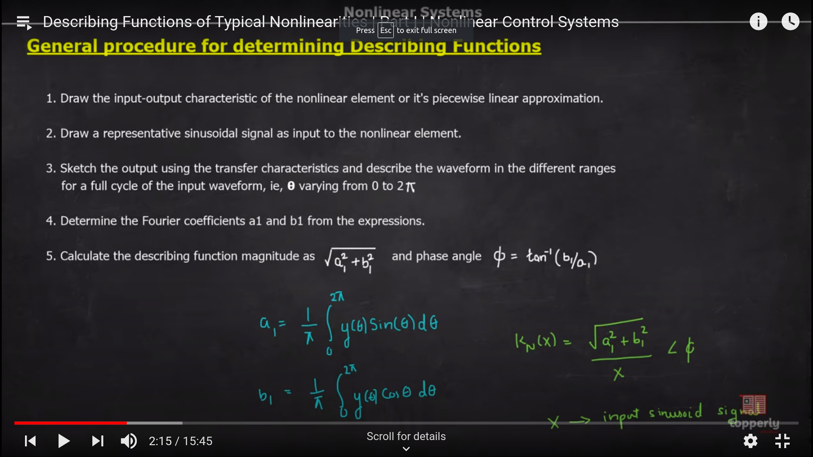
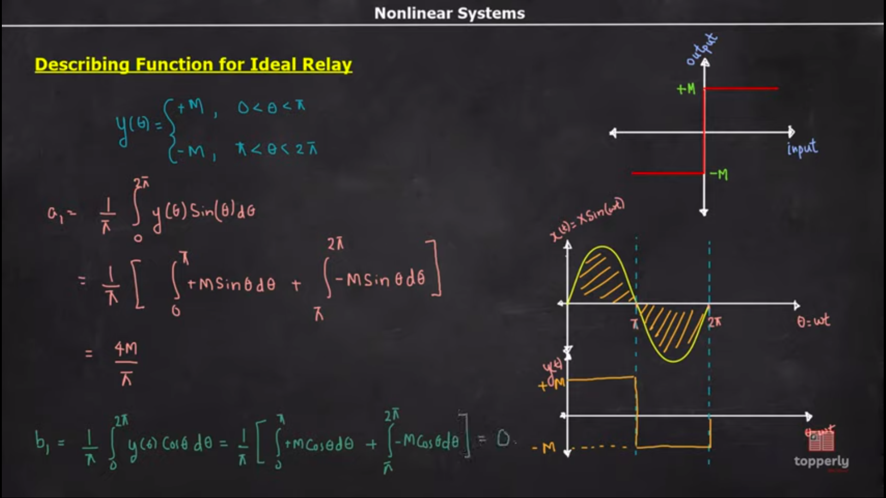
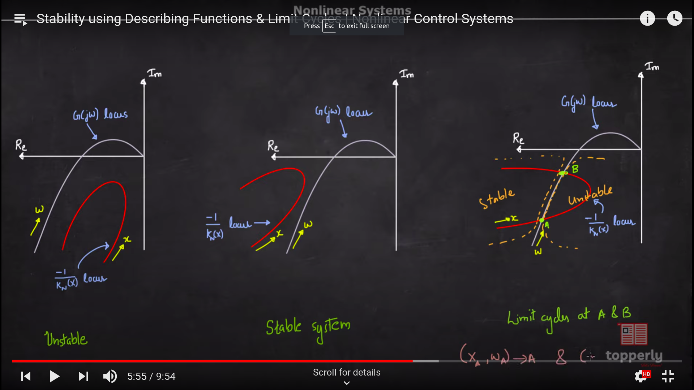

# Non-Linear Systems

- Does not obey superposition principle
- Does not have closed form solution
  - We do not have the ability to express the system in some equations
  - Hence we have perform approximate analysis
- Stability depends on inital conditions , input signals and system parameters

## Mathematical Model of nonlinear systems
- The mathematical model of non linear system can be expressed as follows
  - In the form of vectors
  - $\frac{dx}{dt} = f(t,x,u)$
  - $y = h(t,x,u)$
  - These equations are called state space models

### Variations in the state space model
- **Unforced state Equation**
 - u is zero in this case
 - $\frac{dx}{dt} = f(t,x)$

- **Autonomous System**
  - $\frac{dx}{dt}$ is independent of time and is only dependent on present input
  - $\frac{dx}{dt} = f(x)$

## Non Linearities
- Inherent nonlinearities
  - already present in the system
- Intentional nonlinearities
  - induced in the system 

### Common Physical Non-Linearities
- Saturation or Limiter
- Dead Zone
- 
- Relay
- Output switches b/w positive and negative maximum values depending on whether the input is positive or negative
  - Ideal Relay
  - Relay with dead zone
  - Relay with hysterisis
  - Relay with hysterisis and deadzone
  - 

### Back Lash In Gears
- 

## Methods of Analysis
- Methods of analysis of linear systems

### Describing function
- Assumptions
  - It assumes that the non linear element doesn't rectify the input sinosoids given to it
  - Input to NLE does not have subharmonics present and only the fundamental harmonics of the input wave are dominating

**Intuition**
- Basically in the describing function method we try to approximate the non-linear function using the input and obtained output from the system

- Xsinwt --> Non Linear Element --> Y
- Here Y will come to be a1sinwt + b1coswt

- Procedure for determining describing function
  - 

## Describing function for Relays
### Ideal Relay
- 
- output == $\frac{4m}{ \pi x}$
- see vedio for the rest of the describing function
- It is a similar process
- [vedio](https://www.youtube.com/watch?v=cV9blkYakAw&list=PLhdVEDm7SZ-MqSUpBw78Cb2BmI142R2VA&index=9)

## Stability using Describing function
- In case for finding the stability we will replace the system using the equivalent gain we calculated previously using the describing function
- Then the system will be realized and we can use the modified niquist plots to judge the stability of the system

### Methodology
- So we will draw the -1/Kn(x) locus and G(jw) locus and then we can apply the conditions to find the stability of the system
- 

- Now at the intersection point of the locus , limit cycles exist

## Limit Cycles
- These are basically unsustained oscillations shown by the system
- There are 2 types of limit cycles
   - convergent
   - divergent

- To find convergent and divergent
   - just apply some $\delta x$ change to figure out what if the system is coming back to it's original state
   - here just know that the system if it's stable will reduce the x
   - and if unstable will increase the x

- Hence it the change in x makes the system go far from the intersection then it is a unstable system , otherwise it is a stable system
