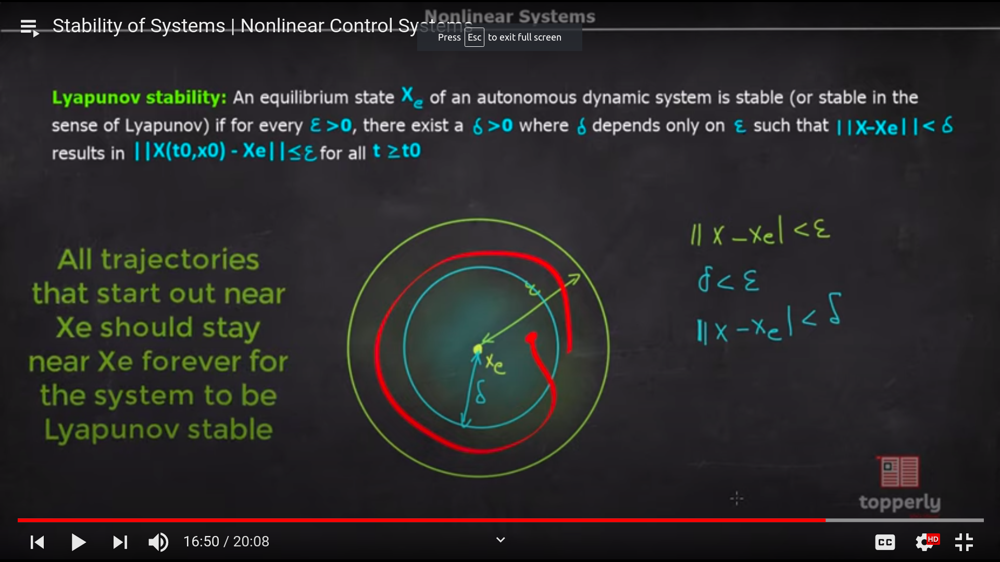
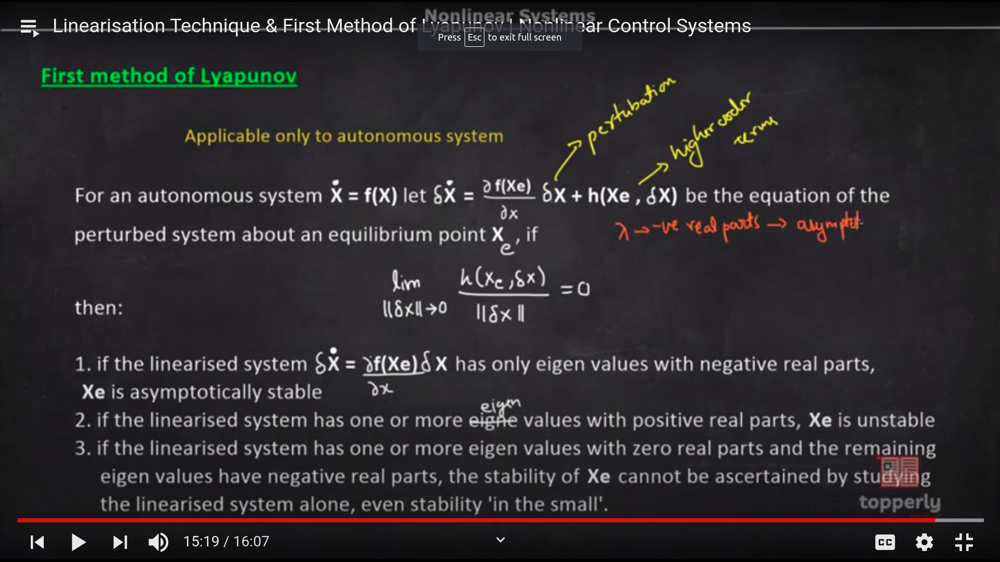
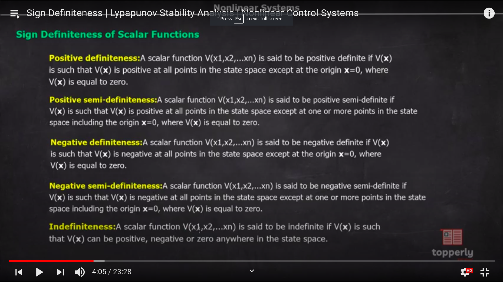
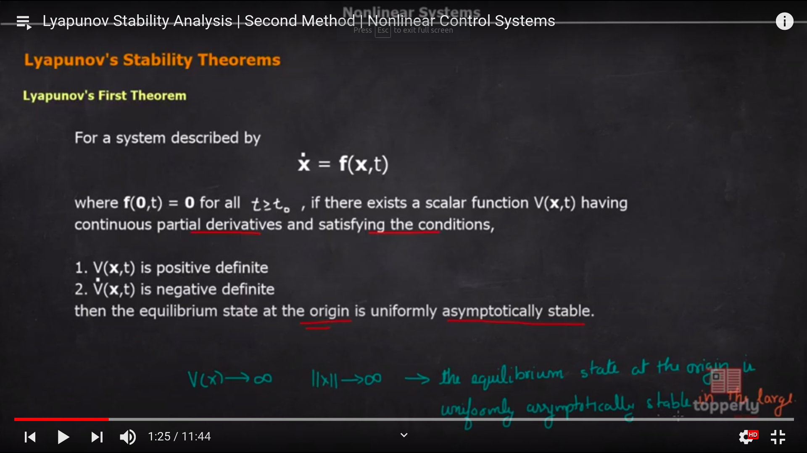
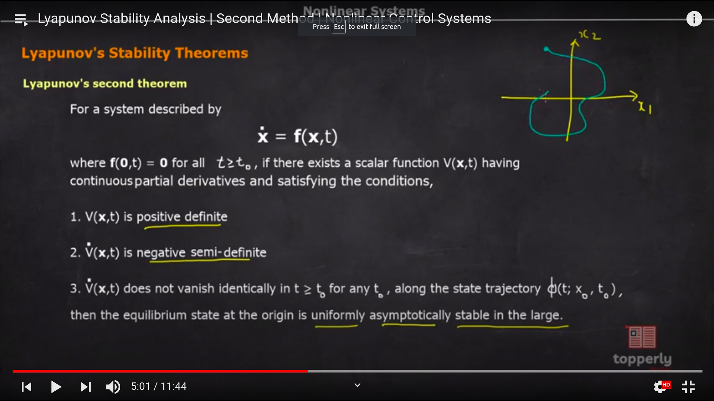
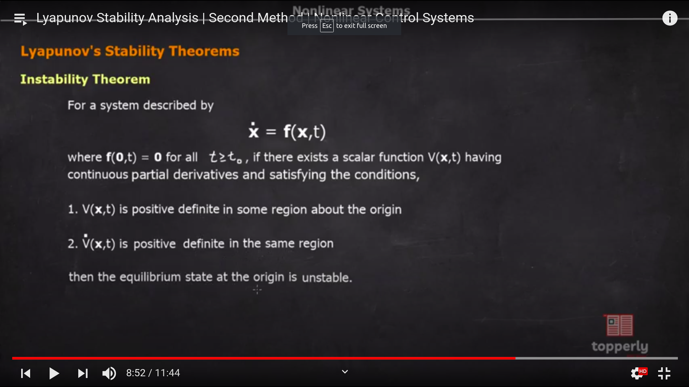

## Liyapunov Stability

### Equilibrium Points
- In case of non-linear systems , there is no talk about system stability
- We always talk the stability of equilibrium points
- Equlibrium Points are those states of the system which when achieved , unless any extra force is applied the system will stay there only
  - **Stability of Equlibrium Points**
  - When stability is only gauranteed in a small region in the immediate neighbourhood it is called **stability in the small**
  - When stability is gaurantedd in a large neighbourhood around the point in the neighbourhodd it is called **stability in the large**

### Liyapunov
- "Stability of a system can be judged on the basis of energy in the system"
- When the rate of change of energy of the system will be equal to zero , then the system will be stable

- **Formal Defination**
- "All trajectories that start out near $X_e$ (equillibrium state) , should stay forever near $X_e$ to be liyapunov stable"
- 

### Liyapunov First Method
- If the linearised version of the non-linear system at an equilibrium point is stable then the non-linear system is also stable locally.

- **Steps**
- First we will have to linearize the system at that point
- Then see if the linear system is stable or not by checking it's eigen values
  - If the linear system has only eigen value with negative real parts the
  system around the point $X_e$ is stable
  - If the linear system has one or more eigen value with positive real parts
  the system around the point $X_e$ is unstable
  - If the linear system has one or more eigen values with zero real parts and
  the remaining eigen values have negative real parts , the stability of $X_e$
  cannot be ascertained by studying the linearised system alone since the
  linear system is marginally stable 
  - 

## Sighn Definiteness
- 5 terms
- 
## Liyapunov Stability Theorem
- Liyapunov's First Theorem --> uniformly asymtotically stable
  - 
- Liyapunov's Second Theorem --> uniformly asymtotically stable in the large
  - 
- Instability Theorem --> Instability in the system
  - 

### Final Steps
- Merging all three we get the following steps
 - Assume a positive V(x) function
 - Determine the derivaive V(x) for the above function {here we will require derivatives of x1,x2.}
 - Evaluate dv/dt along the trajectory by substituting for the derivates of x1 , x2 from the state equations
 - check whether dv/dt is negative definite in the region where V(x) is positive definite.
      - If this is true the LPVN'S first theorem will be true
 - if not check whether dv/dt is atleast negative semi- definite
- if dv/dt is negative semi-definite , verify whether dv/dt vanishes identically only at the origin by substituting the condition of dv/dt to vanish
- Then if dv/dt vanishes only at the origin or dv/dt is negative definite , conclude the stability by either of the 2 theorems
- if dv/dt is positive definite , then the equilibrium point at origin is unstable
