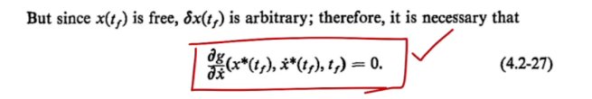
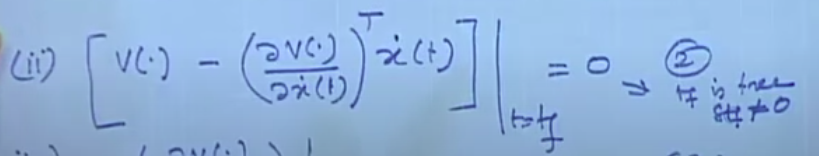

## Optimal Control
*"find an admissable control u which causes the system to follow an admissable
trajectory x that minimize performance measure"*

### Types of Problems in Optimal Control
- TYPE1
  - t0 and tf is specified
  - x(t0) and x(tf) is specified
  - J(x) --> optimizing function is also specifies
  - TASK : find a trajectory from x(t0) to x(tf) while minimizing the J(x)
- TYPE 2
  - tf is specified , but x(tf) is not specified
  - J(x) --> optimizing function is also specifies
  - So we have to find x(to) to all the possible x(tf) while minimizing the J(x)
  - SOLUTION
  - We need to satisfy delg / del x along with euler
  - So the contants can be satisfied using the first boundary condition
  - And the dg/dx(x* (tf) , x.*(tf),tf) = 0 equation will be used to satisfy the second condition
  - 
- TYPE 3
  - here tf is free but x(tf) is specified
  - J(x) --> optimizing function is also specified
  - 
- TYPE4
  - almost similar to type3
