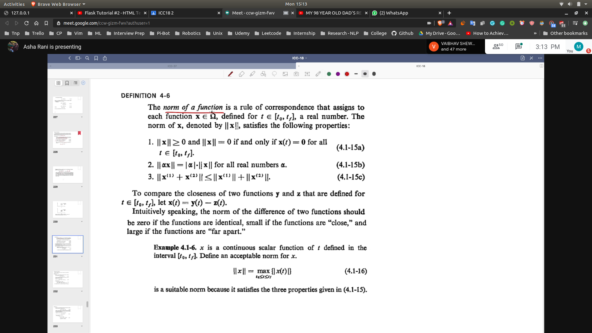
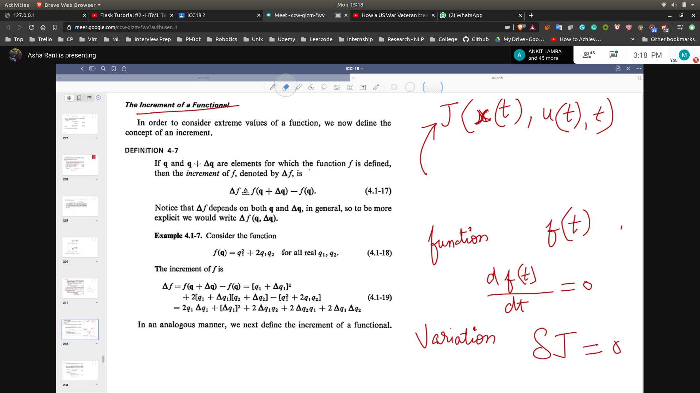
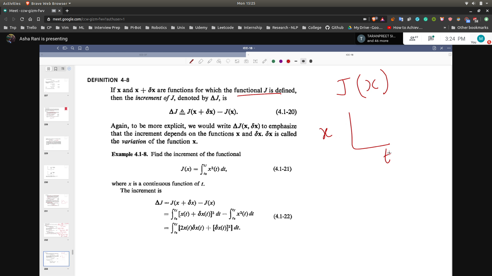
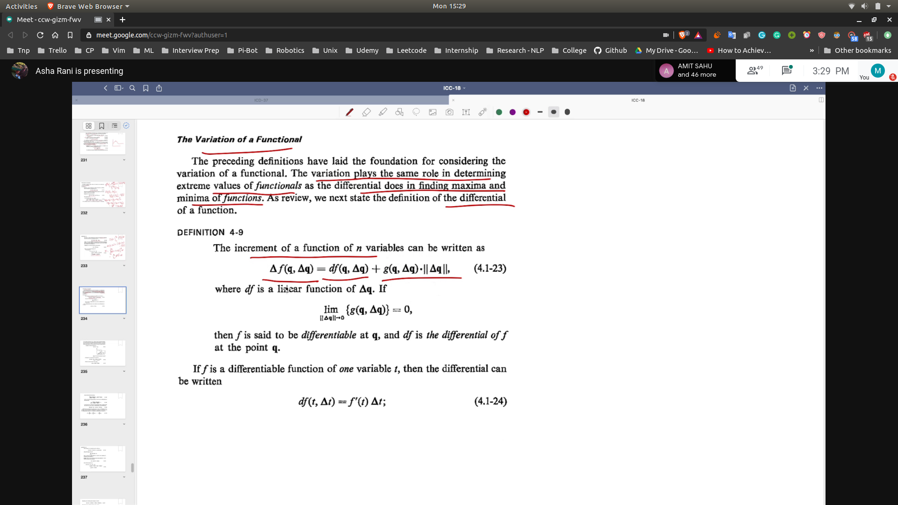
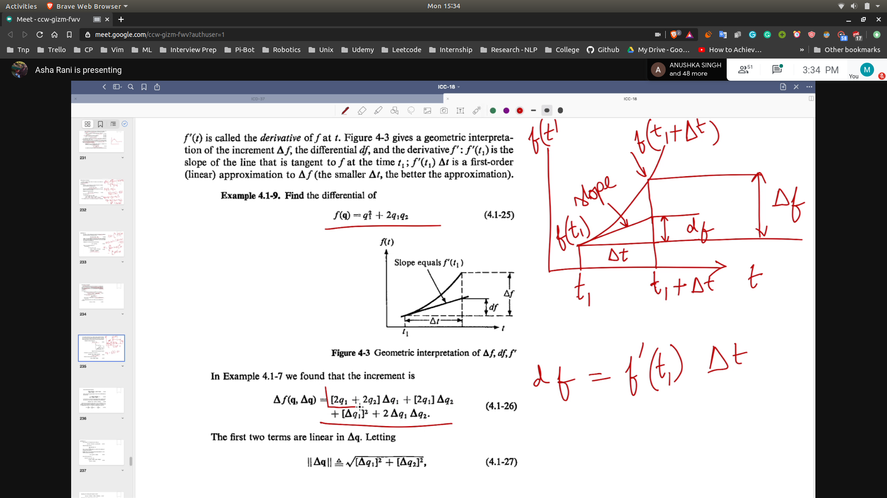
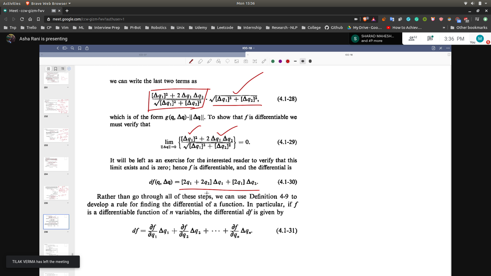
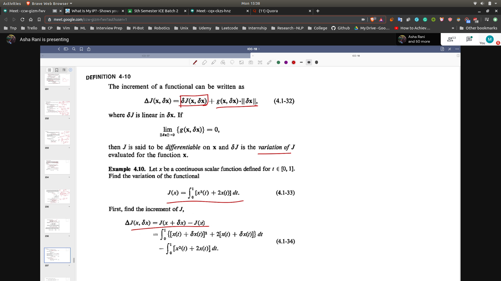
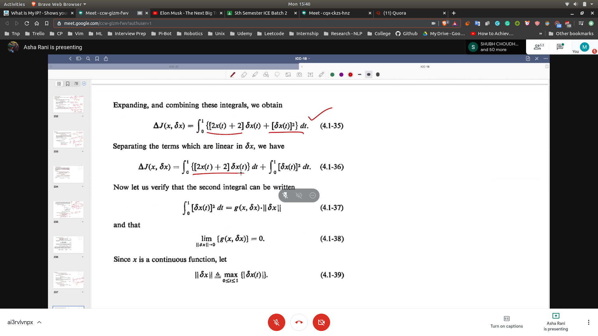
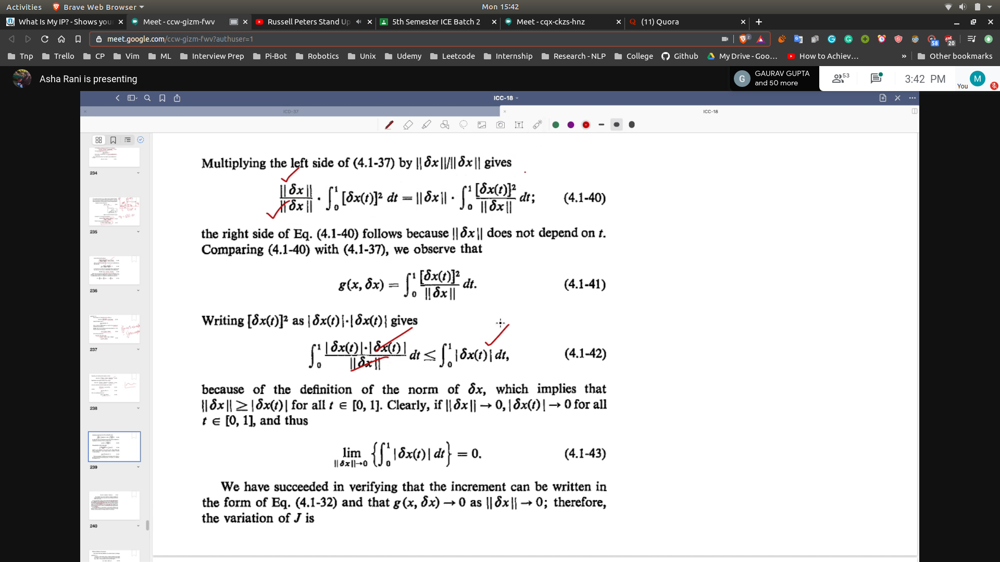
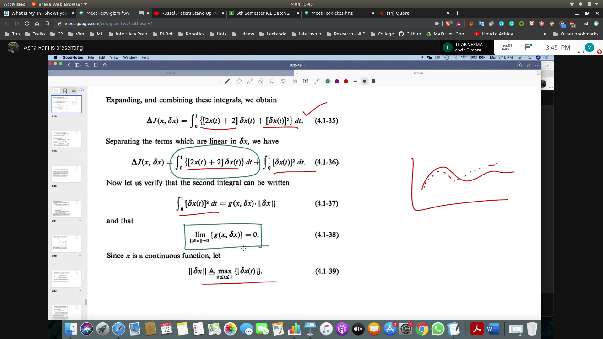

## Norm of a function
-  
- Find variation of J and then equate it to 0
- We will find U* , then put it in x* , then obtain u
## Increment of a functional
- First we are given the incremental of a function
- 
- Next we have the incremental of a functional
- 

## Variation of a Functional
- First we will find variation of a function
- 
- 
- We re arrange the terms to get 
- 
- Variation of a functional
- 
- 
- 
- 

- First Find incremental
- Then brk into linear and non linear
- Then find the variation