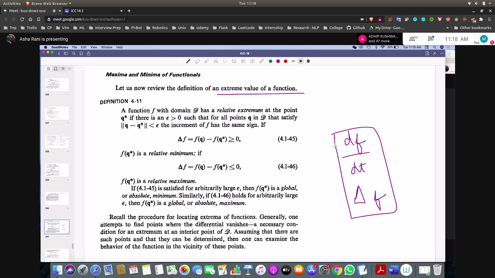
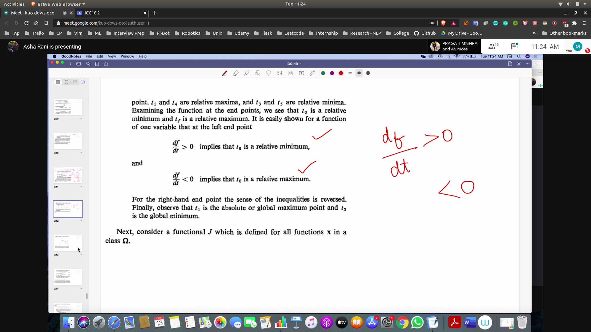
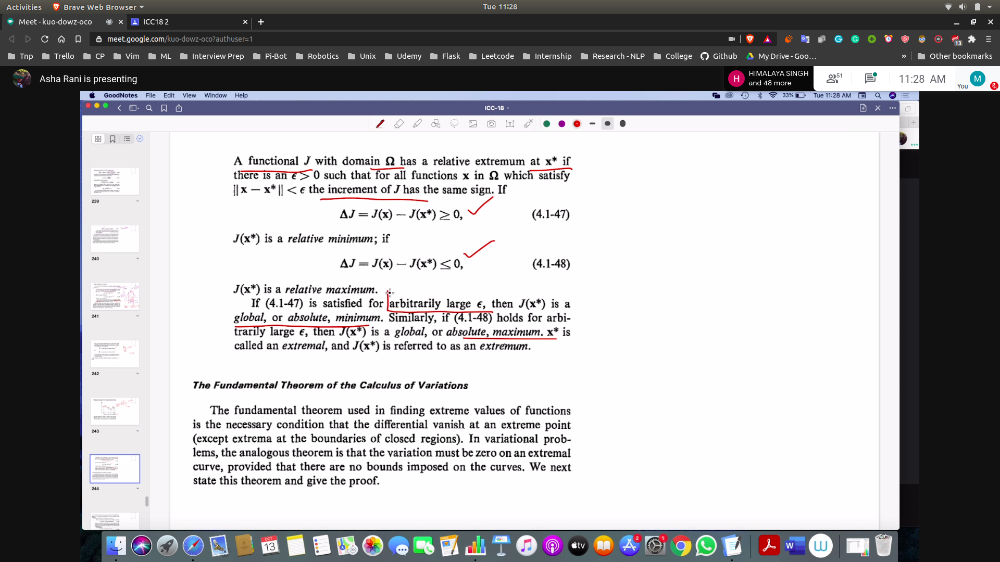
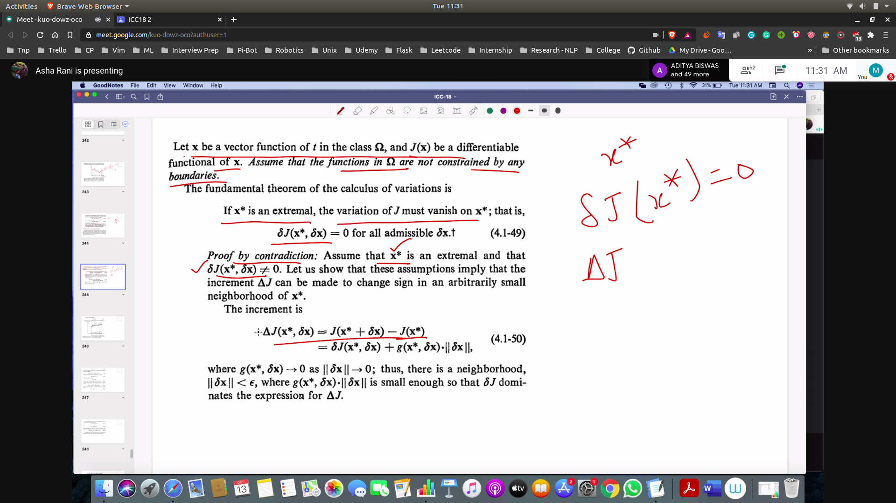

## Maxima amd Minima of functionals
- Maxima and Minima of functions:
  - 
  - 
- Relative Max and Min in Functional:
  - 
- Fundamental theorem of the calculas of variation:
  - 
  - Then we can prove using contradiction
