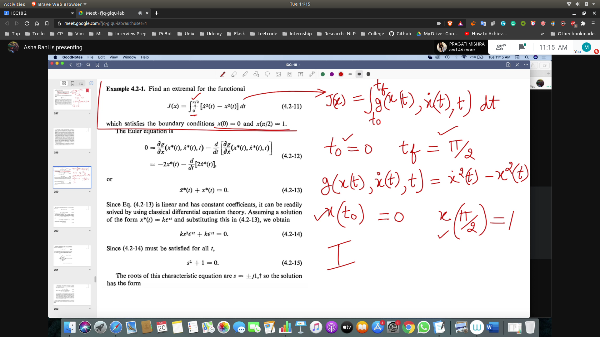
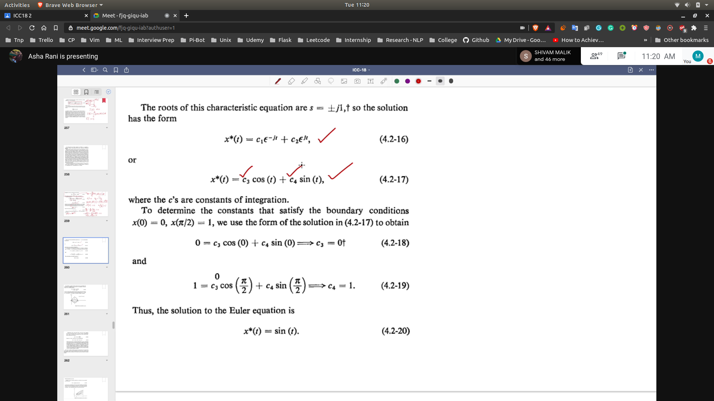
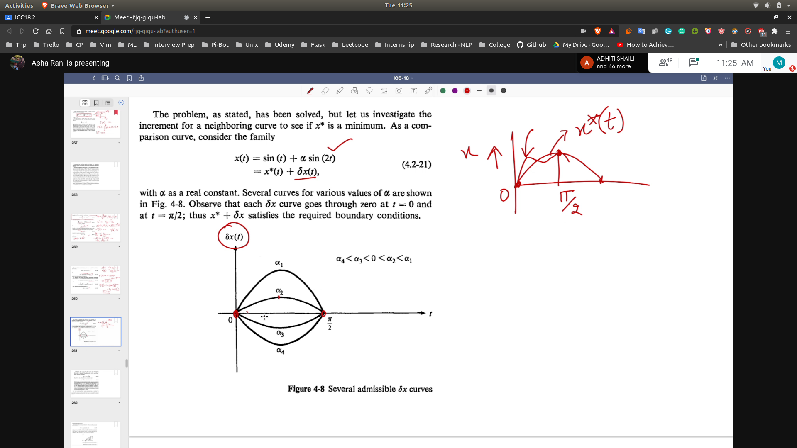
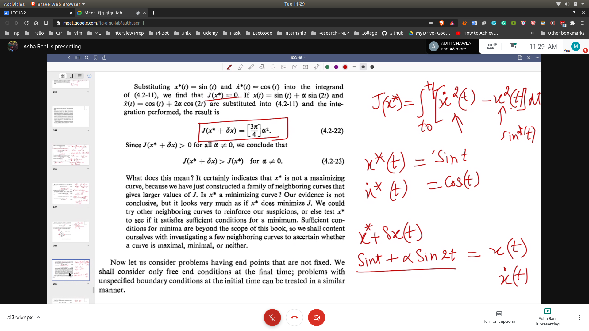
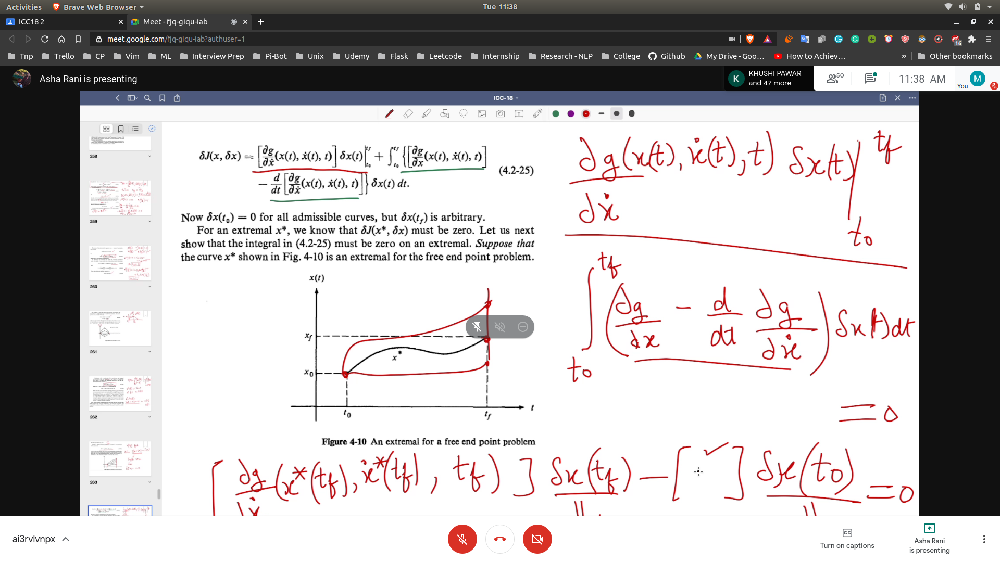
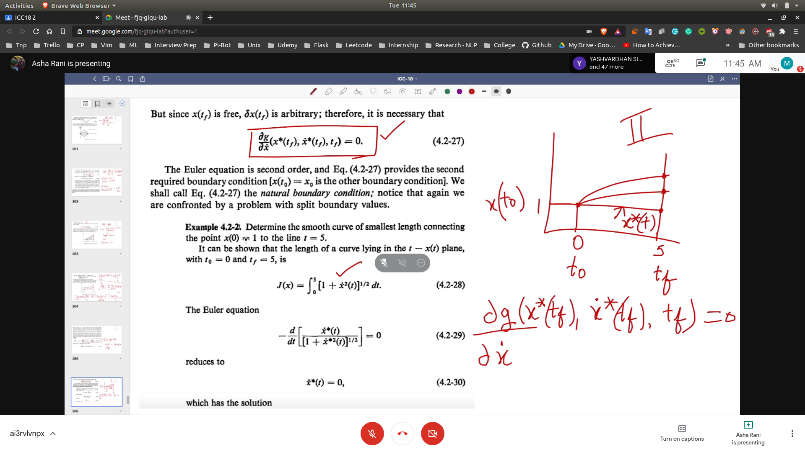
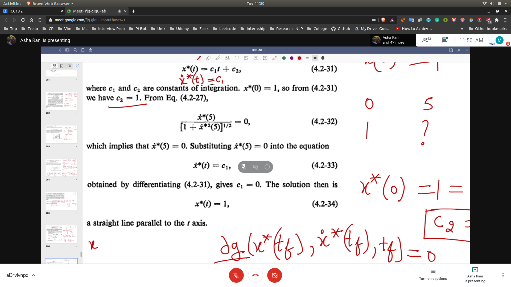

# Solving Optimal Control Problem

## Category 1

- Identification
  - T0 and TF are specified
  - We have to find trajectory from x(T0) to x(TF) while minimizing J(x)

- Solution
  - These types of problems can be solved by solving the euler equation
  - This will give us a differential equation 
  - Solving differential equation will give us the ans
  - 
  - 
  - Further the constants can be find out by the given boundary conditions

- Testing
  - In this step we change the value of the curves
  - Through this we will get neighbouring curves satisfying the same boundary
  - Plotting these curves will tell that the found curve is min
  - 
  - 

## Category 2

- Identification
  - TF is not specified
  - Rest of the details are same as T0

- Derivation
  - Same as in the previous case
  - But the $dx(t_f)!=0$
  - 

- Solution
  - We need to satisfy delg / del x along with euler
  - So the contants can be satisfied using the first boundary condition
  - And the dg/dx(x* (tf) , x.*(tf),tf) = 0 equation will be used to satisfy the second constraint
  - 
  - 
