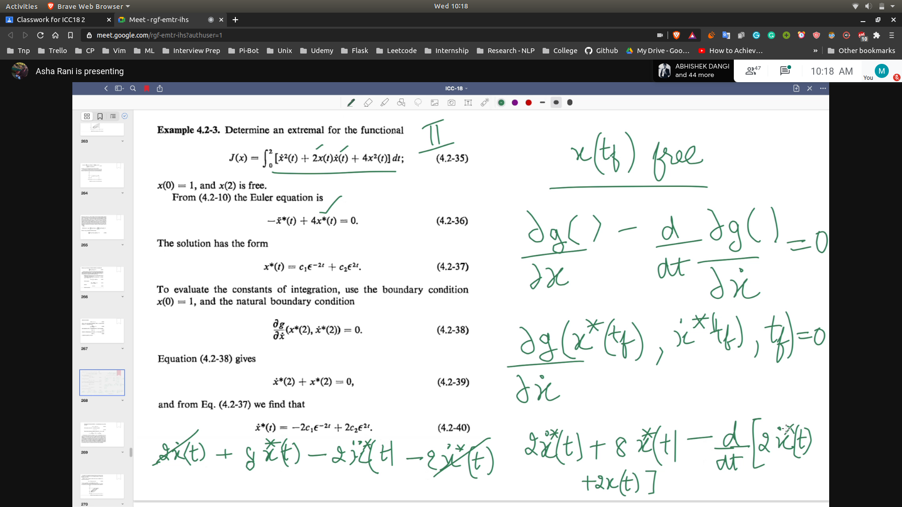
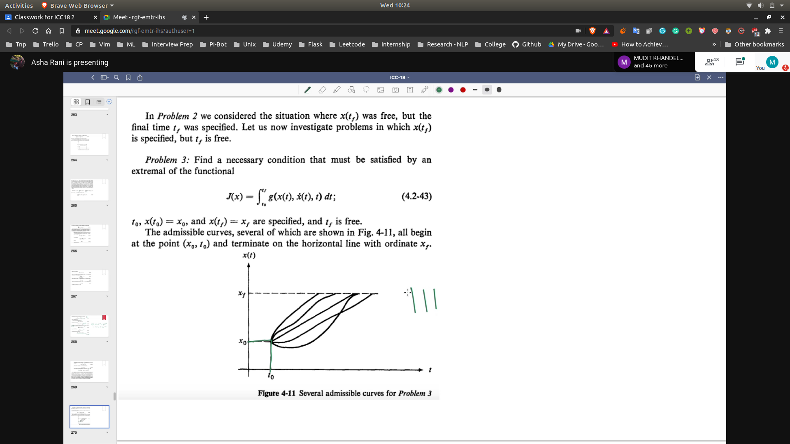
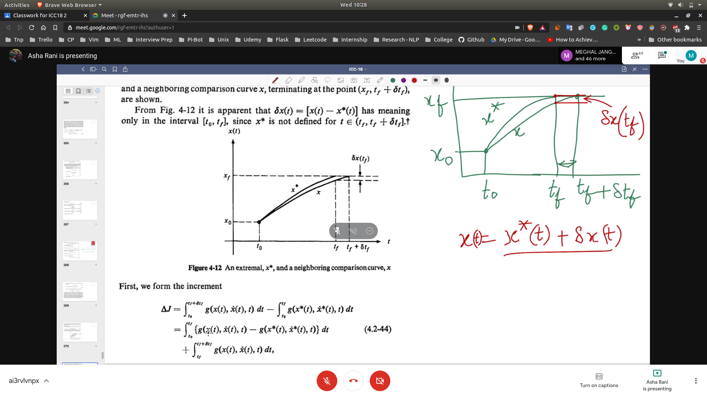

## Category 2 
- In these type of problem x(f) is free.
- 

## Category 3 
- In these type of problem $t_f$ is free.
- x(f) is fixed but $t_f$ is free.
- 

## Derivation

### Finding Extremal
- 

- Rest See from the book
