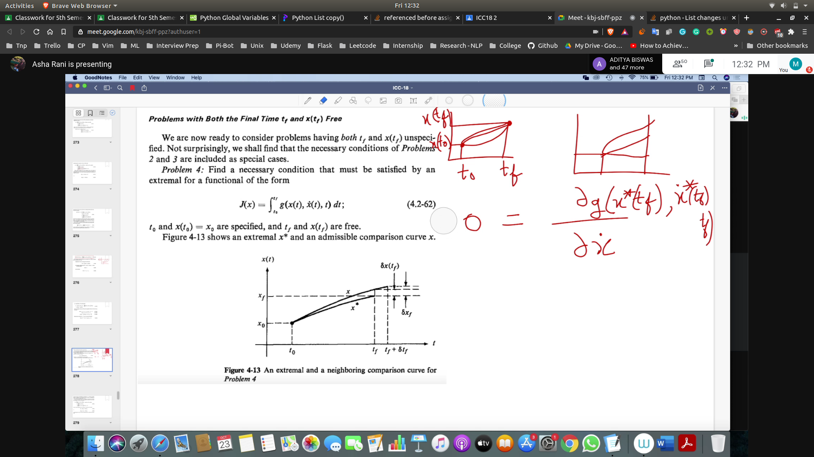
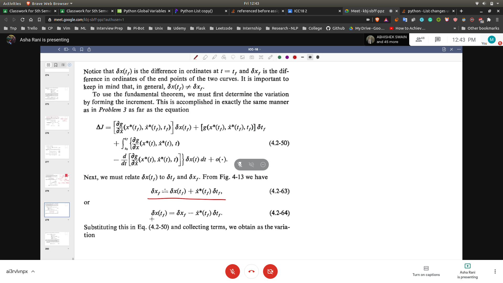
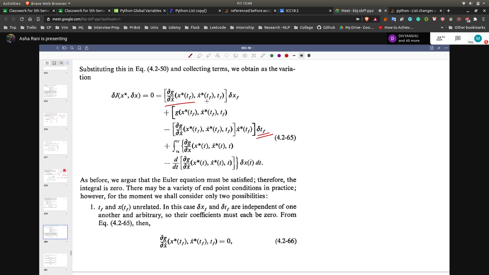
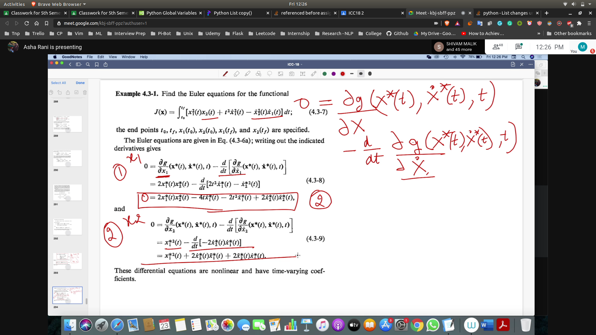

## Category 4 

- 
- First we will find the incremental
- Do as same as done in category 3
- 
- 
- Then put variation = 0

## Multivariable Equations

1. Finding the euler equations for the functional
- 
