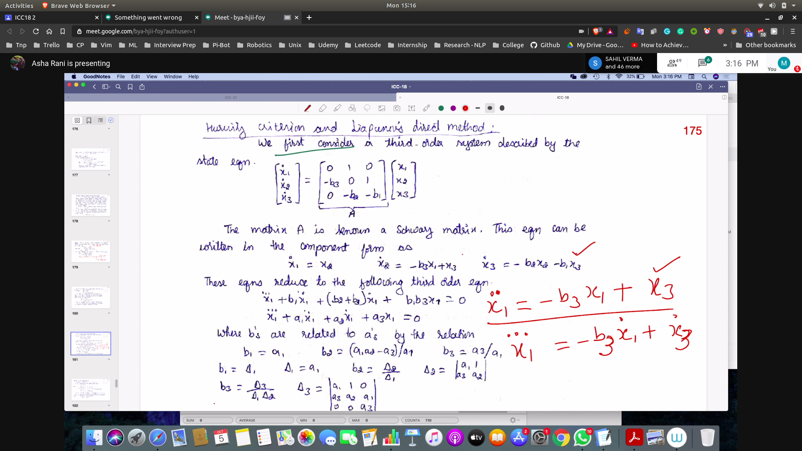
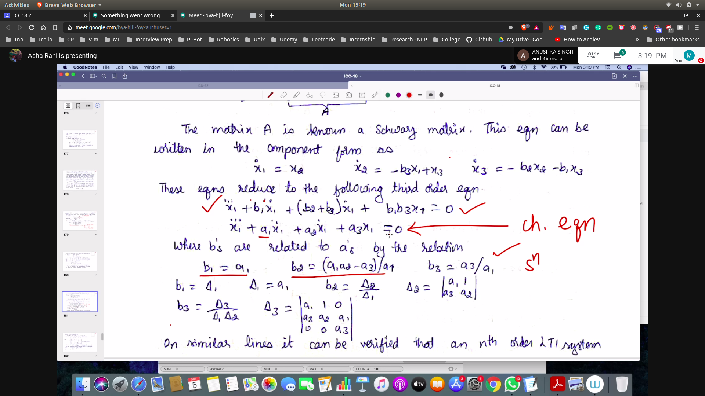
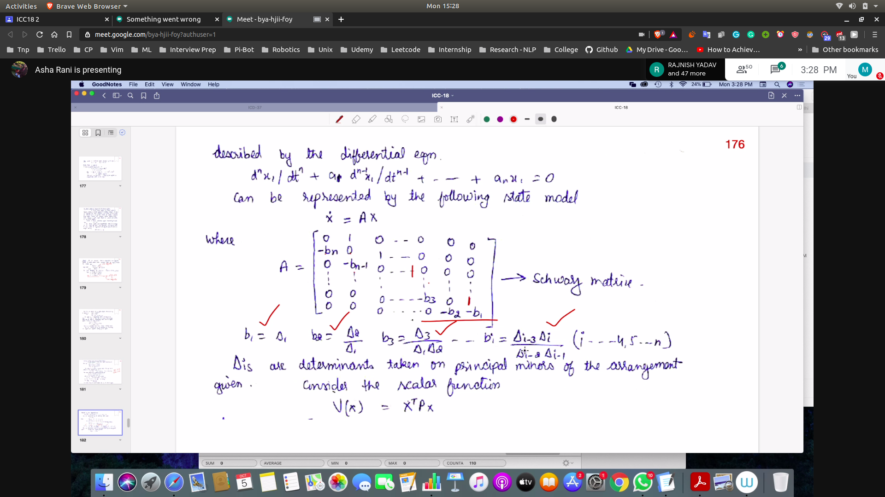
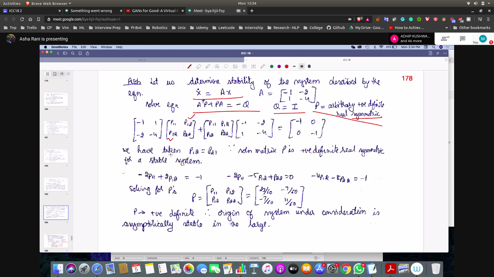
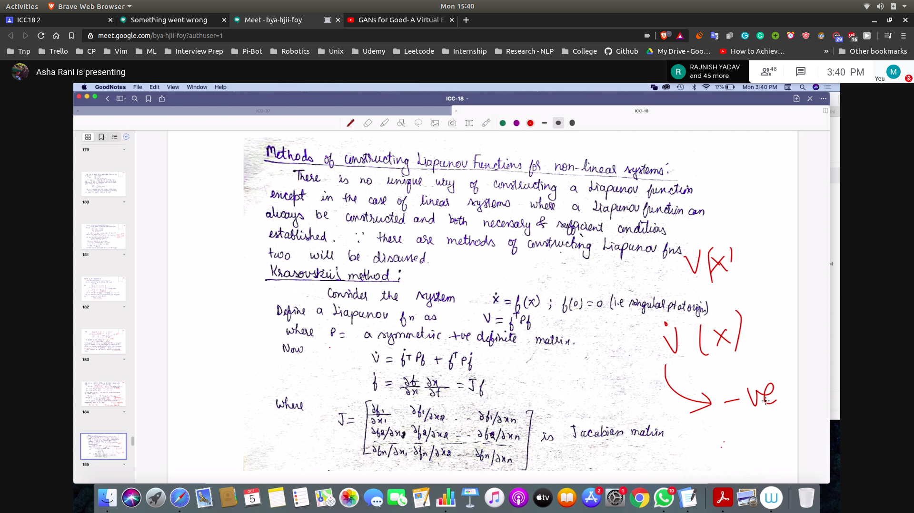

## Proof that Harwitz Criteris == Liaponov Direct Method
- For first Order Sys
 - 
 - 
 - Harwitz Criteria Implies that all delta i must be greater than zero
- For a general nth Order Sys
 - 
 - 

 ## Prob
 - 

 ## Constructing Liapunov Functions for NL Systems
 - 