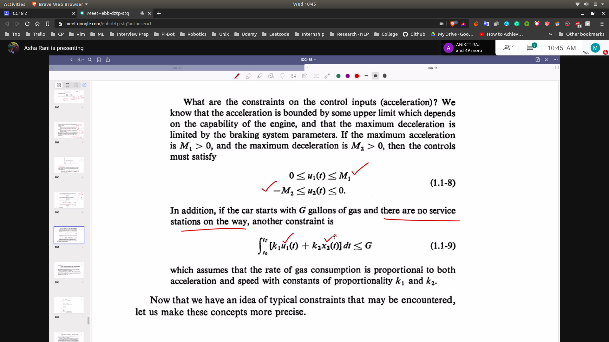

# Optimal Control

## Objective
- To determine the control signals that will cause a process to satisfy the physical constraints and at the same time minimize (or maximize) some performance criterion
- Performance criteria is the function of the states and control signals
  - 

**Basically what we do here is that make zero the performance criteria**
- Also revise
  - Solution of differential eqns.

## Process
- Modelling
  - Preparing the mathematical model of the system
  - 
  - 

- Example
    - 
    - 

- Definations
  - A history of control input values during the interval $[t_0,t_f]$ is denoted by u and is called a control history or simply a control
  - A history of state values in interval $[t_0,t_f]$ is called state trajectory

- Physical Contraints
  - For eg in the case of the above eg
  - Here x1 is taken as displacement and x2 is velocity
  - 
  - More contraints
    - 

- Admissable Control --> when control trajectory satisfied the condition for optimal control

- Performance Measure
  - 