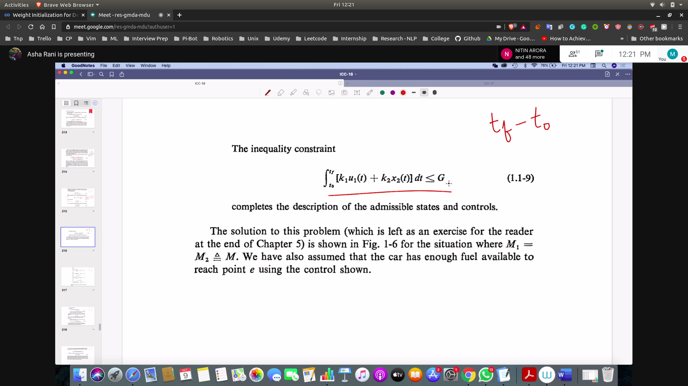

## The optimal control problem
- Finding an admissable control to follow admissable trajectory that minimize performance measure
- 
- Multiple optimal control may exist
- Here we will only find the global minimum of the performance measure for all the trajectories

## Prev Example
- 
   - here we have already partially defined the constraints on the input
   - that is we have specified the limits on the acceleration and deceleration.
- inequality constraint
   - 

## Optimal Control Law
- The solution is of the form f(x(t),u)

## Basic Calculas
- Functions
  - very basic!
- Functional
  - function of a function! basically
  - represented by J
  - 
  - example of a functional
  - area under the x(t) curve
  - here for different values of x(t) wil be assigned to a real value that is their area

## Check Linearity of function
- Linearity of function
  - Should satisfy principle of homogenity
  - and principle of additivity
  - 
  - 

## Check linearity for functional
- 
- 

## Closeness of functions
- Is based on the equilidian norm
  - 