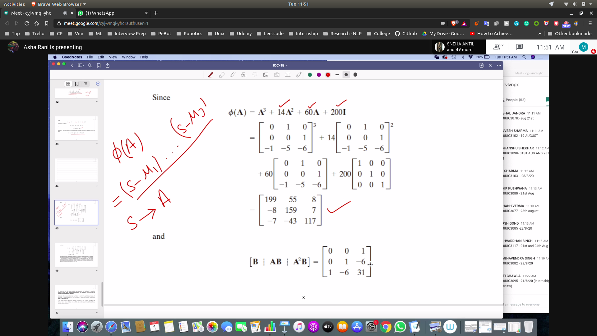

## Notes

## Determination of the k using direct substitution method
- 

## Determination of K Using the Ackermann's Formula
- 

### Deriving ackerman's formula 
- We will prove this using the caley hamilton theorem
  - every matrix A satisfies it's own characteristic equation
  - First doing for the case of n = 3
  - 

- We make A~ for the dersired response
- and A will not satisfy the eqn.
- so phi(A~) = 0 , else phi(A)!=0
- 
- making both the equation equal for desired and actual
- 

- obtaining K ( state feedback gain matrix)
- 

## Regulator System
- reference input is constant
- control system is time varying like (state feedback system)
- 

### Doing Problem
- We have the state variable equation
- Desired Loop poles is given
- 
- First we check controllability using AB in the state equation
- 
- solving using first method
 - 
 - obtained K
- solving using second method
 - 
 - so we put k1, k2 ,k3
 - then put it equal to the desired quation
 - then form eqation in k1,k2,k3 and find the K matrix
 - 
- Third method
  - find char eqn
  - put A in that , and obtain phi(A)
  - 

## Homework
- 
