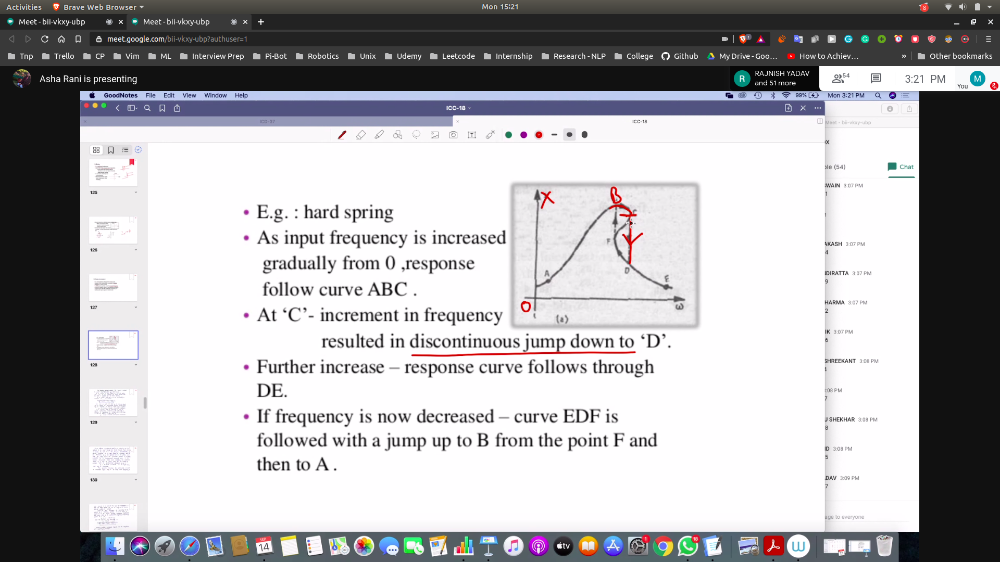
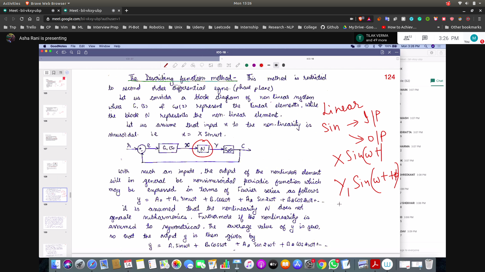
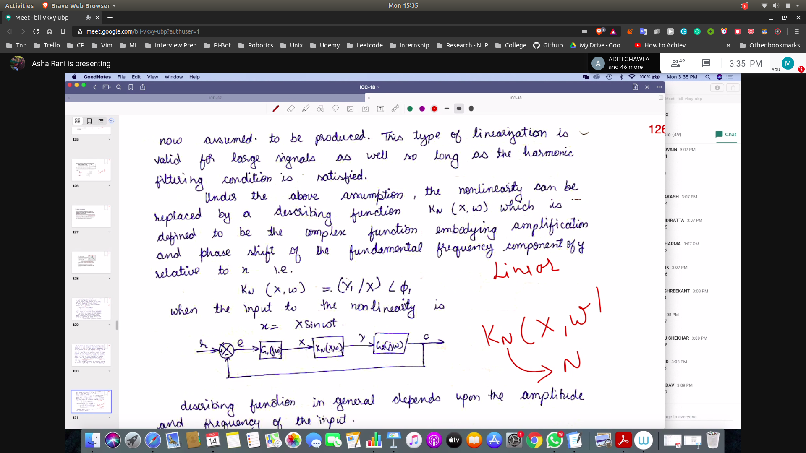
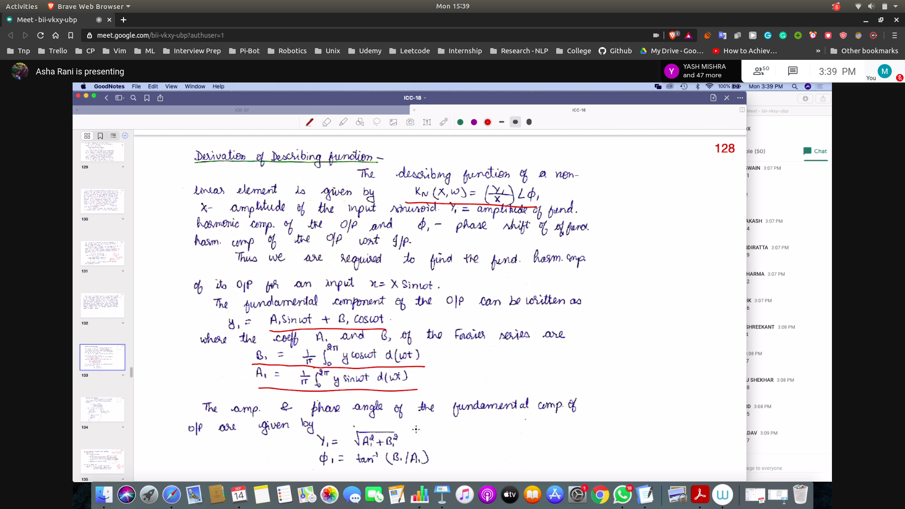
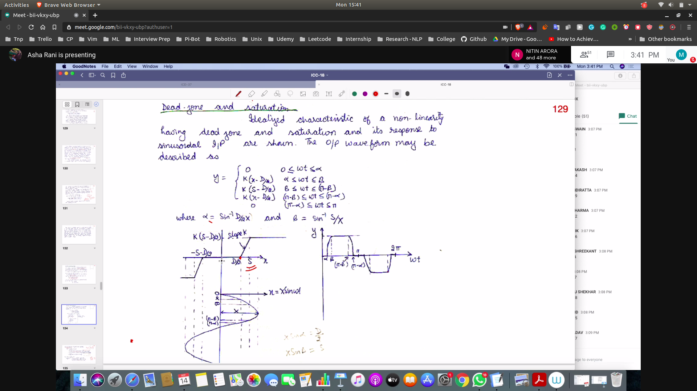

## Jump Resonance
- Happens when we give a system variable frequency
- When you reach resonance and then you increase frequency then it will jump to a lower value , and not follow the path ==> *straight line in the graph*
- 

# Modelling the non linearities
## Describing function
- N is the non-linearity in the system
- see the block diagram
- 
### Assumption
- we assume that , if we give the input , then the output can be expressed in Fourier Series
- we assume that the average value is zero
- thus the Ao terms are zero
- **We also assume that the input is zero**
  - Because we think we have a running system and the input is switched off , so the system should tend to be zero

- We also assume that G2(s) , G1(s) has low pass characteristics
   - Hence we won't have higher harmonics

### Representation
- If the above assumptions are true , then we can linearise the system
- We will replace the non-linearities with a linear transfer function Kn
  - obv Kn has a magnitude and a lag
-  
## Derivation of Describing function
- 

### Deadzone and Saturation
- 

