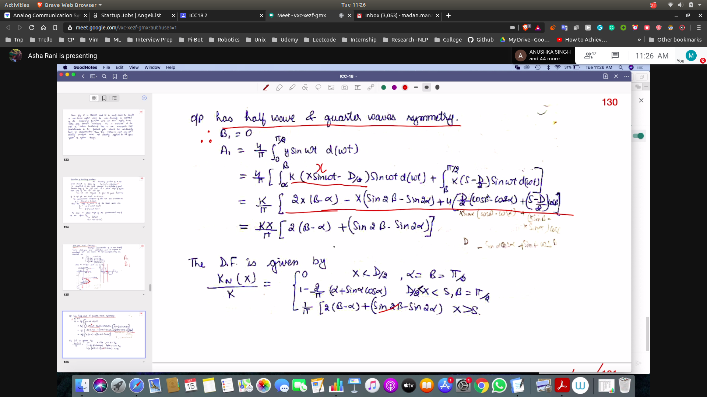
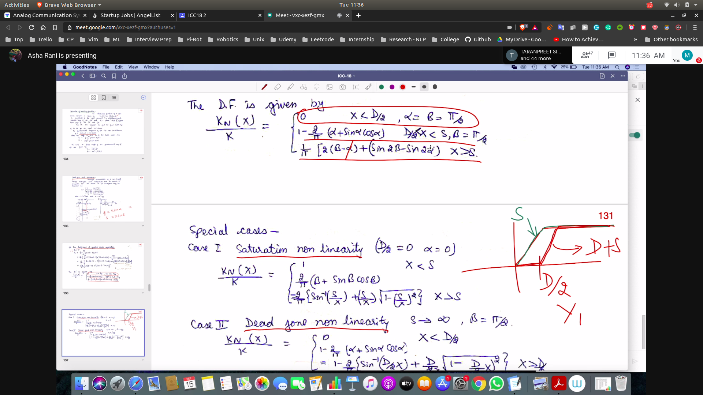
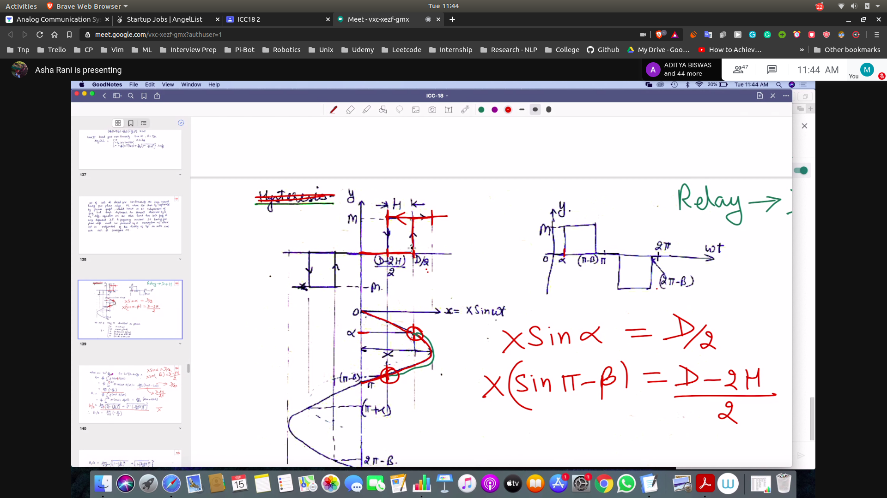

### Continuing to obtain A1,B1
- 
- here integration will start from alpha as the value of 0 to alpha is zero
- as the half wave is symmetric
- Obtained the D.F

### Saturation
- We can evaluate for only saturation also
  - 
### Deadzone
- s -> inf and b = $/pi / 2$
  - 

## Dzone + Relay
- 