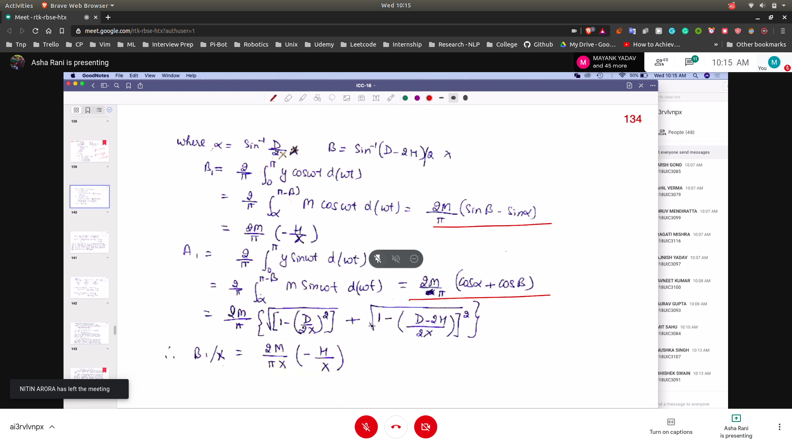

## Obtaining A1 and B1 for (relay + dzone + hysterisis)
- You can calculate B1 for 0 to $\pi$ because it it symmetric
- from 0 to $\beta$ == 0 , so we do from 0 to $\pi - \beta$
- 
- 

### 3 cases of (dzone + hysteris)
- Ideal Relay
- Relay with dead zone
- Relay with hysterisis
- 

**We can use linearized non-lineary for stability only , and non for desighning the system**

## Stability Analysis By Describing function
- Without non-linearities , we can use Nyquist stability criteria
  - In this we used to plot the polar plot
  - and wary $W$ from 0 to inf
  - and see magnitude and the angle
  - we say that if the point -1 + j * 0 is encircled by PP then the system is unstable
  - otherwise is it stable
- 