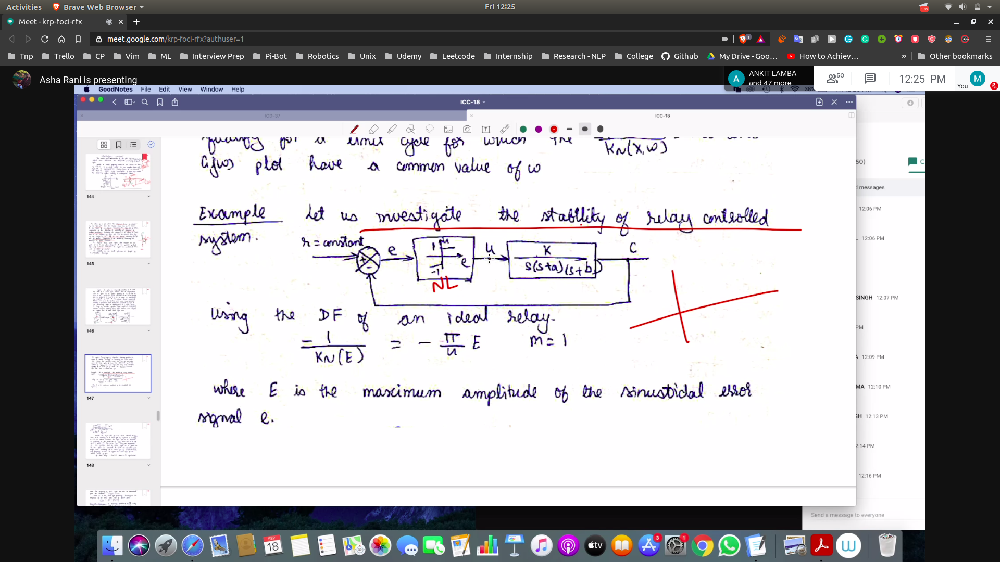

## Uptill Now
- G(jw) plots
- Inc x 
- stability checking using the describing function

## Problem
- check stability in the problem
- FLAG101
- 
### Steps
1. Make Cases and Derive the describing function
2.
3. Make the polar plot and -1/Kne locus for the transfer function
- 