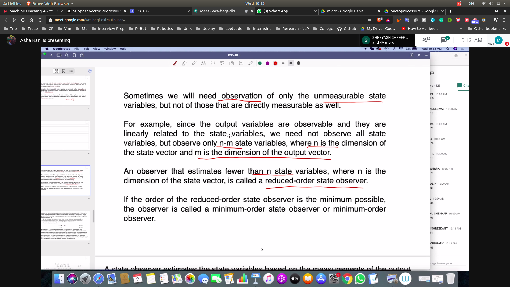
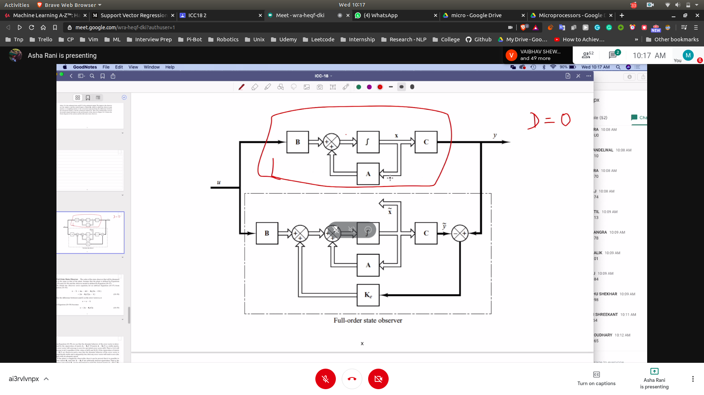
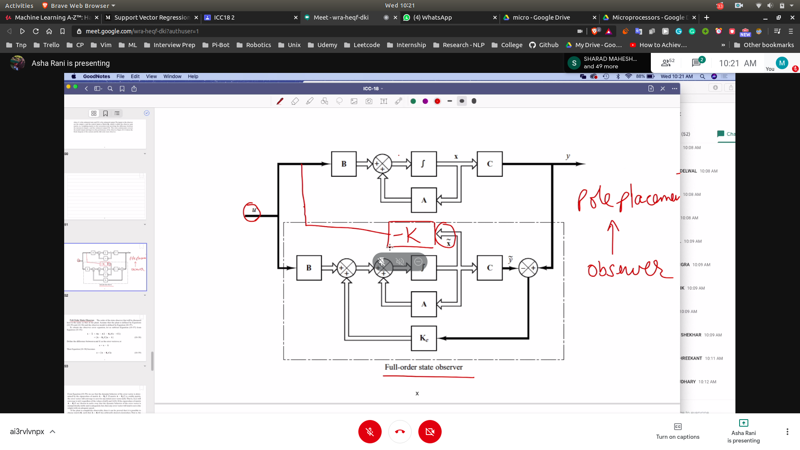
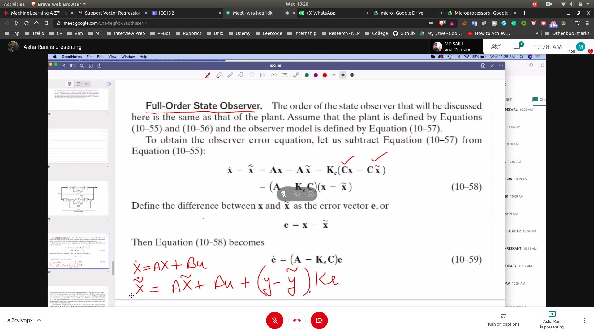
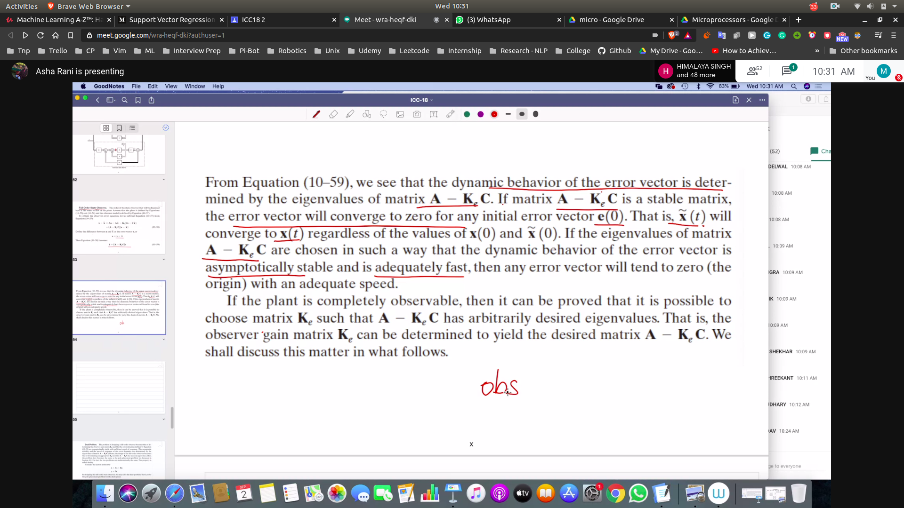
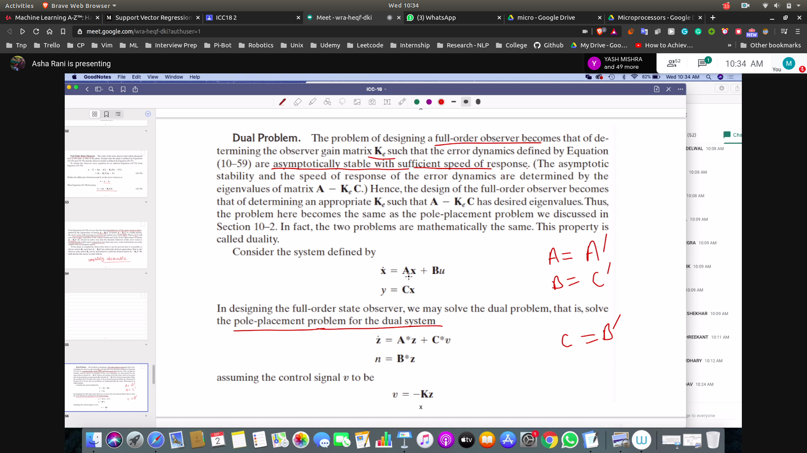
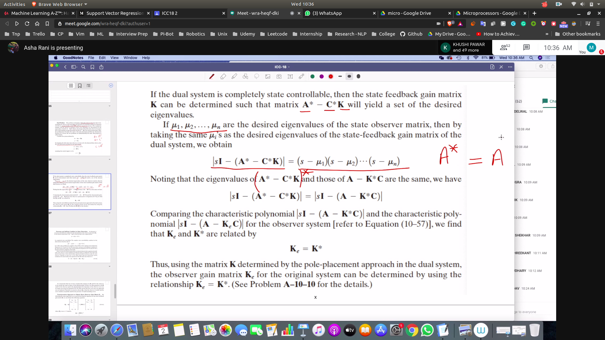
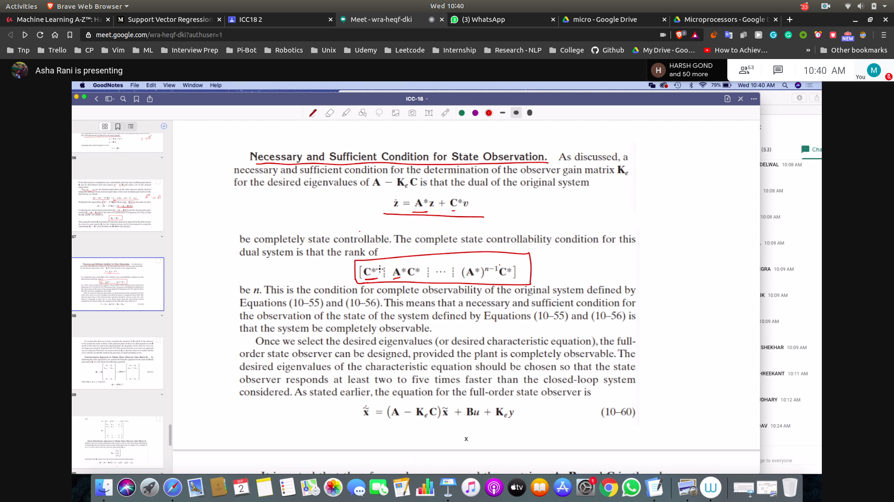
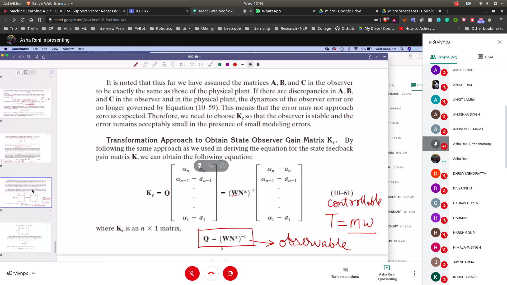
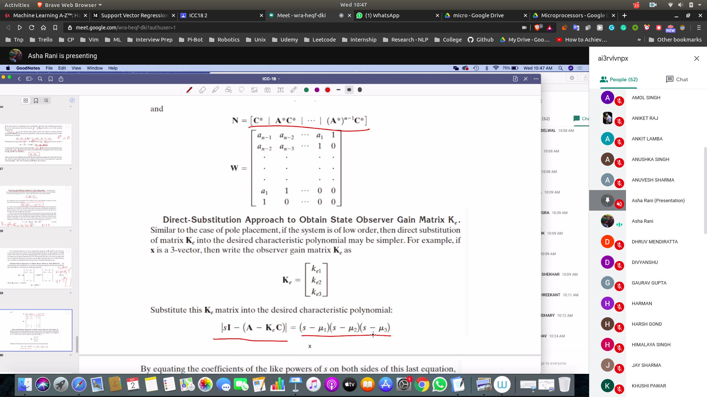

## Observer
- So we have to observe the unmeasurable values
- we do not need to observe the state 
- reduced order observer ==> can observe n-1 variables
- minimum order observer ==> can observe n-m variable
- 

## Notation
- x~ is the full state observer
 - it is the observed states
- 
- 

## Full Order State Observer

- here also we have to observe the Ke matrix
- now when we make y~ = y then only we will get the correct x observer
- to do that we have to get the value fo K_e 
- **So main problem is to estimate K_e** ==> to get the correct estimate
- 
- now e here will be zero , when A-K_eC = 0
- to do that we have to place correct eigen values of A-Kec 
- 

### Dual Problem 
- We treat the system as finding the value of K for dual system
- basicaly in dual we take the transpose of the sytem 
- Ke = K_T ( in the dual proble)
- 
- 

## Condition for state observation
- so we desighn the dual and convert controllability into observability
- 

## Transformation method for finding Ke
- 

## Direct Substitution Method for finding Ke
- 
